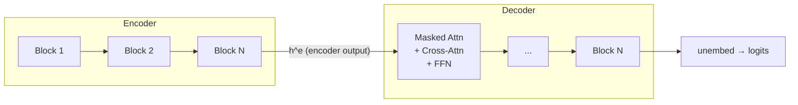

For tasks that map one sequence to another -- translation, summarization, question answering
with generated answers -- the encoder-decoder architecture combines the full-context reading
of an encoder with the sequential generation of a decoder<FN n="1" />.

## Architecture

The **encoder** is a stack of bidirectional transformer blocks (no causal mask) that reads
the source sequence and produces a sequence of contextual representations
$\mathbf{h}^e \in \mathbb{R}^{S \times d}$.

The **decoder** is a stack of transformer blocks with two attention layers per block:
1. **Masked self-attention**: causal, so the decoder can only attend to already-generated tokens.
2. **Cross-attention**: attends over the encoder output $\mathbf{h}^e$.



## Cross-attention

In each decoder block, the cross-attention mechanism:

- **Queries** come from the decoder's current hidden state.
- **Keys and values** come from the encoder output $\mathbf{h}^e$ (fixed for the whole
  decoding pass).
- No causal mask -- the decoder can attend to all encoder positions.

$$
\text{CrossAttn}(\text{dec\_state},\, \mathbf{h}^e) = \text{Attention}(\text{dec\_state}\, W^Q,\ \mathbf{h}^e W^K,\ \mathbf{h}^e W^V).
$$

The cross-attention matrix $\alpha \in \mathbb{R}^{T \times S}$ shows which encoder
positions each decoder position attends to -- like the Bahdanau attention matrix,
but with the full Transformer's key-query parameterization.

## T5: text-to-text transfer transformer

**Raffel et al. (2020)** unified all NLP tasks under a single **text-to-text** format:
every task is a sequence-to-sequence problem where both input and output are plain text<FN n="2" />.

| Task | Input text | Output text |
|------|-----------|------------|
| Translation | `translate English to French: The cat is on the mat.` | `Le chat est sur le tapis.` |
| Summarization | `summarize: <long article>` | `<short summary>` |
| Sentiment | `sst2 sentence: The movie was great.` | `positive` |
| QA | `question: Who wrote Hamlet? context: Hamlet was written by William Shakespeare.` | `William Shakespeare` |

T5 pretrains with **span corruption** (a generalization of MLM): randomly select spans
of tokens, replace each span with a single sentinel token `<extra_id_k>`, and train the
model to reconstruct the original spans in the output.

T5 uses a relative positional encoding rather than absolute; the decoder uses causal
self-attention with position bias.

## BART: denoising sequence-to-sequence

**Lewis et al. (2020)** pretrain an encoder-decoder with a **denoising** objective:
corrupt the source text with various noising functions, then reconstruct the original.

Noising functions (BART uses all of these during pretraining):
- **Token masking**: replace tokens with `[MASK]`.
- **Token deletion**: delete tokens (decoder must infer their positions, unlike MLM).
- **Text infilling**: replace a span with a single `[MASK]` (generalizes token masking).
- **Sentence permutation**: shuffle sentences.
- **Document rotation**: rotate so the document starts at a random token.

The model is pretrained to output the original uncorrupted text. This pretrains both
the encoder (to understand corrupted input) and the decoder (to generate text).

BART is especially strong on generation tasks (summarization, dialogue, translation)
because the decoder is trained as a full language model on clean text.

## Comparison

| Model | Pretraining | Strengths |
|-------|------------|----------|
| T5 | Span corruption (text-to-text) | Unified multitask framework; strong on structured tasks |
| BART | Multi-task denoising | Abstractive summarization; dialogue generation |
| mT5 | Multilingual span corruption | 101 languages in T5 framework |
| Flan-T5 | T5 + instruction fine-tuning | Instruction following with encoder-decoder |

```python-static
from transformers import T5Tokenizer, T5ForConditionalGeneration

tokenizer = T5Tokenizer.from_pretrained("t5-small")
model     = T5ForConditionalGeneration.from_pretrained("t5-small")

# Summarization
inputs = tokenizer(
    "summarize: The cat sat on the mat. The mat was red. The cat was black.",
    return_tensors="pt"
)
outputs = model.generate(**inputs, max_new_tokens=20)
print(tokenizer.decode(outputs[0], skip_special_tokens=True))
```

## When to use encoder-decoder vs decoder-only

**Encoder-decoder:** supervised text-to-text tasks (translation, structured summarization)
where the input and output have a clear boundary and are potentially different lengths.
Cross-attention gives a direct pathway from source to target.

**Decoder-only:** open-ended generation, few-shot prompting, instruction following.
Simpler architecture, easier to scale, and with instruction tuning can perform all
encoder-decoder tasks via prompting.

## Exercises

**Exercise 1.** In a decoder block, the masked self-attention uses a causal mask
but the cross-attention does not. Explain why each choice is correct: what would
break if the cross-attention were causally masked, and what would break if the
self-attention were not?

<details>
<summary>Solution</summary>

**Step 1.** Cross-attention reads the encoder output $\mathbf{h}^e$, the full
source sequence, which is known in its entirety before decoding starts. There is
no "future" to hide: every target position should be free to attend to every
source position, so a causal mask here would needlessly cut the decoder off from
the tail of the source (the end of a sentence being translated, say).

**Step 2.** Self-attention runs over the target tokens, which are generated left
to right. During training the whole target is present, so without a causal mask
position $t$ would attend to target tokens $x_{>t}$ and the next-token objective
would leak its own answer. The mask restores $p(x_t \mid x_{<t}, \mathbf{h}^e)$,
the conditional that generation uses at inference.

</details>

**Exercise 2.** T5 frames sentiment classification as text-to-text, emitting the
literal string `positive` or `negative` rather than a logit over two classes.
Give one concrete advantage and one concrete cost of this choice compared to a
BERT-style classification head on `[CLS]`.

<details>
<summary>Solution</summary>

**Step 1.** Advantage: a single model and loss (next-token cross-entropy over the
vocabulary) handles every task at once. Translation, summarization, and
sentiment share weights and the decoder, so adding a task is a matter of phrasing
its prompt, not bolting on a new head. This is what lets one T5 checkpoint do
multitask learning.

**Step 2.** Cost: the output is unconstrained text, so the model can emit a token
sequence that is not one of the valid labels (a typo, a synonym, or a refusal),
and decoding a multi-token label costs more than reading a single logit vector.
A classification head over a fixed label set cannot produce an invalid answer and
needs one forward pass, not autoregressive decoding.

</details>

**Exercise 3 (code).** Implement decoder-to-encoder cross-attention directly:
queries from a length-$T$ decoder state, keys and values from a length-$S$
encoder output, no causal mask. Verify the attention matrix has shape
$T \times S$, each row is a distribution, and every decoder position attends to
all $S$ encoder positions.

<details>
<summary>Solution</summary>

```python
import numpy as np

def softmax(x, axis=-1):
    e = np.exp(x - x.max(axis=axis, keepdims=True))
    return e / e.sum(axis=axis, keepdims=True)

rng = np.random.default_rng(0)
T, S, d = 4, 7, 8          # 4 decoder positions, 7 encoder positions
dec_state = rng.standard_normal((T, d))
enc_out = rng.standard_normal((S, d))
Wq = rng.standard_normal((d, d))
Wk = rng.standard_normal((d, d))
Wv = rng.standard_normal((d, d))

Q = dec_state @ Wq          # queries from the decoder
K = enc_out @ Wk            # keys and values from the (fixed) encoder output
V = enc_out @ Wv
alpha = softmax(Q @ K.T / np.sqrt(d))   # (T, S), no mask
out = alpha @ V                          # (T, d)

assert alpha.shape == (T, S)
assert out.shape == (T, d)
assert np.allclose(alpha.sum(axis=1), 1.0)   # each decoder row sums to 1
assert np.all(alpha > 0)                     # attends to every source position
print("cross-attention matrix:", alpha.shape, "-> output:", out.shape)
```

The matrix $\alpha \in \mathbb{R}^{T \times S}$ is the alignment between target
and source positions, the direct source-to-target pathway that makes
encoder-decoder strong for translation.

</details>

Modern practice increasingly favors large decoder-only
models for both tasks.

<Footnotes>
  <FNItem n="1">**Vaswani, A., et al.** (2017). "Attention is all you need".
    *NeurIPS*. [arXiv:1706.03762](https://arxiv.org/abs/1706.03762)</FNItem>
  <FNItem n="2">**Raffel, C., et al.** (2020). "Exploring the limits of transfer learning
    with a unified text-to-text transformer (T5)". *JMLR*, 21, 1-67.
    [arXiv:1910.10683](https://arxiv.org/abs/1910.10683)</FNItem>
</Footnotes>
