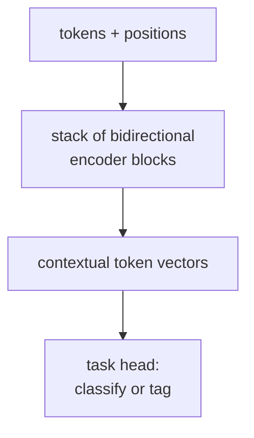

Decoder-only models generate text by predicting one token at a time, left to right.
Many NLP tasks -- sentiment classification, NER, question answering -- do not require
generation: they need to read and **understand** text. **Encoder-only** models remove
causal masking so every position can attend to every other position, then pretrain
with a masked language model (MLM) objective<FN n="1" />.

## Bidirectional self-attention

Remove the upper-triangular mask. Every position now attends to all $T$ positions
(including future ones). This is not a language model in the autoregressive sense:
it cannot generate text token-by-token. It is an encoder that produces a contextual
representation of the full input.

## BERT pretraining objectives

### Masked language modeling (MLM)

Randomly mask 15% of input tokens (replace with a special `[MASK]` token, a random token,
or leave unchanged). Predict the original tokens at masked positions using the full
bidirectional context.

$$
\mathcal{L}_{\text{MLM}} = -\sum_{t \in \mathcal{M}} \log p(x_t^* \mid x_{\setminus \mathcal{M}}),
$$

where $\mathcal{M}$ is the set of masked positions and $x_t^*$ is the original token.

MLM trains a model to denoise: fill in blanks using all available context. Unlike causal
LM, the model sees both left and right context at every layer.

### Next sentence prediction (NSP)

Concatenate two sentences with a `[SEP]` token. The model predicts whether sentence B
actually follows sentence A in the original document. This is prepended with a `[CLS]`
token whose final hidden state is used as the sequence representation for the NSP prediction.

NSP was found to provide limited benefit; RoBERTa removes it and trains MLM only on
longer sequences.

## BERT input format

```
[CLS] token₁ token₂ ... [SEP] token₁' token₂' ... [SEP]
```

Special tokens:
- `[CLS]`: classification token; its final representation aggregates sequence information.
- `[SEP]`: separator between sentences (and end of sequence).
- `[MASK]`: replacement for masked positions during pretraining.

Embeddings: token embedding + segment embedding (0 for sentence A, 1 for B) + positional
embedding. All three are summed elementwise.

## Fine-tuning for downstream tasks

After pretraining, add a task-specific head and fine-tune all parameters:

**Sequence classification** (sentiment, NLI): linear layer on `[CLS]` embedding.

**Token classification** (NER, POS): linear layer on each token's embedding.

**Extractive QA** (SQuAD): two linear layers predicting start/end span positions.

```python-static
from transformers import BertTokenizer, BertForSequenceClassification
import torch

tokenizer = BertTokenizer.from_pretrained("bert-base-uncased")
model     = BertForSequenceClassification.from_pretrained("bert-base-uncased",
                                                          num_labels=2)

# Tokenize a sentence pair
inputs = tokenizer("I love this movie!", "It was fantastic.",
                   return_tensors="pt", truncation=True, padding=True)
# inputs: {"input_ids", "token_type_ids", "attention_mask"}

outputs = model(**inputs)
logits  = outputs.logits   # (1, 2)
probs   = torch.softmax(logits, dim=-1)
print("Sentiment probs:", probs.detach().numpy())
```

## RoBERTa improvements

RoBERTa (Liu et al., 2019) trains BERT longer with more data and cleaner hyperparameters:

- **No NSP**: MLM on continuous sentences only, removing an unhelpful objective.
- **Dynamic masking**: mask patterns are regenerated each epoch rather than fixed.
- **Larger batches**: 8K sequences instead of 256.
- **More data**: 160GB of text vs BERT's 16GB.
- **Longer training**: 500K steps vs 100K.

These changes improved GLUE scores significantly with no architectural change.



## BERT vs decoder-only

| Property | BERT (encoder-only) | GPT (decoder-only) |
|----------|--------------------|--------------------|
| Attention | Bidirectional | Causal (left-to-right) |
| Pretraining | MLM (denoising) | Causal LM |
| Strengths | Classification, NER, QA | Generation, few-shot |
| Fine-tuning | Full fine-tuning per task | Prompting or instruction tuning |

Modern practice: use decoder-only LLMs (instruction-tuned) for most tasks via prompting,
and fine-tune encoder-only BERT/RoBERTa when labeled data is available and low latency
is required. BERT-family models remain dominant in production NLP pipelines for
classification and extraction tasks where their smaller size and lower inference cost
matter.

<Footnotes>
  <FNItem n="1">**Devlin, J., Chang, M.-W., Lee, K., & Toutanova, K.** (2019). "BERT:
    pre-training of deep bidirectional transformers for language understanding".
    *NAACL*. [arXiv:1810.04805](https://arxiv.org/abs/1810.04805)</FNItem>
</Footnotes>
