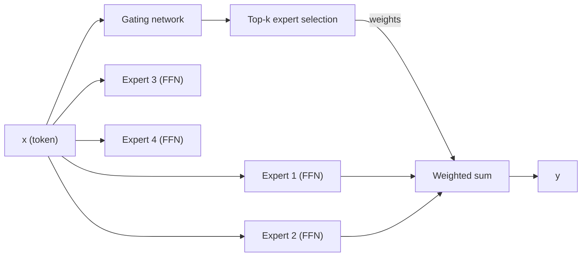

As LLMs scale to 70B+ parameters and serve hundreds of concurrent users, two costs
dominate: **KV cache memory** (proportional to the number of key-value heads and sequence
length) and **FFN compute** (proportional to $d \cdot d_{\text{ff}}$ per token). Two
architectural innovations address each.

## Multi-query attention (MQA)

**Standard MHA** has $h$ query heads, $h$ key heads, and $h$ value heads.
**Multi-query attention (MQA, Shazeer 2019)** keeps $h$ query heads but reduces to
**one shared** key head and one shared value head<FN n="1" />:

$$
\text{MQA}: \quad Q_i = X W_i^Q, \quad K = X W^K, \quad V = X W^V \quad (i = 1, \dots, h).
$$

The single $K$ and $V$ matrices are broadcast to all query heads. The KV cache stores
one head instead of $h$ heads, reducing cache memory by $h\times$.

**Cost:** the model quality degrades because different query heads can no longer attend
with different keys. In practice this is a noticeable (though small) accuracy loss.

## Grouped-query attention (GQA)

**GQA (Ainslie et al., 2023; used by LLaMA-2 70B, LLaMA-3, Mistral)** is a
compromise: divide the $h$ query heads into $g$ groups, and give each group its own
key and value head<FN n="2" />:

$$
\text{GQA}: \quad Q_i = X W_i^Q, \quad K_j = X W_j^K, \quad V_j = X W_j^V,
$$

where head $i$ uses the KV pair of its group $j = \lceil i \cdot g / h \rceil$.

- $g = h$: full MHA (no reduction).
- $g = 1$: MQA (one KV pair for all queries).
- $1 < g < h$: GQA (intermediate).

Typically $g = h/8$ (e.g., 64 query heads, 8 KV heads). The KV cache is reduced by
$h/g = 8\times$ while maintaining most of MHA's expressiveness.

```python
import numpy as np

def gqa_attention(Q, K, V, n_kv_heads):
    """
    Q: (h, T, dk)  K: (g, T, dk)  V: (g, T, dv)
    Each group of h//g query heads shares one K,V pair.
    Returns: (h, T, dv)
    """
    h, T, dk = Q.shape
    g = n_kv_heads
    group_size = h // g
    out = np.zeros((h, T, V.shape[-1]))
    for i in range(h):
        j = i // group_size   # which KV group
        scores = Q[i] @ K[j].T / np.sqrt(dk)   # (T, T)
        mask   = np.triu(np.ones((T, T), dtype=bool), k=1)
        scores[mask] = -1e9
        attn   = np.exp(scores - scores.max(-1, keepdims=True))
        attn  /= attn.sum(-1, keepdims=True)
        out[i] = attn @ V[j]
    return out

h, g, T, dk = 8, 2, 6, 4
Q = np.random.randn(h, T, dk)
K = np.random.randn(g, T, dk)
V = np.random.randn(g, T, dk)
out = gqa_attention(Q, K, V, g)
print("GQA output shape:", out.shape)   # (h, T, dk)
```

## Mixture of Experts (MoE)

**MoE** replaces the dense FFN layer in a transformer block with a set of $E$ expert FFNs,
routing each token to only $k$ of them<FN n="3" />:



### Gating

The gating network maps each token $x$ to expert weights:

$$
G(x) = \text{softmax}(x W_g),
$$

where $W_g \in \mathbb{R}^{d \times E}$. **Top-k gating** keeps only the $k$ largest
weights (zeros out the rest) and renormalizes:

$$
G_{\text{top-}k}(x) = \frac{G(x) \odot \mathbf{1}[\text{top-}k]}{\|G(x) \odot \mathbf{1}[\text{top-}k]\|_1}.
$$

### MoE FFN output

$$
\text{MoE-FFN}(x) = \sum_{e=1}^{E} G_{\text{top-}k}(x)_e \cdot \text{FFN}_e(x).
$$

Only $k$ experts are actually evaluated (the others receive weight zero). For $k=2$ and
$E=8$, each token uses $2/8 = 25\%$ of the total expert parameters.

### Why MoE?

- **Parameter efficiency:** a MoE model with $E$ experts has $E\times$ as many FFN
  parameters but the same compute per token (only $k$ experts run).
- **Capacity vs cost tradeoff:** increase model capacity (parameters) without proportionally
  increasing FLOPs.

### Load balancing

If the gating always selects the same few experts, most experts become idle and underused.
An **auxiliary load-balancing loss** penalizes uneven expert usage:

$$
\mathcal{L}_{\text{aux}} = \alpha \sum_e f_e \cdot P_e,
$$

where $f_e$ is the fraction of tokens routed to expert $e$ and $P_e$ is the average
gating probability assigned to expert $e$. This loss encourages uniform routing.

### Production MoE models

| Model | Experts ($E$) | Active ($k$) | Total params | Active params |
|-------|--------------|-------------|-------------|--------------|
| Mixtral 8x7B | 8 | 2 | 47B | 13B |
| DeepSeek-V3 | 256 | 8 | 671B | 37B |
| GPT-4 (rumored) | ~16 | 2 | unknown | ~55B |

DeepSeek-V3 uses **expert specialization** (each expert tends to handle specific types
of tokens) and **shared experts** (2 experts always active, 6 routed) -- a refinement
that improves learning stability.

## Exercises

**Exercise 1.** A model has $h = 64$ query heads with per-head dimension
$d_k = 128$, across $n_\ell = 80$ layers, serving a context of $T = 4096$ tokens
in fp16 (2 bytes per number). Compute the KV-cache size for full MHA and for GQA
with $g = 8$ KV heads, and state the reduction factor.

<details>
<summary>Solution</summary>

**Step 1.** The cache holds both keys and values, so per token per layer MHA
stores $2 h\, d_k = 2 \cdot 64 \cdot 128 = 16384$ numbers. Over all layers and
tokens: $16384 \cdot 80 \cdot 4096 = 5{,}368{,}709{,}120$ numbers. At 2 bytes
each that is $10.74$ GB.

**Step 2.** GQA replaces $h$ KV heads with $g = 8$: per token per layer
$2 g\, d_k = 2 \cdot 8 \cdot 128 = 2048$ numbers, so the total is
$2048 \cdot 80 \cdot 4096 = 671{,}088{,}640$ numbers, $1.34$ GB.

**Step 3.** The ratio is $h / g = 64 / 8 = 8$. GQA cuts the cache $8\times$, from
$10.74$ GB to $1.34$ GB, the headroom that lets the same hardware serve longer
contexts or more concurrent users.

</details>

**Exercise 2.** A Mixtral-style block has $E = 8$ experts and routes each token
to $k = 2$ of them. The dense FFN it replaces costs $C$ FLOPs per token. Ignoring
the small gating cost, what is the per-token FFN compute of the MoE block, and
what fraction of the total expert parameters does each token touch?

<details>
<summary>Solution</summary>

**Step 1.** Each expert is a full FFN costing $C$ FLOPs per token. Top-$k$ routing
evaluates only the $k = 2$ selected experts, so the per-token compute is
$k \cdot C = 2C$. The other six experts receive weight zero and are never run.

**Step 2.** The block stores $E = 8$ experts' worth of parameters but each token
activates $k = 2$, a fraction $k / E = 2 / 8 = 25\%$. This is the MoE lever:
$8\times$ the FFN parameters (capacity) at a fixed small multiple of the dense
compute per token.

</details>

**Exercise 3 (code).** Implement GQA routing for $h = 8$ query heads sharing
$g = 2$ KV heads. Verify that the heads partition into two contiguous groups of
four, and that two query heads in the same group fed an identical query produce
an identical output (they share one $K, V$ pair).

<details>
<summary>Solution</summary>

```python
import numpy as np

def softmax(x, axis=-1):
    e = np.exp(x - x.max(axis=axis, keepdims=True))
    return e / e.sum(axis=axis, keepdims=True)

def gqa_attention(Q, K, V, n_kv_heads):
    h, T, dk = Q.shape
    group_size = h // n_kv_heads
    out = np.zeros((h, T, V.shape[-1]))
    groups = np.zeros(h, dtype=int)
    for i in range(h):
        j = i // group_size                 # head i borrows KV pair of group j
        groups[i] = j
        scores = Q[i] @ K[j].T / np.sqrt(dk)
        scores[np.triu(np.ones((T, T), dtype=bool), k=1)] = -1e9
        out[i] = softmax(scores) @ V[j]
    return out, groups

rng = np.random.default_rng(0)
h, g, T, dk = 8, 2, 5, 4
Q = rng.standard_normal((h, T, dk))
K = rng.standard_normal((g, T, dk))
V = rng.standard_normal((g, T, dk))

out, groups = gqa_attention(Q, K, V, g)
assert np.array_equal(groups, np.array([0, 0, 0, 0, 1, 1, 1, 1]))

Q[1] = Q[0]                                  # heads 0 and 1 both in group 0
out, _ = gqa_attention(Q, K, V, g)
assert np.allclose(out[0], out[1])           # same query + same KV -> same output
print("KV group of each head:", groups)
```

Heads in a group are distinguished only by their queries, since they read the
same cached keys and values, which is exactly how GQA shrinks the cache without
collapsing every head into one.

</details>

The next lesson pushes cache compression further with multi-head latent
attention, which caches a single low-rank latent per token rather than shared KV
heads.

<Footnotes>
  <FNItem n="1">**Shazeer, N.** (2019). "Fast transformer decoding: one write-head is
    all you need (MQA)". [arXiv:1911.02150](https://arxiv.org/abs/1911.02150)</FNItem>
  <FNItem n="2">**Ainslie, J., et al.** (2023). "GQA: training generalized multi-query
    transformer models from multi-head checkpoints". *EMNLP*.
    [arXiv:2305.13245](https://arxiv.org/abs/2305.13245)</FNItem>
  <FNItem n="3">**Fedus, W., Zoph, B., & Shazeer, N.** (2022). "Switch transformers:
    scaling to trillion parameter models with simple and efficient sparsity". *JMLR*.
    [arXiv:2101.03961](https://arxiv.org/abs/2101.03961)</FNItem>
</Footnotes>
