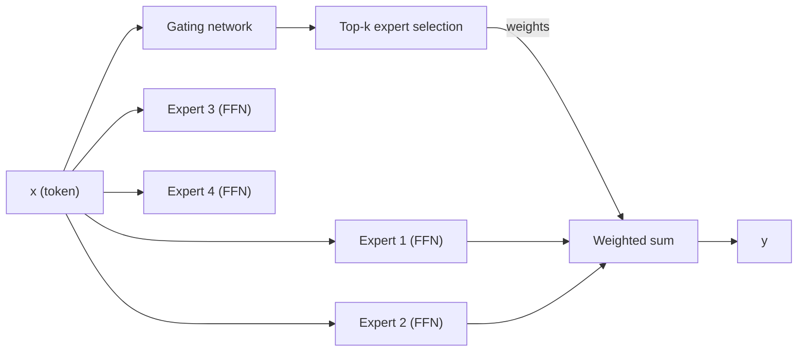

As LLMs scale to 70B+ parameters and serve hundreds of concurrent users, two costs
dominate: **KV cache memory** (proportional to the number of key-value heads and sequence
length) and **FFN compute** (proportional to $d \cdot d_{\text{ff}}$ per token). Two
architectural innovations address each.

## Multi-query attention (MQA)

**Standard MHA** has $h$ query heads, $h$ key heads, and $h$ value heads.
**Multi-query attention (MQA, Shazeer 2019)** keeps $h$ query heads but reduces to
**one shared** key head and one shared value head:

$$
\text{MQA}: \quad Q_i = X W_i^Q, \quad K = X W^K, \quad V = X W^V \quad (i = 1, \dots, h).
$$

The single $K$ and $V$ matrices are broadcast to all query heads. The KV cache stores
one head instead of $h$ heads, reducing cache memory by $h\times$.

**Cost:** the model quality degrades because different query heads can no longer attend
with different keys. In practice this is a noticeable (though small) accuracy loss.

## Grouped-query attention (GQA)

**GQA (Ainslie et al., 2023; used by LLaMA-2 70B, LLaMA-3, Mistral)** is a
compromise: divide the $h$ query heads into $g$ groups, and give each group its own
key and value head:

$$
\text{GQA}: \quad Q_i = X W_i^Q, \quad K_j = X W_j^K, \quad V_j = X W_j^V,
$$

where head $i$ uses the KV pair of its group $j = \lceil i \cdot g / h \rceil$.

- $g = h$: full MHA (no reduction).
- $g = 1$: MQA (one KV pair for all queries).
- $1 < g < h$: GQA (intermediate).

Typically $g = h/8$ (e.g., 64 query heads, 8 KV heads). The KV cache is reduced by
$h/g = 8\times$ while maintaining most of MHA's expressiveness.

```python
import numpy as np

def gqa_attention(Q, K, V, n_kv_heads):
    """
    Q: (h, T, dk)  K: (g, T, dk)  V: (g, T, dv)
    Each group of h//g query heads shares one K,V pair.
    Returns: (h, T, dv)
    """
    h, T, dk = Q.shape
    g = n_kv_heads
    group_size = h // g
    out = np.zeros((h, T, V.shape[-1]))
    for i in range(h):
        j = i // group_size   # which KV group
        scores = Q[i] @ K[j].T / np.sqrt(dk)   # (T, T)
        mask   = np.triu(np.ones((T, T), dtype=bool), k=1)
        scores[mask] = -1e9
        attn   = np.exp(scores - scores.max(-1, keepdims=True))
        attn  /= attn.sum(-1, keepdims=True)
        out[i] = attn @ V[j]
    return out

h, g, T, dk = 8, 2, 6, 4
Q = np.random.randn(h, T, dk)
K = np.random.randn(g, T, dk)
V = np.random.randn(g, T, dk)
out = gqa_attention(Q, K, V, g)
print("GQA output shape:", out.shape)   # (h, T, dk)
```

## Mixture of Experts (MoE)

**MoE** replaces the dense FFN layer in a transformer block with a set of $E$ expert FFNs,
routing each token to only $k$ of them:



### Gating

The gating network maps each token $x$ to expert weights:

$$
G(x) = \text{softmax}(x W_g),
$$

where $W_g \in \mathbb{R}^{d \times E}$. **Top-k gating** keeps only the $k$ largest
weights (zeros out the rest) and renormalizes:

$$
G_{\text{top-}k}(x) = \frac{G(x) \odot \mathbf{1}[\text{top-}k]}{\|G(x) \odot \mathbf{1}[\text{top-}k]\|_1}.
$$

### MoE FFN output

$$
\text{MoE-FFN}(x) = \sum_{e=1}^{E} G_{\text{top-}k}(x)_e \cdot \text{FFN}_e(x).
$$

Only $k$ experts are actually evaluated (the others receive weight zero). For $k=2$ and
$E=8$, each token uses $2/8 = 25\%$ of the total expert parameters.

### Why MoE?

- **Parameter efficiency:** a MoE model with $E$ experts has $E\times$ as many FFN
  parameters but the same compute per token (only $k$ experts run).
- **Capacity vs cost tradeoff:** increase model capacity (parameters) without proportionally
  increasing FLOPs.

### Load balancing

If the gating always selects the same few experts, most experts become idle and underused.
An **auxiliary load-balancing loss** penalizes uneven expert usage:

$$
\mathcal{L}_{\text{aux}} = \alpha \sum_e f_e \cdot P_e,
$$

where $f_e$ is the fraction of tokens routed to expert $e$ and $P_e$ is the average
gating probability assigned to expert $e$. This loss encourages uniform routing.

### Production MoE models

| Model | Experts ($E$) | Active ($k$) | Total params | Active params |
|-------|--------------|-------------|-------------|--------------|
| Mixtral 8x7B | 8 | 2 | 47B | 13B |
| DeepSeek-V3 | 256 | 8 | 671B | 37B |
| GPT-4 (rumored) | ~16 | 2 | unknown | ~55B |

DeepSeek-V3 uses **expert specialization** (each expert tends to handle specific types
of tokens) and **shared experts** (2 experts always active, 6 routed) -- a refinement
that improves learning stability.
