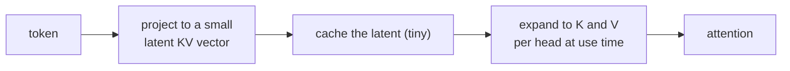

Autoregressive decoding caches the key and value vectors of every past token so each new
token attends without recomputing them. That cache is the dominant memory cost at long
context. [Grouped-query attention](gqa-moe) shrinks it by sharing keys and values across
groups of heads. Multi-head latent attention (MLA), introduced in DeepSeek-V2, shrinks it
a different way: it caches a single low-rank latent per token and reconstructs the
per-head keys and values on the fly<FN n="1" />.

## 1. The cost being optimized

Let $d$ be the model width, $n_h$ the number of heads, and $d_h$ the per-head dimension
(so standard multi-head attention has $n_h d_h = d$). For a sequence of length $L$ and
$n_\ell$ layers, plain multi-head attention caches both $K$ and $V$:

$$
\text{cache}_{\text{MHA}} = 2\, n_\ell\, L\, n_h\, d_h \quad\text{numbers}.
$$

The factor $n_h d_h = d$ per token per layer (times two for K and V) is what MLA targets.

## 2. Down-projection to a latent

MLA introduces a learned down-projection $W^{DKV} \in \mathbb{R}^{d_c \times d}$ with a
latent dimension $d_c \ll n_h d_h$. For the token representation $h_t \in \mathbb{R}^d$ it
computes

$$
c_t = W^{DKV} h_t \in \mathbb{R}^{d_c}.
$$

This vector $c_t$ is the only thing cached. At attention time, two up-projections
$W^{UK}, W^{UV} \in \mathbb{R}^{n_h d_h \times d_c}$ reconstruct the per-head keys and
values:

$$
k_t = W^{UK} c_t, \qquad v_t = W^{UV} c_t.
$$

Because $k_t$ and $v_t$ are linear in $c_t$, the up-projections can be folded into the
query and output projections during inference, so the reconstruction is not paid as a
separate matmul. The cache per token per layer drops from $2 n_h d_h$ to $d_c$:

$$
\text{cache}_{\text{MLA}} = n_\ell\, L\, d_c.
$$

With DeepSeek-V2's choice $d_c$ around $4 d_h$, this is several times smaller than even a
GQA cache, while staying closer to full multi-head quality because every head still gets
its own reconstructed $k_t, v_t$ rather than a shared one.

The magnitudes make the saving concrete. At the V2-scale config below ($d = 5120$,
$n_h = 128$ heads, $d_h = 40$, GQA with 8 KV groups, $d_c = 512$, $d^R_h = 64$), the
per-token-per-layer cache in raw numbers is:

- **MHA** caches $2 n_h d_h = 2 \cdot 128 \cdot 40 = 10240$ numbers, the full keys and
  values for all 128 heads.
- **GQA** shares them down to 8 KV groups: $2 \cdot 8 \cdot 40 = 640$ numbers, a 16x cut.
- **MLA** caches the latent plus the decoupled key: $d_c + d^R_h = 512 + 64 = 576$
  numbers, 17.8x below MHA and a hair under GQA's 640.

So MLA reaches GQA-level memory (576 vs 640) while every head still reconstructs its own
distinct $k_t, v_t$, where GQA forces eight heads to share one. Same footprint, more
expressive cache.

## 3. The decoupled RoPE key

There is one obstruction. [Rotary position embeddings](positional-encodings) rotate keys
by a position-dependent matrix $R_t$, so the effective key is $R_t k_t$. That rotation
does not commute with the latent up-projection, which would block folding $W^{UK}$ away.
MLA resolves it by *decoupling* position: it carries a small separate key
$k^R_t \in \mathbb{R}^{d^R_h}$ that holds the rotary part, computed from its own
projection and rotated directly. The score combines a content term from the latent and a
positional term from the decoupled key:

$$
\text{score}(q_t, k_s) = \underbrace{q^{C\top}_t k^C_s}_{\text{from } c_s}
 + \underbrace{q^{R\top}_t\, R_{t-s}\, k^R_s}_{\text{decoupled RoPE}}.
$$

The cache then holds $c_s$ plus the small $k^R_s$, still far below the multi-head baseline.



## 4. Memory comparison

The block below computes the per-token cache for plain MHA, GQA, and MLA at a typical
configuration, showing the ratios.

```python
import numpy as np

d_model = 5120
n_heads = 128
d_head = d_model // n_heads     # 40
n_kv_groups = 8                 # GQA: 8 KV heads shared across 128 query heads
d_c = 512                       # MLA latent
d_rope = 64                     # decoupled rotary key

# numbers cached per token per layer
mha = 2 * n_heads * d_head
gqa = 2 * n_kv_groups * d_head
mla = d_c + d_rope

print("per-token-per-layer cache (numbers):")
print("  MHA:", mha)
print("  GQA:", gqa)
print("  MLA:", mla)
print("MLA vs MHA:", round(mla / mha, 3))
print("MLA vs GQA:", round(mla / gqa, 3))
```

MLA lands well below the multi-head cache and competitive with GQA, while keeping
per-head keys and values distinct. The next architectural axes, sparsity and recurrence,
are covered by [mixture of experts](gqa-moe) and the
[state space models](/pillar/D/D3/state-space-models) in pillar D.

<Footnotes>
  <FNItem n="1">**DeepSeek-AI.** (2024). "DeepSeek-V2: a strong, economical, and efficient
    mixture-of-experts language model (MLA)".
    [arXiv:2405.04434](https://arxiv.org/abs/2405.04434)</FNItem>
</Footnotes>
