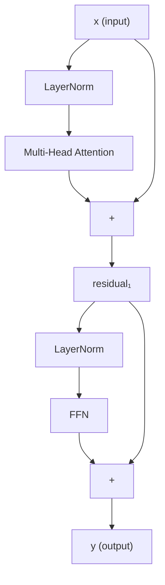

Multi-head attention mixes information across positions. But attention is a weighted average
of values -- it is linear in the values, and a model made entirely of attention heads is
just a large linear transformation. Two additions turn this into a deep nonlinear model:
a **position-wise feed-forward network** and **residual connections with layer
normalization**.

## Position-wise FFN

After attention, each token's representation is updated by a small MLP applied
**independently** to each position. For input $x \in \mathbb{R}^{d_{\text{model}}}$:

$$
\text{FFN}(x) = W_2\, \text{ReLU}(W_1 x + b_1) + b_2,
$$

where $W_1 \in \mathbb{R}^{d_{\text{ff}} \times d_{\text{model}}}$ and
$W_2 \in \mathbb{R}^{d_{\text{model}} \times d_{\text{ff}}}$, with
$d_{\text{ff}} = 4 d_{\text{model}}$ typically.

The FFN is "position-wise" because the same weights are shared across all positions, but
applied independently -- no cross-position mixing happens here. Modern variants replace
ReLU with **SwiGLU** or **GELU**: $\text{FFN}(x) = (W_1 x \odot \sigma(W_3 x)) W_2$,
which empirically trains better.

## Residual connections

Residual connections (He et al., 2016) add the block's input directly to its output:

$$
x \leftarrow x + \text{SubLayer}(x).
$$

This creates a direct gradient path from the loss to early layers, mitigating the
vanishing-gradient problem in deep networks. It also gives the model an easy way to
learn "do nothing" (output zero from the sublayer).

## Layer normalization

**Layer norm** (Ba et al., 2016) normalizes across the feature dimension (not the batch
dimension like BatchNorm):

$$
\text{LN}(x) = \gamma \odot \frac{x - \mu}{\sqrt{\sigma^2 + \epsilon}} + \beta,
$$

where $\mu$ and $\sigma^2$ are the mean and variance computed over the $d_{\text{model}}$
features of a single token, and $\gamma, \beta \in \mathbb{R}^{d_{\text{model}}}$ are
learned affine parameters.

Layer norm stabilizes training across batch sizes and sequence lengths. It is computed
per-token, making it independent of other tokens in the batch.

**Pre-norm vs post-norm:** the original Transformer uses post-norm
($\text{LN}(x + \text{Sub}(x))$). Modern LLMs use **pre-norm**
($x + \text{Sub}(\text{LN}(x))$), which stabilizes training at scale without learning-rate
warmup.

## The full transformer block



With pre-norm:

$$
\text{Block}(x) = x + \text{FFN}(\text{LN}(x + \text{MHA}(\text{LN}(x)))).
$$

## Tracing tensor shapes

For $d_{\text{model}} = 512$, $h = 8$, $d_{\text{ff}} = 2048$, sequence length $T$:

| Tensor | Shape |
|--------|-------|
| Input $x$ | $(T, 512)$ |
| $Q, K, V$ (per head) | $(T, 64)$ each |
| Attention output per head | $(T, 64)$ |
| Concatenated heads | $(T, 512)$ |
| After $W^O$ | $(T, 512)$ |
| After residual + LN | $(T, 512)$ |
| FFN intermediate | $(T, 2048)$ |
| FFN output | $(T, 512)$ |
| Block output | $(T, 512)$ |

The sequence length dimension is never changed by any operation -- the block is
**shape-preserving**.

## Implementation

```python
import numpy as np

def layer_norm(x, gamma, beta, eps=1e-5):
    mu    = x.mean(axis=-1, keepdims=True)
    sigma = x.std(axis=-1, keepdims=True)
    return gamma * (x - mu) / (sigma + eps) + beta

def gelu(x):
    return 0.5 * x * (1 + np.tanh(np.sqrt(2 / np.pi) * (x + 0.044715 * x**3)))

class TransformerBlock:
    def __init__(self, d_model, n_heads, d_ff, seed=0):
        rng = np.random.default_rng(seed)
        s = 0.02
        self.mha    = None   # placeholder -- use the class from the previous lesson
        self.W1     = rng.normal(0, s, (d_ff, d_model))
        self.b1     = np.zeros(d_ff)
        self.W2     = rng.normal(0, s, (d_model, d_ff))
        self.b2     = np.zeros(d_model)
        self.gamma1 = np.ones(d_model);  self.beta1 = np.zeros(d_model)
        self.gamma2 = np.ones(d_model);  self.beta2 = np.zeros(d_model)

    def ffn(self, x):
        return gelu(x @ self.W1.T + self.b1) @ self.W2.T + self.b2

    def forward(self, x, mha_out):
        """Pre-norm transformer block. mha_out already computed externally."""
        # Attention sublayer
        x_normed = layer_norm(x, self.gamma1, self.beta1)
        x = x + mha_out   # residual (pre-norm: mha_out = MHA(x_normed))

        # FFN sublayer
        x_normed = layer_norm(x, self.gamma2, self.beta2)
        x = x + self.ffn(x_normed)
        return x

# Verify shapes
d_model, n_heads, d_ff, T = 32, 4, 128, 6
rng = np.random.default_rng(0)
x   = rng.normal(0, 1, (T, d_model))
# Fake MHA output for demonstration
mha_out = rng.normal(0, 0.1, (T, d_model))
block = TransformerBlock(d_model, n_heads, d_ff)
y     = block.forward(x, mha_out)
print("Input shape: ", x.shape)
print("Output shape:", y.shape)
print("Max absolute change:", np.abs(y - x).max().round(4))
```

## Parameter count of one block

| Component | Parameters |
|-----------|-----------|
| MHA ($W^Q, W^K, W^V, W^O$) | $4 d^2$ |
| LN1 ($\gamma, \beta$) | $2d$ |
| FFN ($W_1, b_1, W_2, b_2$) | $2 d \cdot d_{\text{ff}} + d_{\text{ff}} + d$ |
| LN2 ($\gamma, \beta$) | $2d$ |

For GPT-2 ($d=768$, $d_{\text{ff}}=3072$, 12 blocks): $\sim 85$M parameters.
For GPT-3 ($d=12288$, $d_{\text{ff}}=49152$, 96 blocks): $\sim 175$B parameters.

The next lesson adds **positional encodings**, which tell the model where in the sequence
each token sits -- since attention itself is permutation-equivariant.
