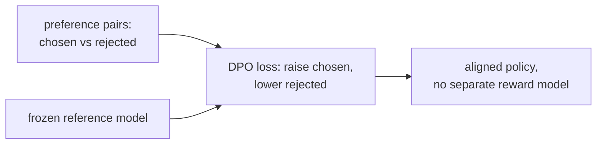

PPO-RLHF requires a trained reward model and a value model, making the training pipeline
complex and memory-intensive. **Direct Preference Optimization (DPO, Rafailov et al. 2023)**
shows that the optimal policy under the RLHF objective can be derived in closed form, and
the reward model can be eliminated entirely -- the policy is trained directly on preference
pairs with a simple classification-like objective<FN n="1" />.

## Deriving DPO

Start from the KL-penalized RLHF objective<FN n="2" />:

$$
\max_\pi \mathbb{E}_{y \sim \pi}[r(x, y)] - \beta\, \mathrm{KL}(\pi \| \pi_{\text{ref}}).
$$

The optimal policy has a closed-form solution (derived by setting the functional derivative to zero):

$$
\pi^*(y \mid x) = \frac{1}{Z(x)} \pi_{\text{ref}}(y \mid x) \exp\!\left(\frac{r(x, y)}{\beta}\right),
$$

where $Z(x) = \sum_y \pi_{\text{ref}}(y|x) \exp(r(x,y)/\beta)$ is the partition function.

**Rearranging:** given the optimal policy, we can express the reward in terms of the policy:

$$
r(x, y) = \beta \log \frac{\pi^*(y \mid x)}{\pi_{\text{ref}}(y \mid x)} + \beta \log Z(x).
$$

**Key insight:** $\beta \log Z(x)$ does not depend on $y$, so it cancels in the
Bradley-Terry preference probability:

$$
p(y_w \succ y_l \mid x) = \sigma(r(y_w) - r(y_l)) = \sigma\!\left(\beta \log \frac{\pi^*(y_w|x)}{\pi_{\text{ref}}(y_w|x)} - \beta \log \frac{\pi^*(y_l|x)}{\pi_{\text{ref}}(y_l|x)}\right).
$$

Replace $\pi^*$ with the learned policy $\pi_\theta$ and maximize likelihood:

$$
\boxed{\mathcal{L}_{\text{DPO}}(\theta) = -\mathbb{E}_{(x, y_w, y_l)} \left[ \log \sigma\!\left(\beta \log \frac{\pi_\theta(y_w|x)}{\pi_{\text{ref}}(y_w|x)} - \beta \log \frac{\pi_\theta(y_l|x)}{\pi_{\text{ref}}(y_l|x)}\right) \right].}
$$

This is the DPO objective: binary cross-entropy on preference pairs, using the log-ratio
of the policy to the reference model as an implicit reward.

## What DPO does intuitively

The quantity $\log \frac{\pi_\theta(y|x)}{\pi_{\text{ref}}(y|x)}$ measures how much more
(or less) likely the policy makes response $y$ relative to the SFT baseline.

DPO maximizes $[\text{implicit reward of } y_w] - [\text{implicit reward of } y_l]$:
- It increases the relative probability of preferred responses.
- It decreases the relative probability of dispreferred responses.
- The $\beta$ controls the scale -- large $\beta$ keeps changes close to the reference.

The loss is binary cross-entropy on the **margin** $\hat r_w - \hat r_l$, where
$\hat r = \beta \log \frac{\pi_\theta}{\pi_{\text{ref}}}$. Watching that margin makes the
scale concrete (with the per-pair loss $-\log\sigma(\text{margin})$):

- **At initialization**, $\pi_\theta = \pi_{\text{ref}}$, so both log-ratios are $0$, the
  margin is $0$, and the loss is $-\log\sigma(0) = -\log\tfrac12 \approx 0.693$ nats. Every
  pair starts at the same value, the entropy of a coin flip.
- **A modest correct nudge.** Suppose training raises $\log\pi_\theta(y_w)$ by $+3$ nats
  over the reference and lowers $\log\pi_\theta(y_l)$ by $2$ nats. With $\beta = 0.1$ the
  implicit rewards are $\hat r_w = 0.3$ and $\hat r_l = -0.2$, a margin of $0.5$, and the loss
  drops to $-\log\sigma(0.5) \approx 0.474$. The same probability shifts at $\beta = 1$ would
  give a margin of $5$ and loss $\approx 0.0067$: $\beta$ rescales how loudly a fixed change
  in token probabilities registers.
- **Saturation.** Once the margin reaches $\approx 4$, $\sigma(4) \approx 0.982$ and the loss
  is $\approx 0.018$; pushing further yields almost no gradient. The objective stops driving a
  pair apart once the preferred response is already clearly ahead, which is what keeps DPO from
  collapsing the policy onto the chosen samples.

The confusion to name: the implicit reward $\hat r$ is **not** a log-probability of $y$, but
$\beta$ times a log-*ratio* against the frozen reference. A response can have low absolute
likelihood and still earn a high implicit reward if the policy raised it far above where the
SFT model put it.

## Implementation

```python-static
import torch
import torch.nn.functional as F

def dpo_loss(policy, ref_model, prompts, y_w, y_l, beta=0.1):
    """
    policy, ref_model: callable (prompt, response) -> log-probability
    prompts, y_w, y_l: batched inputs
    """
    def log_prob(model, prompt, response):
        # In practice: compute log p(response | prompt) by summing token log-probs
        return model.log_probs(prompt, response)   # (B,)

    log_pi_w   = log_prob(policy,    prompts, y_w)
    log_pi_l   = log_prob(policy,    prompts, y_l)
    log_ref_w  = log_prob(ref_model, prompts, y_w)
    log_ref_l  = log_prob(ref_model, prompts, y_l)

    implicit_r_w = beta * (log_pi_w - log_ref_w)
    implicit_r_l = beta * (log_pi_l - log_ref_l)

    loss = -F.logsigmoid(implicit_r_w - implicit_r_l).mean()
    return loss
```

## IPO: identity preference optimization

DPO assumes the Bradley-Terry model, which may not hold for all preference datasets.
**IPO (Azar et al., 2024)** derives a variant that is more robust to reward hacking and
works without the BT assumption by directly fitting the log-ratio:

$$
\mathcal{L}_{\text{IPO}} = \mathbb{E}\left[\left(\log \frac{\pi(y_w|x)}{\pi_{\text{ref}}(y_w|x)} - \log \frac{\pi(y_l|x)}{\pi_{\text{ref}}(y_l|x)} - \frac{1}{2\beta}\right)^2\right].
$$

This is a regression target: push the difference in log-ratios to $1/(2\beta)$, a fixed
margin rather than maximizing the BT objective without bound.

## KTO: Kahneman-Tversky optimization

**KTO (Ethayarajh et al., 2024)** does not require preference pairs $(y_w, y_l)$ -- only
binary labels (good/bad). This is valuable when pairwise preference collection is expensive.

The objective aligns with human decision-making under prospect theory: losses are felt more
acutely than equivalent gains, matching Kahneman-Tversky's reference-point model.

## ORPO: odds ratio preference optimization

**ORPO (Hong et al., 2024)** removes the reference model entirely by combining SFT and
preference optimization in a single objective:

$$
\mathcal{L}_{\text{ORPO}} = \mathcal{L}_{\text{SFT}} - \lambda \mathbb{E}\left[\log \sigma\!\left(\log \frac{\text{odds}_\theta(y_w|x)}{\text{odds}_\theta(y_l|x)}\right)\right],
$$

where $\text{odds}_\theta(y|x) = p_\theta(y|x) / (1 - p_\theta(y|x))$.

ORPO uses the ratio of odds rather than log-ratios to a reference, making it a
true single-stage training method with no SFT warm-up required.



## Comparison

| Method | Requires RM? | Requires ref model? | Pairs required? |
|--------|-------------|-------------------|----------------|
| PPO-RLHF | Yes | Yes | Pairs (via RM) |
| DPO | No | Yes | Yes |
| IPO | No | Yes | Yes |
| KTO | No | Yes | No (binary) |
| ORPO | No | No | Yes |

## Exercises

**Exercise 1.** During DPO training with $\beta = 0.1$, a chosen response has its policy
log-probability raised by $+3$ nats over the reference and a rejected response lowered by
$2$ nats. Compute the two implicit rewards, the margin, and the per-pair DPO loss
$-\log\sigma(\text{margin})$ in nats.

<details>
<summary>Solution</summary>

**Step 1.** The implicit reward is $\hat r = \beta \log \frac{\pi_\theta}{\pi_{\text{ref}}}$.
For the chosen response the log-ratio is $+3$, so $\hat r_w = 0.1 \times 3 = 0.3$. For the
rejected response the log-ratio is $-2$, so $\hat r_l = 0.1 \times (-2) = -0.2$.

**Step 2.** The margin is $\hat r_w - \hat r_l = 0.3 - (-0.2) = 0.5$.

**Step 3.** The loss is $-\log\sigma(0.5)$. With $\sigma(0.5) = 1/(1 + e^{-0.5})$ and
$e^{-0.5} \approx 0.60653$, $\sigma(0.5) \approx 0.62246$, so the loss is
$-\log 0.62246 \approx 0.4741$ nats. This matches the lesson's $\approx 0.474$ for the same
shifts at $\beta = 0.1$.

</details>

**Exercise 2.** Derive the gradient of the DPO loss with respect to the margin
$u = \hat r_w - \hat r_l$, and show that it scales with $\sigma(-u) = 1 - \sigma(u)$. Use
this to explain the saturation noted in the lesson: that a pair with margin $\approx 4$
gets almost no gradient.

<details>
<summary>Solution</summary>

**Step 1.** The per-pair loss is $\ell = -\log\sigma(u)$. With
$\frac{d}{du}\log\sigma(u) = 1 - \sigma(u) = \sigma(-u)$:

$$
\frac{d\ell}{du} = -\sigma(-u) = -(1 - \sigma(u)).
$$

**Step 2.** The gradient magnitude is $1 - \sigma(u)$, the weight DPO places on a pair.
For a still-ambiguous pair near $u = 0$, $1 - \sigma(0) = 0.5$, a strong push.

**Step 3.** At $u = 4$, $\sigma(4) \approx 0.9820$, so $1 - \sigma(4) \approx 0.0180$. The
gradient is roughly $28\times$ weaker than at $u = 0$. Once the preferred response is well
ahead, the loss stops driving the pair apart, which keeps DPO from collapsing the policy
onto the chosen samples.

</details>

**Exercise 3 (code).** Implement the DPO loss in numpy directly from policy and reference
log-probabilities (four scalars per pair). Verify the Exercise 1 numbers, and check that
adding the same constant to both chosen log-probs (policy and reference together) leaves
the loss unchanged, since only the log-ratio enters.

<details>
<summary>Solution</summary>

```python
import numpy as np

def logsigmoid(z):
    # numerically stable log sigmoid
    return -np.logaddexp(0.0, -z)

def dpo_loss(logp_w, logref_w, logp_l, logref_l, beta=0.1):
    r_w = beta * (logp_w - logref_w)        # implicit reward, chosen
    r_l = beta * (logp_l - logref_l)        # implicit reward, rejected
    margin = r_w - r_l
    return -logsigmoid(margin), margin

# Exercise 1: chosen log-ratio +3, rejected log-ratio -2, beta = 0.1.
logref_w, logref_l = -1.0, -1.0
logp_w = logref_w + 3.0                      # raised by +3 nats
logp_l = logref_l - 2.0                      # lowered by 2 nats

loss, margin = dpo_loss(logp_w, logref_w, logp_l, logref_l, beta=0.1)
assert np.isclose(margin, 0.5)
assert np.isclose(loss, -np.log(1 / (1 + np.exp(-0.5))))

# Only the log-ratio matters: shift policy and reference chosen log-probs together.
c = 2.5
loss_shift, _ = dpo_loss(logp_w + c, logref_w + c, logp_l, logref_l, beta=0.1)
assert np.isclose(loss_shift, loss)
print("DPO loss:", round(float(loss), 4), "margin:", round(float(margin), 4))
```

The loss reproduces $\approx 0.4741$ nats at margin $0.5$ and is invariant to shifting the
chosen policy and reference log-probs together, confirming DPO sees only the log-ratio.

</details>

DPO and its variants are now the dominant preference optimization methods for open-source
LLMs due to their simplicity, stability, and competitive performance with PPO.

<Footnotes>
  <FNItem n="1">**Rafailov, R., et al.** (2023). "Direct preference optimization (DPO)".
    *NeurIPS*. [arXiv:2305.18290](https://arxiv.org/abs/2305.18290). The closed-form reparameterization that trains the policy directly on preference pairs.</FNItem>
  <FNItem n="2">**Ouyang, L., et al.** (2022). "Training language models to follow instructions with human feedback (InstructGPT)".
    *NeurIPS*. [arXiv:2203.02155](https://arxiv.org/abs/2203.02155). The KL-penalized RLHF objective DPO reparameterizes.</FNItem>
</Footnotes>
