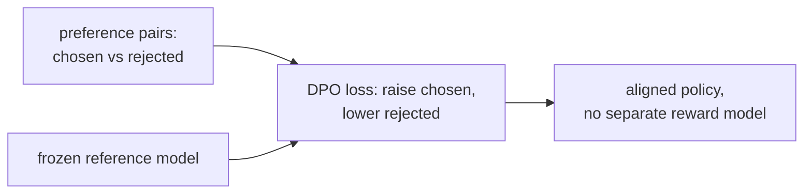

PPO-RLHF requires a trained reward model and a value model, making the training pipeline
complex and memory-intensive. **Direct Preference Optimization (DPO, Rafailov et al. 2023)**
shows that the optimal policy under the RLHF objective can be derived in closed form, and
the reward model can be eliminated entirely -- the policy is trained directly on preference
pairs with a simple classification-like objective<FN n="1" />.

## Deriving DPO

Start from the KL-penalized RLHF objective<FN n="2" />:

$$
\max_\pi \mathbb{E}_{y \sim \pi}[r(x, y)] - \beta\, \mathrm{KL}(\pi \| \pi_{\text{ref}}).
$$

The optimal policy has a closed-form solution (derived by setting the functional derivative to zero):

$$
\pi^*(y \mid x) = \frac{1}{Z(x)} \pi_{\text{ref}}(y \mid x) \exp\!\left(\frac{r(x, y)}{\beta}\right),
$$

where $Z(x) = \sum_y \pi_{\text{ref}}(y|x) \exp(r(x,y)/\beta)$ is the partition function.

**Rearranging:** given the optimal policy, we can express the reward in terms of the policy:

$$
r(x, y) = \beta \log \frac{\pi^*(y \mid x)}{\pi_{\text{ref}}(y \mid x)} + \beta \log Z(x).
$$

**Key insight:** $\beta \log Z(x)$ does not depend on $y$, so it cancels in the
Bradley-Terry preference probability:

$$
p(y_w \succ y_l \mid x) = \sigma(r(y_w) - r(y_l)) = \sigma\!\left(\beta \log \frac{\pi^*(y_w|x)}{\pi_{\text{ref}}(y_w|x)} - \beta \log \frac{\pi^*(y_l|x)}{\pi_{\text{ref}}(y_l|x)}\right).
$$

Replace $\pi^*$ with the learned policy $\pi_\theta$ and maximize likelihood:

$$
\boxed{\mathcal{L}_{\text{DPO}}(\theta) = -\mathbb{E}_{(x, y_w, y_l)} \left[ \log \sigma\!\left(\beta \log \frac{\pi_\theta(y_w|x)}{\pi_{\text{ref}}(y_w|x)} - \beta \log \frac{\pi_\theta(y_l|x)}{\pi_{\text{ref}}(y_l|x)}\right) \right].}
$$

This is the DPO objective: binary cross-entropy on preference pairs, using the log-ratio
of the policy to the reference model as an implicit reward.

## What DPO does intuitively

The quantity $\log \frac{\pi_\theta(y|x)}{\pi_{\text{ref}}(y|x)}$ measures how much more
(or less) likely the policy makes response $y$ relative to the SFT baseline.

DPO maximizes $[\text{implicit reward of } y_w] - [\text{implicit reward of } y_l]$:
- It increases the relative probability of preferred responses.
- It decreases the relative probability of dispreferred responses.
- The $\beta$ controls the scale -- large $\beta$ keeps changes close to the reference.

## Implementation

```python-static
import torch
import torch.nn.functional as F

def dpo_loss(policy, ref_model, prompts, y_w, y_l, beta=0.1):
    """
    policy, ref_model: callable (prompt, response) -> log-probability
    prompts, y_w, y_l: batched inputs
    """
    def log_prob(model, prompt, response):
        # In practice: compute log p(response | prompt) by summing token log-probs
        return model.log_probs(prompt, response)   # (B,)

    log_pi_w   = log_prob(policy,    prompts, y_w)
    log_pi_l   = log_prob(policy,    prompts, y_l)
    log_ref_w  = log_prob(ref_model, prompts, y_w)
    log_ref_l  = log_prob(ref_model, prompts, y_l)

    implicit_r_w = beta * (log_pi_w - log_ref_w)
    implicit_r_l = beta * (log_pi_l - log_ref_l)

    loss = -F.logsigmoid(implicit_r_w - implicit_r_l).mean()
    return loss
```

## IPO: identity preference optimization

DPO assumes the Bradley-Terry model, which may not hold for all preference datasets.
**IPO (Azar et al., 2024)** derives a variant that is more robust to reward hacking and
works without the BT assumption by directly fitting the log-ratio:

$$
\mathcal{L}_{\text{IPO}} = \mathbb{E}\left[\left(\log \frac{\pi(y_w|x)}{\pi_{\text{ref}}(y_w|x)} - \log \frac{\pi(y_l|x)}{\pi_{\text{ref}}(y_l|x)} - \frac{1}{2\beta}\right)^2\right].
$$

This is a regression target: push the difference in log-ratios to $1/(2\beta)$, a fixed
margin rather than maximizing the BT objective without bound.

## KTO: Kahneman-Tversky optimization

**KTO (Ethayarajh et al., 2024)** does not require preference pairs $(y_w, y_l)$ -- only
binary labels (good/bad). This is valuable when pairwise preference collection is expensive.

The objective aligns with human decision-making under prospect theory: losses are felt more
acutely than equivalent gains, matching Kahneman-Tversky's reference-point model.

## ORPO: odds ratio preference optimization

**ORPO (Hong et al., 2024)** removes the reference model entirely by combining SFT and
preference optimization in a single objective:

$$
\mathcal{L}_{\text{ORPO}} = \mathcal{L}_{\text{SFT}} - \lambda \mathbb{E}\left[\log \sigma\!\left(\log \frac{\text{odds}_\theta(y_w|x)}{\text{odds}_\theta(y_l|x)}\right)\right],
$$

where $\text{odds}_\theta(y|x) = p_\theta(y|x) / (1 - p_\theta(y|x))$.

ORPO uses the ratio of odds rather than log-ratios to a reference, making it a
true single-stage training method with no SFT warm-up required.



## Comparison

| Method | Requires RM? | Requires ref model? | Pairs required? |
|--------|-------------|-------------------|----------------|
| PPO-RLHF | Yes | Yes | Pairs (via RM) |
| DPO | No | Yes | Yes |
| IPO | No | Yes | Yes |
| KTO | No | Yes | No (binary) |
| ORPO | No | No | Yes |

DPO and its variants are now the dominant preference optimization methods for open-source
LLMs due to their simplicity, stability, and competitive performance with PPO.

<Footnotes>
  <FNItem n="1">**Rafailov, R., et al.** (2023). "Direct preference optimization (DPO)".
    *NeurIPS*. [arXiv:2305.18290](https://arxiv.org/abs/2305.18290). The closed-form reparameterization that trains the policy directly on preference pairs.</FNItem>
  <FNItem n="2">**Ouyang, L., et al.** (2022). "Training language models to follow instructions with human feedback (InstructGPT)".
    *NeurIPS*. [arXiv:2203.02155](https://arxiv.org/abs/2203.02155). The KL-penalized RLHF objective DPO reparameterizes.</FNItem>
</Footnotes>
