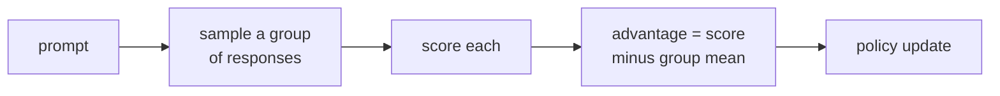

PPO requires a trained value model (the critic) to compute advantages. Training two models
simultaneously -- the policy and the value network -- is expensive and adds complexity.
**Group Relative Policy Optimization (GRPO, Shao et al., 2024)** eliminates the value model
by estimating baselines from a **group** of responses sampled from the current policy<FN n="1" />.

## The core idea

Instead of training a neural value model $V_\psi(s_t)$ to estimate expected return, GRPO
samples $G$ responses $\{y_1, \dots, y_G\}$ from the policy for the same prompt $x$ and
uses the **group mean reward** as the baseline:

$$
A_i = r_i - \frac{1}{G} \sum_{j=1}^{G} r_j,
$$

where $r_i = r_\phi(x, y_i)$ is the reward for response $i$. The advantage $A_i$
measures how much better response $i$ is compared to the average response from the
current policy -- a form of **self-normalized reward**.

This is essentially REINFORCE with leave-one-out baseline, adapted to the LLM setting.

**What "group-relative" buys you.** The same reward yields a different advantage
depending on the company it keeps, because the baseline is the group mean. Take a
verifiable reward $r \in \{0, 1\}$ and $G = 8$ responses, and look at a single
*correct* response ($r_i = 1$):

- **Easy prompt**, 7 of 8 responses correct. Group mean $= 0.875$, so the correct
  response gets advantage $A_i = 1 - 0.875 = 0.125$. Getting it right was expected;
  the gradient barely pushes.
- **Hard prompt**, 1 of 8 responses correct. Group mean $= 0.125$, so the same
  correct response gets $A_i = 1 - 0.125 = 0.875$. Solving what the policy usually
  fails is the signal worth chasing, and the advantage is $7\times$ larger.

So the curriculum is automatic: per-prompt, the baseline subtracts off whatever the
policy can already do, leaving the gradient to concentrate on the prompts at the
edge of its ability. The degenerate case makes the same point from the other side:
if all 8 responses agree (all correct or all wrong), the mean equals every reward
and every $A_i = 0$, so a group that gives no information gives no update.

## The GRPO objective

For each group of $G$ responses, the objective mirrors PPO's clipped surrogate<FN n="2" />:

$$
\mathcal{L}_{\text{GRPO}} = -\frac{1}{G} \sum_{i=1}^{G} \min\!\left(\rho_i \hat{A}_i,\ \text{clip}(\rho_i, 1-\epsilon, 1+\epsilon) \hat{A}_i\right) + \beta\, \mathrm{KL}(\pi_\theta \| \pi_{\text{ref}}),
$$

where $\rho_i = \pi_\theta(y_i|x) / \pi_{\theta_{\text{old}}}(y_i|x)$ and
$\hat{A}_i = (A_i - \mu_A) / \sigma_A$ is the normalized advantage.

The KL penalty (against the SFT reference model) prevents reward hacking.

## Normalizing advantages

GRPO normalizes advantages within the group:

$$
\hat{A}_i = \frac{A_i - \text{mean}(\{A_j\}_{j=1}^G)}{\text{std}(\{A_j\}_{j=1}^G) + \epsilon}.
$$

This normalization:
- Makes the objective invariant to the reward scale (no need to carefully tune reward magnitude).
- Stabilizes gradient magnitudes throughout training.

## Verifiable reward functions

GRPO is particularly powerful when the reward function is **verifiable** -- when you can
check the correctness of an answer without human annotation:

- **Mathematics:** did the model reach the correct numerical answer?
- **Code:** does the generated function pass unit tests?
- **Formal verification:** does the proof check?

With a verifiable reward $r \in \{0, 1\}$, there is no need for a reward model at all.
The policy is trained directly with binary correctness signals.

## GRPO implementation sketch

```python-static
import torch

def grpo_step(policy, ref_model, reward_fn, prompts, G=8, beta=0.04, eps=0.2):
    """
    prompts: (B,) list of prompt strings
    G: group size (samples per prompt)
    """
    all_responses, all_rewards, all_log_pi_old = [], [], []

    with torch.no_grad():
        for prompt in prompts:
            responses   = [policy.generate(prompt, do_sample=True) for _ in range(G)]
            rewards     = [reward_fn(prompt, r) for r in responses]
            log_pi_olds = [policy.log_probs(prompt, r) for r in responses]
            all_responses.append(responses)
            all_rewards.append(rewards)
            all_log_pi_old.append(log_pi_olds)

    total_loss = 0.0
    for i, (prompt, responses, rewards, log_pi_olds) in enumerate(
            zip(prompts, all_responses, all_rewards, all_log_pi_old)):
        r_tensor = torch.tensor(rewards, dtype=torch.float)
        # Group-relative advantage
        A = (r_tensor - r_tensor.mean()) / (r_tensor.std() + 1e-8)

        for j, (response, adv, log_pi_old) in enumerate(zip(responses, A, log_pi_olds)):
            log_pi  = policy.log_probs(prompt, response)
            log_ref = ref_model.log_probs(prompt, response)

            ratio = torch.exp(log_pi - log_pi_old)
            clip  = ratio.clamp(1 - eps, 1 + eps)
            ppo_loss = -torch.min(ratio * adv, clip * adv).mean()
            kl_loss  = beta * (log_pi - log_ref).mean()
            total_loss += ppo_loss + kl_loss

    return total_loss / (len(prompts) * G)
```

## GRPO and DeepSeek-R1

GRPO is the training algorithm behind **DeepSeek-R1** (DeepSeek, 2025), which uses
pure RL (no SFT warm-up) with GRPO and a verifiable math reward to train a model that
generates long reasoning chains before answering.

Key findings from DeepSeek-R1:
- With only binary correctness rewards (no process reward), the model spontaneously develops
  self-reflection, backtracking, and extended chain-of-thought.
- The emergent reasoning behavior appears without explicit supervision of the reasoning steps.
- A "cold start" with a small amount of SFT on curated reasoning chains before GRPO prevents
  reward hacking and improves final performance.



## Comparison: PPO vs DPO vs GRPO

| Property | PPO | DPO | GRPO |
|----------|-----|-----|------|
| Requires reward model | Yes | No | Sometimes |
| Requires value model | Yes | No | No |
| Requires reference model | Yes | Yes | Yes |
| Online (policy rollouts) | Yes | No | Yes |
| Works with verifiable rewards | Yes | No | Yes |
| Computational cost | Highest | Lowest | Medium |

## Exercises

**Exercise 1.** A group of $G = 4$ responses to one prompt earns verifiable rewards
$r = (1, 0, 1, 0)$. Compute the group-mean baseline, the raw advantages $A_i = r_i - \bar r$,
and the normalized advantages $\hat A_i = (A_i - \text{mean}(A)) / \text{std}(A)$ (population
std). State which responses get a positive gradient.

<details>
<summary>Solution</summary>

**Step 1.** The group mean is $\bar r = (1 + 0 + 1 + 0)/4 = 0.5$.

**Step 2.** Raw advantages $A_i = r_i - 0.5$: $A = (0.5, -0.5, 0.5, -0.5)$.

**Step 3.** $\text{mean}(A) = 0$ (subtracting the mean already centers the advantages). The
population variance is $\frac{1}{4}(0.5^2 + 0.5^2 + 0.5^2 + 0.5^2) = 0.25$, so
$\text{std}(A) = 0.5$.

**Step 4.** Normalized: $\hat A_i = A_i / 0.5 = (1, -1, 1, -1)$. The two correct responses
get $\hat A = +1$ (positive gradient, made more likely); the two wrong ones get $\hat A = -1$
(made less likely).

</details>

**Exercise 2.** Take a verifiable reward $r \in \{0, 1\}$ and a group of $G$ responses of
which $k$ are correct. Show that a single correct response gets raw advantage
$A = 1 - k/G$ and a single wrong response gets $A = -k/G$. Use this to explain why a group
where all responses agree ($k = 0$ or $k = G$) produces no update.

<details>
<summary>Solution</summary>

**Step 1.** The group mean reward is $\bar r = k/G$ (the fraction correct).

**Step 2.** A correct response has $r_i = 1$, so $A = 1 - k/G$. A wrong response has
$r_i = 0$, so $A = 0 - k/G = -k/G$.

**Step 3.** If $k = G$ (all correct), $\bar r = 1$, every $r_i = 1$, so every $A = 0$. If
$k = 0$ (all wrong), $\bar r = 0$, every $A = 0$. In both cases all advantages vanish, the
normalization is undefined or zero, and the policy gets no gradient: a group whose responses
all agree carries no relative signal.

</details>

**Exercise 3 (code).** Implement the group-relative advantage (raw and normalized) in numpy.
Verify the Exercise 1 numbers, and confirm that a unanimous group ($r$ all equal) yields
all-zero raw advantages.

<details>
<summary>Solution</summary>

```python
import numpy as np

def group_advantages(rewards):
    r = np.asarray(rewards, float)
    raw = r - r.mean()                          # leave-one-out style baseline
    std = raw.std()                             # population std
    norm = (raw - raw.mean()) / (std + 1e-8)
    return raw, norm

# Exercise 1: rewards (1, 0, 1, 0).
raw, norm = group_advantages([1, 0, 1, 0])
assert np.allclose(raw, [0.5, -0.5, 0.5, -0.5])
assert np.allclose(norm, [1.0, -1.0, 1.0, -1.0])

# Unanimous group -> all-zero raw advantages, no update.
raw_all_correct, _ = group_advantages([1, 1, 1, 1])
assert np.allclose(raw_all_correct, 0.0)
raw_all_wrong, _ = group_advantages([0, 0, 0, 0])
assert np.allclose(raw_all_wrong, 0.0)
print("raw:", raw, "norm:", norm)
```

The raw advantages are $\pm 0.5$ and normalize to $\pm 1$, while a unanimous group gives
all-zero advantages, matching the automatic-curriculum argument: only groups with mixed
outcomes move the policy.

</details>

GRPO occupies a useful middle ground: simpler than PPO (no value model), but online
(generates new rollouts) and compatible with verifiable rewards -- making it the method
of choice for reasoning-oriented RL.

<Footnotes>
  <FNItem n="1">**Shao, Z., et al.** (2024). "DeepSeekMath: pushing the limits of mathematical reasoning in open language models (GRPO)".
    [arXiv:2402.03300](https://arxiv.org/abs/2402.03300). Introduces the group-relative baseline that replaces the value model.</FNItem>
  <FNItem n="2">**Schulman, J., Wolski, F., Dhariwal, P., Radford, A., & Klimov, O.** (2017). "Proximal policy optimization algorithms (PPO)".
    [arXiv:1707.06347](https://arxiv.org/abs/1707.06347). The clipped surrogate objective GRPO reuses with a group-mean baseline.</FNItem>
</Footnotes>
