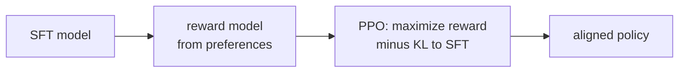

The reward model gives a scalar signal for a complete response, but it is non-differentiable
with respect to the token selection (argmax / sampling is not differentiable). **Reinforcement
learning from human feedback (RLHF)** uses policy gradient methods to optimize the language
model policy with this reward signal<FN ns="1, 2" />.

## The RLHF problem formulation

Frame language generation as a Markov Decision Process:
- **State** $s_t = (x, y_1, \dots, y_{t-1})$: the prompt plus tokens generated so far.
- **Action** $a_t = y_t$: the next token sampled.
- **Reward:** $r_T = r_\phi(x, y)$ at the final step; 0 otherwise. (Sparse terminal reward.)
- **Policy** $\pi_\theta(a_t \mid s_t)$: the language model.

We want to maximize:

$$
\mathcal{J}(\theta) = \mathbb{E}_{x \sim \mathcal{D},\ y \sim \pi_\theta(y|x)}\bigl[r_\phi(x, y)\bigr] - \beta\, \mathrm{KL}(\pi_\theta \| \pi_{\mathrm{ref}}),
$$

where $\pi_{\mathrm{ref}}$ is the SFT model (frozen) and $\beta$ controls how far the
policy is allowed to drift.

**Why the KL penalty?** Without it, the policy will maximize the reward model by
finding adversarial outputs that score high but are low-quality (reward hacking).
The KL term keeps the policy close to the sensible SFT distribution.

## The four models in RLHF

At any point during RLHF training, four model instances are active:

1. **Policy $\pi_\theta$:** the LLM being trained. Generates responses; gradients flow through it.
2. **Reference $\pi_{\text{ref}}$:** the frozen SFT model. Provides the KL baseline.
3. **Reward model $r_\phi$:** the frozen preference model. Scores complete responses.
4. **Value model $V_\psi$:** predicts the expected future reward from a given state (the critic).
   Initialized from the reward model backbone.

The value model is needed to compute the **advantage** for variance reduction in the policy gradient.

## Policy gradient: REINFORCE

The basic policy gradient (REINFORCE):

$$
\nabla_\theta \mathcal{J}(\theta) = \mathbb{E}\left[ \sum_t \nabla_\theta \log \pi_\theta(y_t \mid s_t) \cdot R_t \right],
$$

where $R_t = r_T - V(s_t)$ is the **advantage**: how much better than expected was the reward.
The baseline $V(s_t)$ reduces variance without changing the expectation.

## Proximal Policy Optimization (PPO)

REINFORCE has high variance and large gradient steps can destabilize training. PPO (Schulman
et al., 2017) adds two stabilization mechanisms<FN n="3" />:

**1. Importance sampling ratio.** Reuse old rollouts for multiple gradient steps using
importance weights:

$$
\rho_t = \frac{\pi_\theta(y_t \mid s_t)}{\pi_{\theta_{\text{old}}}(y_t \mid s_t)}.
$$

**2. Clipped surrogate objective.** Clip $\rho_t$ to $[1-\epsilon, 1+\epsilon]$ to
prevent excessively large policy updates:

$$
\mathcal{L}_{\text{PPO}} = \mathbb{E}_t \left[ \min\!\left( \rho_t A_t,\ \text{clip}(\rho_t, 1-\epsilon, 1+\epsilon) A_t \right) \right],
$$

where $A_t$ is the advantage and $\epsilon \approx 0.2$.

The minimum takes the smaller (more conservative) of the clipped and unclipped objectives,
ensuring the policy can improve but cannot make large moves that might overshoot.

## The KL-modified reward

In practice, the reward signal per token is the terminal reward minus a KL penalty per token:

$$
\hat{r}_t = \begin{cases} r_\phi(x, y) - \beta \log \frac{\pi_\theta(y_t | s_t)}{\pi_{\text{ref}}(y_t | s_t)} & t = T \\ -\beta \log \frac{\pi_\theta(y_t | s_t)}{\pi_{\text{ref}}(y_t | s_t)} & t < T \end{cases}
$$

This transforms the sparse terminal reward into a dense per-token signal, making the credit
assignment problem tractable.

## The RLHF training loop

```python-static
import torch

def rlhf_step(policy, ref_model, reward_model, value_model, prompts, optimizer, beta=0.1, eps=0.2):
    # 1. Generate responses with the current policy
    with torch.no_grad():
        responses = policy.generate(prompts, max_new_tokens=128, do_sample=True)
        # Log-probs under reference model
        ref_logps  = ref_model.log_probs(prompts, responses)
        # Reward scores
        rewards    = reward_model(prompts, responses)   # (B,)
        # Value estimates for advantage computation
        values     = value_model(prompts, responses)    # (B, T)
        # Snapshot of policy log-probs for importance sampling (frozen)
        old_logps  = policy.log_probs(prompts, responses)

    # 2. Compute per-token rewards with KL penalty
    policy_logps = policy.log_probs(prompts, responses)  # (B, T), with grad
    kl_per_token = policy_logps - ref_logps              # (B, T)
    r_dense      = -beta * kl_per_token                  # (B, T)
    r_dense[:, -1] += rewards                            # terminal reward at last step

    # 3. Compute advantages (simplified: use GAE in practice)
    advantages = r_dense - values

    # 4. PPO objective uses old_logps from the rollout snapshot

    # 5. PPO objective
    ratio = torch.exp(policy_logps - old_logps)          # (B, T)
    obj1  = ratio * advantages
    obj2  = ratio.clamp(1 - eps, 1 + eps) * advantages
    loss  = -torch.min(obj1, obj2).mean()

    # 6. Value loss (MSE against actual returns)
    returns     = advantages + values.detach()
    value_loss  = ((value_model(prompts, responses) - returns) ** 2).mean()

    total_loss = loss + 0.5 * value_loss
    optimizer.zero_grad()
    total_loss.backward()
    torch.nn.utils.clip_grad_norm_(policy.parameters(), 1.0)
    optimizer.step()
    return total_loss.item()
```



## Limitations of PPO-RLHF

- **Complexity:** requires four model instances simultaneously, substantial GPU memory.
- **Instability:** PPO is sensitive to learning rate, KL coefficient, and advantage normalization.
- **Value model:** requires training a separate value head, which adds a second optimization loop.

## Exercises

**Exercise 1.** With clip parameter $\epsilon = 0.2$, evaluate the PPO clipped objective
$\min(\rho A, \text{clip}(\rho, 0.8, 1.2) A)$ for these cases: (a) $\rho = 1.5$, $A = +3$;
(b) $\rho = 1.5$, $A = -3$; (c) $\rho = 0.5$, $A = +3$. Explain in each case whether the
clip is active and what behavior it enforces.

<details>
<summary>Solution</summary>

**Step 1.** (a) $\rho = 1.5$, $A > 0$. Unclipped: $1.5 \times 3 = 4.5$. Clipped:
$\text{clip}(1.5, 0.8, 1.2) = 1.2$, giving $1.2 \times 3 = 3.6$. The min is $\min(4.5, 3.6) = 3.6$.
The clip is active: for a good action the objective stops rewarding pushing $\rho$ above
$1.2$, capping how far the policy moves.

**Step 2.** (b) $\rho = 1.5$, $A < 0$. Unclipped: $1.5 \times (-3) = -4.5$. Clipped:
$1.2 \times (-3) = -3.6$. The min is $\min(-4.5, -3.6) = -4.5$, the unclipped term. Here the
clip does **not** protect the policy: a bad action that became more likely
($\rho > 1$) keeps the full negative objective, so the update strongly discourages it.

**Step 3.** (c) $\rho = 0.5$, $A > 0$. Unclipped: $0.5 \times 3 = 1.5$. Clipped:
$\text{clip}(0.5, 0.8, 1.2) = 0.8$, giving $0.8 \times 3 = 2.4$. The min is $\min(1.5, 2.4) = 1.5$,
the unclipped term. For a good action that became less likely, the objective uses the
smaller unclipped value, letting the gradient pull $\rho$ back up.

</details>

**Exercise 2.** The per-token KL-modified reward at a non-terminal step is
$\hat r_t = -\beta \log \frac{\pi_\theta(y_t \mid s_t)}{\pi_{\text{ref}}(y_t \mid s_t)}$.
With $\beta = 0.1$, compute $\hat r_t$ when the policy makes a token (a) $e^2 \approx 7.39\times$
more likely than the reference, and (b) equally likely. Explain the sign in each case.

<details>
<summary>Solution</summary>

**Step 1.** (a) The log-ratio is $\log(e^2) = 2$, so
$\hat r_t = -0.1 \times 2 = -0.2$. The reward is negative: the policy is penalized for
drifting above the reference on this token, which is the KL term pushing back toward the
SFT distribution.

**Step 2.** (b) Equally likely means $\pi_\theta = \pi_{\text{ref}}$, log-ratio $= \log 1 = 0$,
so $\hat r_t = -0.1 \times 0 = 0$. No penalty where the policy agrees with the reference.

**Step 3.** The per-token reward is zero exactly when the policy matches the reference and
turns negative as the policy diverges, so summed over the response it is the negative KL
divergence (times $\beta$); only the terminal step adds the actual task reward $r_\phi(x, y)$.

</details>

**Exercise 3 (code).** Implement the PPO clipped surrogate (per token) in numpy and verify
the three cases from Exercise 1. Then confirm that for $A > 0$ the clipped objective never
exceeds $(1 + \epsilon) A$, so the per-sample improvement is bounded.

<details>
<summary>Solution</summary>

```python
import numpy as np

def ppo_objective(ratio, adv, eps=0.2):
    ratio = np.asarray(ratio, float)
    adv   = np.asarray(adv, float)
    unclipped = ratio * adv
    clipped   = np.clip(ratio, 1 - eps, 1 + eps) * adv
    return np.minimum(unclipped, clipped)

# Exercise 1 cases (a), (b), (c).
obj = ppo_objective([1.5, 1.5, 0.5], [3.0, -3.0, 3.0])
assert np.allclose(obj, [3.6, -4.5, 1.5])

# For A > 0 the objective is capped at (1 + eps) * A regardless of how large ratio gets.
rng = np.random.default_rng(0)
ratios = rng.uniform(0.1, 5.0, 1000)
adv_pos = 2.0
capped = ppo_objective(ratios, np.full_like(ratios, adv_pos))
assert np.all(capped <= (1 + 0.2) * adv_pos + 1e-9)
print("Ex.1 objectives:", np.round(obj, 4))
```

The objectives match $3.6, -4.5, 1.5$, and for positive advantage the clipped surrogate
never rises above $(1 + \epsilon)A = 2.4$, the bound that keeps each PPO step from
overshooting.

</details>

DPO (next lesson) eliminates the reward model and value model entirely by showing that the
optimal policy under the KL-penalized RLHF objective can be expressed as a closed-form
function of the preference data.

<Footnotes>
  <FNItem n="1">**Ouyang, L., et al.** (2022). "Training language models to follow instructions with human feedback (InstructGPT)".
    *NeurIPS*. [arXiv:2203.02155](https://arxiv.org/abs/2203.02155). The canonical three-stage RLHF pipeline (SFT, reward model, PPO with a KL penalty).</FNItem>
  <FNItem n="2">**Stiennon, N., et al.** (2020). "Learning to summarize from human feedback".
    *NeurIPS*. [arXiv:2009.01325](https://arxiv.org/abs/2009.01325). Applied PPO with a KL-to-reference penalty to optimize a learned reward.</FNItem>
  <FNItem n="3">**Schulman, J., Wolski, F., Dhariwal, P., Radford, A., & Klimov, O.** (2017). "Proximal policy optimization algorithms (PPO)".
    [arXiv:1707.06347](https://arxiv.org/abs/1707.06347). The clipped surrogate objective used as the policy optimizer here.</FNItem>
</Footnotes>
