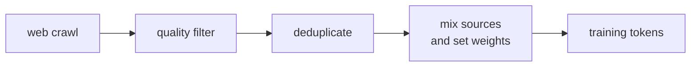

Training a large language model begins before a single gradient is computed: with
**data curation**. The quality and composition of the pretraining corpus is one of the
largest determinants of model capability, often more important than architectural choices<FN n="1" />.

## Sources

**Common Crawl** is the dominant source: petabytes of raw web data, re-crawled monthly.
Roughly 70% of the pretraining data for most open LLMs originates here.

Other high-quality sources:

- **Books:** Project Gutenberg, Books3, BookCorpus -- long-form coherent text that trains
  on long-range dependencies.
- **Code:** GitHub, The Stack, StarCoder data -- improves reasoning and structured output.
- **Scientific papers:** ArXiv, Semantic Scholar -- technical vocabulary and reasoning.
- **Wikipedia and Wikidata:** factual, encyclopedic text in many languages.
- **Curated high-quality web:** OpenWebText, C4 (Google's cleaned CommonCrawl), FineWeb.

## Quality filtering

Raw web data is mostly noise. A multi-stage filtering pipeline removes low-quality content:

**1. Language identification.** Keep only the target language(s). FastText language ID on
every document; discard anything with confidence < 0.65.

**2. Perplexity filter.** Train a small n-gram LM on high-quality text (Wikipedia).
Compute perplexity of each web document; discard the high-perplexity tail (random text,
spam, machine-generated filler).

**3. Heuristic filters.** Rules that fire on known low-quality patterns:
- Documents shorter than 100 tokens (stubs).
- Documents where most "words" are not in a dictionary.
- Documents with excessive punctuation, repetition, or boilerplate.
- HTML artifacts (excessive tags, escape sequences).

**4. Safety filtering.** Remove known CSAM hashes (PhotoDNA), extreme hate speech
(classifiers), and personal information (PII scrubbing with regex + NER).

## Deduplication

Near-duplicate documents inflate the effective dataset size without adding information,
and can cause **memorization** (the model learns to copy rather than generalize).

**MinHash / LSH deduplication.** Represent each document as a set of $k$-shingles (n-grams
of characters or tokens). Two documents are near-duplicates if their Jaccard similarity
$|A \cap B| / |A \cup B|$ exceeds a threshold (typically 0.8). MinHash with locality-
sensitive hashing (LSH) finds approximate near-duplicates in $O(N)$ rather than $O(N^2)$.

**Exact deduplication.** SHA-256 hashes of document text; remove identical documents.

The Chinchilla paper found that deduplication improved data quality enough to shift the
optimal data mix significantly -- 1T deduplicated tokens is worth more than 2T raw tokens<FN n="2" />.

## Domain mixing

Different domains contribute different capabilities. A pure web corpus is mediocre at
code, math, and multi-step reasoning. LLaMA-3 and Qwen report mixing ratios approximately:

| Domain | Rough weight |
|--------|-------------|
| Web text | 45-60% |
| Code | 15-25% |
| Books | 5-10% |
| Scientific text | 5-10% |
| Wikipedia | 2-5% |
| Multilingual | varies |

These are rough; exact ratios are closely guarded. Code-heavy mixes improve reasoning
("let's think step by step" is a form of code-style planning).

## Data curricula

**Static mix:** sample from all domains at fixed proportions throughout training.

**Curriculum learning:** change the mix during training. A common pattern:
1. Early training: broad web data for general language understanding.
2. Mid training: upweight code, math, and high-quality text.
3. Cool-down: fine-tuning-adjacent data (instruction following, conversations).

LLaMA-3's "annealing" phase in the last ~10% of tokens upweights high-quality sources
(GitHub, scientific papers) and runs at a very low learning rate.

## Tokenization and sequence packing

After filtering, documents are tokenized and packed into fixed-length windows (e.g.,
4096 or 8192 tokens). **Packing without padding:** concatenate documents with a separator
token and slice into fixed-length chunks. This maximizes GPU utilization -- no wasted
compute on padding tokens.

For long documents that span multiple chunks, the model never sees the document boundary
across chunks (gradient is not backpropagated across chunk boundaries in most implementations).

## Exercises

**Exercise 1.** Two web documents share most of their text. Document $A$ has token set
of size $1000$, document $B$ has $1200$, and their intersection is $900$ tokens. Compute
the Jaccard similarity $|A \cap B| / |A \cup B|$ and decide whether a MinHash deduplication
threshold of $0.8$ would mark them as near-duplicates.

Solution

**Step 1.** The union size by inclusion-exclusion is
$|A \cup B| = |A| + |B| - |A \cap B| = 1000 + 1200 - 900 = 1300$.

**Step 2.** The Jaccard similarity is

$$
J = \frac{|A \cap B|}{|A \cup B|} = \frac{900}{1300} \approx 0.692.
$$

**Step 3.** Since $0.692 < 0.8$, the pair falls below the threshold and is **not** marked
a near-duplicate. The two documents are kept as distinct, despite sharing 900 tokens,
because the union is large enough that the overlap fraction stays under the cutoff.

**Exercise 2.** A pretraining mix targets these proportions: web $50\%$, code $25\%$,
books $10\%$, scientific $10\%$, Wikipedia $5\%$. The available corpus has $10\text{T}$ web,
$1\text{T}$ code, $0.5\text{T}$ books, $0.5\text{T}$ scientific, $0.2\text{T}$ Wikipedia
tokens. If you train on a total of $2\text{T}$ tokens at the target proportions, which
domains require **upsampling** (seeing examples more than once), and by what factor for code?

Solution

**Step 1.** Target token counts at $2\text{T}$ total: web $1\text{T}$, code $0.5\text{T}$,
books $0.2\text{T}$, scientific $0.2\text{T}$, Wikipedia $0.1\text{T}$.

**Step 2.** Compare each target to what the corpus holds. Web: need $1\text{T}$, have
$10\text{T}$, fine. Code: need $0.5\text{T}$, have $1\text{T}$, fine. Books: need $0.2\text{T}$,
have $0.5\text{T}$, fine. Scientific: need $0.2\text{T}$, have $0.5\text{T}$, fine. Wikipedia:
need $0.1\text{T}$, have $0.2\text{T}$, fine.

**Step 3.** At a $2\text{T}$ budget, every domain has enough unique tokens, so no upsampling
is required; the code factor is $0.5\text{T}/1\text{T} = 0.5$, meaning code is in fact
**downsampled** (half of it is used once). Upsampling would only be forced at a larger budget:
for example at $6\text{T}$ total, code's target $1.5\text{T}$ exceeds its $1\text{T}$ of
unique tokens, requiring a $1.5\times$ repeat.

**Exercise 3.** The Chinchilla finding is that "1T deduplicated tokens is worth more than
2T raw tokens." Frame this as a design trade-off: a team can spend a fixed engineering
budget either on a more aggressive deduplication pass (halving the corpus but removing
near-duplicates) or on crawling twice as much raw web data. Argue which they should prefer
and name the failure mode the dedup pass prevents.

Solution

**Step 1.** Identify the quantity that matters. Training loss scales with the number of
**informative** tokens, not raw tokens. Near-duplicate documents add token count without
adding new information, so raw size overstates the effective dataset.

**Step 2.** Compare the two options. Crawling twice as much raw web data brings in more
near-duplicates (the web is heavily mirrored), so a large fraction of the added tokens is
redundant; the effective dataset grows far less than $2\times$. The dedup pass removes the
redundancy already present, raising the informative fraction of every token seen.

**Step 3.** Name the failure mode. Training repeatedly on near-duplicates drives
**memorization**: the model learns to copy frequent passages verbatim rather than
generalize, and verbatim memorization also raises privacy and contamination risk. The
Chinchilla result says the dedup pass is the better spend: deduplicated tokens carry more
signal per token, so $1\text{T}$ clean tokens beat $2\text{T}$ raw ones.

With a clean, mixed, deduplicated corpus in hand, the next question is how large a model
and how many of these tokens to train on, which the scaling-laws lesson answers.

<Footnotes>
  <FNItem n="1">**Brown, T., et al.** (2020). "Language models are few-shot learners (GPT-3)".
    *NeurIPS*. [arXiv:2005.14165](https://arxiv.org/abs/2005.14165). Trained on a curated, filtered, and weighted mixture of Common Crawl, WebText, Books, and Wikipedia.</FNItem>
  <FNItem n="2">**Hoffmann, J., et al.** (2022). "Training compute-optimal large language models (Chinchilla)".
    *NeurIPS*. [arXiv:2203.15556](https://arxiv.org/abs/2203.15556). Source of the deduplication and data-quality findings discussed here.</FNItem>
</Footnotes>
