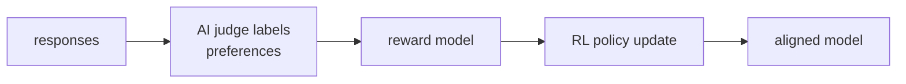

RLHF relies on human annotators to label preferences, which is expensive, slow, and hard
to scale. **Reinforcement Learning from AI Feedback (RLAIF)** replaces human feedback with
AI-generated feedback: a strong AI supervisor (the "critic") evaluates or revises responses
based on a set of principles, and those AI labels are used to train the target policy<FN n="2" />.

## Constitutional AI (CAI)

**Constitutional AI (Anthropic, 2022)** is the original RLAIF approach<FN n="1" />. It proposes a
two-stage process guided by a written **constitution** -- a set of human-authored principles
describing desired behavior (helpful, harmless, honest, not discriminatory, etc.).

### Stage 1: Supervised learning from AI revisions (SL-CAI)

1. **Generate initial responses.** The model responds to prompts, including potentially
   harmful ones (to expose failure modes).
2. **Critique with the constitution.** A supervisor model (often the same model, or a
   stronger one) is prompted to critique the response based on a randomly selected
   constitutional principle:
   > *"Identify ways in which the assistant's last response is harmful, unethical, racist,
   > sexist, toxic, dangerous, or illegal."*
3. **Revise.** The supervisor is then prompted to revise the response to address its critique.
4. **Supervised fine-tuning.** Fine-tune the target model on (prompt, revised response) pairs.

Repeating critique-and-revise multiple times improves response quality.

### Stage 2: RL from AI feedback (RLAIF)

1. **Generate preference data from AI comparisons.** Present pairs of responses to the
   supervisor model and ask it to choose which is less harmful based on a constitutional
   principle:
   > *"Which response is less likely to contain harmful or unethical content?"*
2. **Train a reward model** on these AI-labeled pairs (using the BT framework as in RLHF).
3. **RL fine-tuning.** Apply PPO or DPO using the AI-trained reward model.

The entire feedback loop requires **no human preference annotation** after the initial
constitution is written.

## The constitution

A typical CAI constitution includes principles such as:

- Choose the response that is least likely to contain harmful, biased, or dishonest content.
- Prefer responses that acknowledge uncertainty when appropriate.
- Choose responses that least likely assist in planning or executing harmful actions.
- Prefer responses that best balance helpfulness with harmlessness.

These are abstract principles; the AI evaluator interprets them in context. Different
principles are randomly sampled for different comparisons, providing diverse supervision.

## Self-critique chain

A key insight from CAI: the **same model** used to generate responses can be prompted to
critique them, without a separate stronger model. A model can identify problems it created
when given explicit prompting to look for them.

This self-critique chain is a form of **process supervision**: the model has access to
its own intermediate reasoning. The revised responses are often substantially safer and
more helpful than the original, demonstrating that the model "knows" what a better response
looks like even if it doesn't produce it without explicit prompting.

## Scalable oversight

RLAIF is an instance of the broader research agenda of **scalable oversight**: designing
supervision mechanisms that remain effective as AI systems become more capable than human
supervisors.

As AI capabilities grow:
- Humans cannot verify complex reasoning steps.
- AI supervisors can evaluate arguments humans cannot.
- The constitution provides a fixed, human-authored value anchor even when the AI supervisor
  is much more capable than the human annotators.

**Iterated amplification:** a related approach where a human augmented by an AI assistant
acts as the supervisor for training a more capable AI -- forming a recursive oversight
structure. Weak Supervision (next lesson E8) provides an empirical test of this idea.

## RLAIF vs RLHF in practice

| Aspect | RLHF | RLAIF |
|--------|------|-------|
| Feedback cost | High (human annotators) | Low (API calls to supervisor) |
| Speed | Slow (annotation pipeline) | Fast (automated) |
| Scale | Limited by annotator throughput | Scales with compute |
| Quality | Human-grounded, diverse | Depends on supervisor quality |
| Consistency | Low (inter-annotator disagreement) | High |
| Bias | Human biases | Supervisor model biases |

**Hybrid approach (LLM-as-judge):** modern systems use RLHF for initial alignment and
RLAIF for continued self-improvement. Frameworks like Llama-2-chat use human feedback for
safety-critical principles and LLM-generated feedback for general helpfulness.

## Exercises

**Exercise 1.** Trace the two stages of Constitutional AI for a single harmful prompt.
Name the model role acting at each step, the input it consumes, and the output it produces,
from the initial response through to the data used to train the reward model.

Solution

**Step 1.** SL-CAI, generate. The base policy consumes the (possibly harmful) prompt and
produces an initial response, deliberately including failure modes.

**Step 2.** SL-CAI, critique. A supervisor model consumes the response plus a randomly
sampled constitutional principle and produces a critique identifying how the response
violates that principle.

**Step 3.** SL-CAI, revise then fine-tune. The supervisor consumes the response and its
critique and produces a revised response; the target model is then supervised-fine-tuned on
(prompt, revised response) pairs.

**Step 4.** RLAIF stage. The supervisor consumes pairs of responses plus a principle and
produces a preference label (which is less harmful). These AI-labeled pairs are the
training data for a Bradley-Terry reward model, which then drives PPO or DPO. No human
preference annotation enters after the constitution is written.

**Exercise 2.** The RLHF-vs-RLAIF table lists RLAIF as high consistency, low cost, and
fast, but its quality "depends on supervisor quality" and it inherits "supervisor model
biases." Design a hybrid pipeline that keeps RLAIF's scale while bounding its worst failure
mode, and justify which signal you route to humans versus the AI supervisor.

Solution

**Step 1.** Identify the worst failure mode. A biased or miscalibrated AI supervisor can
systematically mislabel a whole category (e.g. safety-critical refusals) at scale, and
because RLAIF is consistent it will reproduce that bias uniformly rather than averaging it
out across annotators.

**Step 2.** Route by stakes. Send safety-critical and value-laden judgments (harm,
legality, deception) to human annotators, where the cost is justified and the human-authored
constitution anchors the values. Send high-volume, lower-stakes judgments (general
helpfulness, style, formatting) to the AI supervisor, where throughput matters and errors
are cheap.

**Step 3.** Justify the split. This is the Llama-2-chat pattern: humans set the value
anchor and cover the cases where a supervisor bias would be most damaging, while RLAIF
supplies the volume of feedback that human annotation cannot match. The constitution gives
both signals a shared, fixed reference so the AI supervisor stays aligned to human-authored
principles even as it scales.

**Exercise 3.** Scalable oversight asks how supervision stays effective when the AI exceeds
human ability to verify its reasoning. Explain why a fixed written constitution is the part
of the CAI pipeline that addresses this, and identify one way the self-critique chain could
still fail even with a good constitution.

Solution

**Step 1.** State the scalable-oversight problem. As the supervisor model surpasses humans,
humans can no longer check individual judgments, so the supervision signal cannot come from
per-example human verification.

**Step 2.** Locate the human anchor. The constitution is human-authored and fixed: it
encodes the values once, in natural language, and the (possibly superhuman) AI supervisor
interprets and applies them. Humans verify the principles, not every judgment, so the
anchor scales independently of how capable the supervisor becomes.

**Step 3.** Name a residual failure. Even with a sound constitution, the self-critique
chain relies on the same model recognizing its own faults. If the model is systematically
blind to a class of harm (it does not represent the harm as a violation of any principle),
its critiques will miss that class, and the revised data will encode the blind spot. The
constitution bounds the values but not the model's ability to perceive when they are
breached; this is the gap that empirical tests of weak-to-strong supervision probe.

The constitution fixes the values; the open question of how far a weaker supervisor can
steer a stronger model is what the weak supervision lesson takes up next.

<Footnotes>
  <FNItem n="1">**Bai, Y., et al.** (2022). "Constitutional AI: harmlessness from AI feedback".
    [arXiv:2212.08073](https://arxiv.org/abs/2212.08073). The self-critique, revision, and AI-preference pipeline guided by a written constitution.</FNItem>
  <FNItem n="2">**Lee, H., et al.** (2023). "RLAIF: scaling reinforcement learning from human feedback with AI feedback".
    [arXiv:2309.00267](https://arxiv.org/abs/2309.00267). Shows AI-labeled preferences can match human feedback for RL fine-tuning.</FNItem>
</Footnotes>
