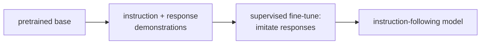

A pretrained language model generates plausible continuations of text -- it is a good
completion engine. It is not (yet) an instruction follower: ask it a question and it may
continue generating questions rather than answering them. **Supervised fine-tuning (SFT)**
bridges this gap by training on (instruction, response) pairs where responses are
human-written or human-curated.

## The SFT objective

SFT is standard next-token prediction, but restricted to the **completion** tokens:

$$
\mathcal{L}_{\text{SFT}} = -\sum_{t \in \text{response}} \log p(x_t \mid x_{<t}; \theta).
$$

The prompt tokens are included in the context (the model reads them) but are **not
included in the loss** (the model is not penalized for the prompt text). Only the
model's response tokens count.

This is implemented by applying a **mask** to the loss: zero out positions corresponding
to the prompt, compute cross-entropy only on response positions.

## Data format

SFT data consists of conversations formatted with role markers:

```
<|system|>
You are a helpful, harmless, and honest assistant.
<|user|>
Explain the difference between precision and recall.
<|assistant|>
Precision measures how many of your positive predictions were actually positive...
<|end|>
```

The exact format (special tokens, delimiters) varies by model family. What matters:
the model learns to recognize the structure and generate the assistant turn.

## Data quality over quantity

SFT with a small number of high-quality examples often outperforms SFT with a large number
of mediocre ones.

- **LIMA (Zhou et al., 2023):** 1000 carefully curated examples achieved near-RLHF-quality
  instruction following on many tasks.
- **Alpaca vs WizardLM:** WizardLM's "Evol-Instruct" (LLM-generated more complex variants
  of simple instructions) significantly outperformed the original Alpaca dataset (52K GPT-3
  distillation examples) despite similar size.

**Sources of SFT data:**
- Human demonstrations (expensive but highest quality).
- LLM distillation: generate responses with a stronger teacher model (GPT-4, Claude), curate.
- RLHF-selected responses: use a reward model to select good completions.

## Formatting matters

SFT implicitly teaches the model the **conversation format** it should follow at inference.
Inconsistent formatting (different system prompt styles, missing end tokens) in the SFT
data leads to format errors at inference.

## Catastrophic forgetting

Fine-tuning on SFT data can degrade capabilities learned during pretraining if:
- The SFT dataset is too small or domain-narrow.
- The learning rate is too high.

Mitigations:
- Mix a small fraction of pretraining data into SFT training.
- Use low learning rates (1e-5 to 5e-5).
- LoRA fine-tuning (next lesson) avoids forgetting by keeping most pretrained weights frozen.



## SFT vs prompting

An alternative to SFT is **few-shot prompting**: include examples of (instruction, response)
in the prompt context and let the base model continue. SFT is preferable when:
- The desired format is consistent and learnable.
- Response quality matters more than cost (SFT bakes the style in rather than spending tokens
  on examples every inference).
- The target behavior is hard to specify through examples alone.

```python-static
from transformers import AutoModelForCausalLM, AutoTokenizer, TrainingArguments, Trainer
from datasets import Dataset

model_name = "meta-llama/Llama-3.2-1B"
tokenizer  = AutoTokenizer.from_pretrained(model_name)
model      = AutoModelForCausalLM.from_pretrained(model_name)

sft_data = [
    {"instruction": "What is backpropagation?",
     "response": "Backpropagation is the algorithm used to compute gradients..."},
    {"instruction": "Explain gradient descent.",
     "response": "Gradient descent is an optimization algorithm that..."},
]

def format_and_tokenize(example):
    prompt = f"<|user|>\n{example['instruction']}\n<|assistant|>\n"
    full   = prompt + example["response"] + tokenizer.eos_token
    tokens = tokenizer(full, truncation=True, max_length=512)
    # Mask the prompt tokens in labels
    prompt_len  = len(tokenizer(prompt)["input_ids"])
    labels      = [-100] * prompt_len + tokens["input_ids"][prompt_len:]
    tokens["labels"] = labels
    return tokens

dataset = Dataset.from_list(sft_data).map(format_and_tokenize)
args    = TrainingArguments(output_dir="sft_out", num_train_epochs=3, learning_rate=2e-5)
trainer = Trainer(model=model, args=args, train_dataset=dataset)
trainer.train()
```

SFT is the first of three stages in RLHF. The SFT model is the starting point for reward
modeling and policy optimization, which the next lessons derive.
