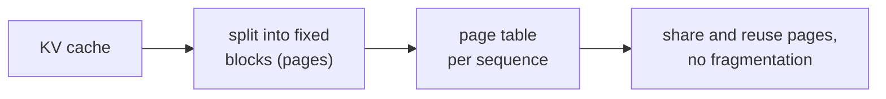

In production LLM serving, requests arrive at different times and have different prompt
and generation lengths. Naive serving allocates a contiguous block of GPU memory per
request -- large enough for the maximum possible output length. This wastes memory and
limits concurrency.

**PagedAttention** (Kwon et al., 2023, vLLM) and **continuous batching** are the two
key techniques that make production LLM serving efficient<FN n="1" />.

## The memory waste problem

A 70B model at 4-bit quantization uses ~35GB for weights. On a single 80GB A100:
- Weights: 35GB
- Available for KV cache: 45GB

At sequence length 4096, one 70B LLaMA-3 request uses ~320MB of KV cache (see kv-cache
lesson). Serving 140 concurrent requests would need 44.8GB -- just barely fitting.

**The problem:** a request that will generate 200 tokens but was allocated space for 4096
wastes 3896 token slots. With fragmented, variable-length sequences, effective utilization
of the KV cache is typically 20-40%.

## PagedAttention: OS-inspired memory management

PagedAttention treats KV cache memory like an OS virtual memory system:

**Physical KV blocks:** the GPU memory is divided into fixed-size **blocks** (typically
16 or 32 token slots). Each block stores the K and V tensors for a fixed number of tokens.

**Logical sequence:** each request has a **logical sequence** of KV entries. Logical
sequence positions are mapped to physical blocks via a **block table** (like a page table
in virtual memory).

**Non-contiguous storage:** consecutive logical tokens can reside in non-contiguous physical
blocks. The attention kernel is modified to follow the block table when loading K and V.

**Benefits:**
- **No pre-allocation waste:** blocks are allocated on-demand as tokens are generated.
- **Block sharing:** multiple requests that share the same prompt prefix can share the
  same physical KV blocks (copy-on-write if they diverge). This is critical for
  chatbot system prompts shared across thousands of sessions.
- **Fragmentation $\approx$ 0:** less than one block of waste per sequence.

## Block table example

For a sequence with 5 tokens, block size 2:

```
Logical sequence:  [t0, t1, t2, t3, t4]
Block table:       {0 -> block 7, 1 -> block 3, 2 -> block 11}
                   (logical block 0 = tokens 0-1 stored in physical block 7, etc.)
```

The attention kernel uses the block table to locate and load the correct K,V tensors
during each attention computation.

## Attention kernel modification

Standard causal attention computes:

$$
\text{Attn}(q_t) = \text{softmax}\!\left(\frac{q_t K_{0:t}^\top}{\sqrt{d_k}}\right) V_{0:t}.
$$

With PagedAttention, $K_{0:t}$ and $V_{0:t}$ are loaded block-by-block, following the
block table. Each block is fetched from its physical location and the attention accumulates
across blocks using a running softmax numerically.

## Continuous batching

**Without continuous batching (static batching):** a batch of $B$ requests runs
together until the longest request finishes. Short requests in the batch complete early
but hold their GPU slots, blocking new requests.

**Continuous batching (Orca, 2022):** replace finished requests with new ones at the
end of each decode step, without waiting for the entire batch to finish.

```
Step 1: [req_A, req_B, req_C, req_D]  -- all decoding
Step 2: [req_A, req_B, req_C, req_D]  -- req_C finishes
Step 3: [req_A, req_B,  req_E, req_D]  -- req_E immediately starts (infill)
Step 4: [req_A,  req_F,  req_E, req_D]  -- req_B finishes, req_F starts
```

This "in-flight batching" keeps the GPU fully saturated. In combination with PagedAttention,
it enables fine-grained scheduling of token generation across hundreds of concurrent requests.

## Prefill-decode disaggregation

A newer architectural pattern: separate the prefill and decode compute onto different GPU
pools.

- **Prefill workers:** compute-bound; process full prompts in batches. Can run at high
  utilization because all tokens process in parallel.
- **Decode workers:** memory-bandwidth bound; generate tokens autoregressively.
  Continuous batching maximizes their utilization.

This disaggregation avoids the "prefill-decode interference" problem (a long prefill
blocks all decode steps in the same batch) and allows independent scaling of each phase.



## Impact

In the original vLLM paper, PagedAttention + continuous batching achieved:
- 2-4x higher throughput than HuggingFace Transformers' naive batching.
- Near-zero KV cache fragmentation vs. 60-80% waste with static allocation.

These techniques are now standard in all production LLM serving frameworks (vLLM, TGI,
SGLang, TensorRT-LLM).

## Exercises

**Exercise 1.** A request generates 200 tokens but naive serving pre-allocated KV
slots for the model's 4096-token maximum. Compute the fraction of allocated KV
memory actually used, then the effective utilization if the GPU runs 100 such
requests in parallel with the same pattern.

<details>
<summary>Solution</summary>

**Step 1.** The request uses $200$ of $4096$ pre-allocated slots:

$$
\frac{200}{4096} = 0.0488,
$$

about $4.9\%$ utilization. The other $3896$ slots are reserved and wasted for the
life of the request.

**Step 2.** Utilization is a per-slot ratio, so 100 identical requests each waste the
same proportion; the aggregate utilization is still $4.9\%$. Static pre-allocation to
the maximum length is what makes naive serving waste $60$ to $80\%$ of the KV cache in
practice, and the fix is to allocate on demand rather than to the worst case.

</details>

**Exercise 2.** PagedAttention uses fixed blocks of 16 token slots. A sequence has
70 tokens. How many blocks does it occupy, how many slots are wasted in the last
block, and what is the internal fragmentation as a fraction of the sequence length?

<details>
<summary>Solution</summary>

**Step 1.** Blocks needed is the ceiling of $70/16$. Since $4 \times 16 = 64 < 70$
and $5 \times 16 = 80 \ge 70$, the sequence occupies $5$ blocks ($80$ slots).

**Step 2.** The last block holds $70 - 64 = 6$ live tokens, so $16 - 6 = 10$ slots
are wasted.

**Step 3.** Fragmentation as a fraction of the sequence is $10/70 = 0.143$, but the
meaningful bound is that waste never exceeds one block per sequence regardless of
length: at $T = 700$ tokens the same $\le 10$ wasted slots are $1.4\%$. Paging caps
internal fragmentation at under one block per request, versus the thousands of wasted
slots under max-length pre-allocation.

</details>

**Exercise 3.** A chat service has 500 concurrent sessions that all share an
identical 1000-token system prompt, then diverge. Compare the KV cache used for the
shared prefix with and without PagedAttention's copy-on-write block sharing (use the
$1$ MiB-per-token figure from the kv-cache lesson), and state the assumption that
makes the sharing safe.

<details>
<summary>Solution</summary>

**Step 1.** Without sharing, each session stores its own copy of the 1000-token
prefix: $500 \times 1000 \times 1 \text{ MiB} = 500{,}000$ MiB $\approx 488$ GiB of
KV cache for the prefix alone.

**Step 2.** With block sharing, the identical prefix is stored once and all 500 block
tables point to the same physical blocks: $1 \times 1000 \times 1 \text{ MiB} = 1000$
MiB $\approx 0.98$ GiB, a $500\times$ reduction on the shared region.

**Step 3.** The sharing is safe only because the prefix blocks are read-only while
shared: keys and values of a generated token never change once written (the kv-cache
lesson's reusability argument). When a session generates its first divergent token it
triggers copy-on-write, allocating a private block from that point on, so correctness
is preserved while the common prefix stays shared.

</details>

<Footnotes>
  <FNItem n="1">**Kwon, W., et al.** (2023). "Efficient memory management for large language model serving with PagedAttention".
    *SOSP*. [arXiv:2309.06180](https://arxiv.org/abs/2309.06180). The vLLM paper: paged KV blocks, copy-on-write prefix sharing, and continuous batching.</FNItem>
</Footnotes>
