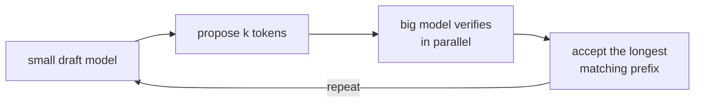

Autoregressive decoding is inherently sequential: each token depends on all previous ones,
so the $T$ decode steps cannot be parallelized. The target model sits idle for most of the
decode phase -- it is memory-bandwidth bound, not compute bound.

**Speculative decoding (Leviathan et al., 2023; Chen et al., 2023)** exploits this idle
compute: a small, fast **draft model** generates $k$ tokens in parallel (or near-parallel),
then the large **target model** verifies all $k$ in a single forward pass<FN ns="1, 2" />.

## The algorithm

1. **Draft:** the draft model generates $k$ candidate tokens $x_1', \dots, x_k'$
   autoregressively. The draft model is much smaller ($7\text{B}$ draft for a $70\text{B}$
   target; the target model itself can be used with early exit as the draft).

2. **Verify:** run the target model on the $k+1$ tokens (the last accepted token +
   all $k$ drafts) in a **single parallel forward pass**, producing $k+1$ distributions
   $q_1, \dots, q_{k+1}$.

3. **Accept or reject:** for each draft token $x_i'$, accept or reject using the
   ratio $q_i(x_i') / p_i(x_i')$:

   - Sample $u \sim \text{Uniform}[0, 1]$.
   - If $u \le q_i(x_i') / p_i(x_i')$: **accept** $x_i'$ and move to token $i+1$.
   - Otherwise: **reject**, sample a corrected token from the adjusted distribution, and
     stop (tokens $i+1, \dots, k$ are discarded).

4. **Correction:** if token $i$ is rejected, sample from:

   $$
   p_{\text{adj}}(x) \propto \max(0,\, q_i(x) - p_i(x)).
   $$

   This ensures the corrected sample is drawn from $q_i$, not $p_i$.

## The acceptance-rejection scheme preserves the target distribution

**Claim:** the accepted tokens are sampled exactly from $q$ (the target distribution),
regardless of the draft distribution $p$.

**Proof sketch for one token:** Let $q(x)$ be the target distribution and $p(x)$ the draft.

The probability of accepting draft token $x$:

$$
P(\text{accept}\ x) = p(x) \cdot \min\!\left(1, \frac{q(x)}{p(x)}\right) = \min(p(x), q(x)).
$$

The probability of a token $x$ being the output (either accepted or sampled from adjusted):

$$
P(\text{output} = x) = \min(p(x), q(x)) + P(\text{reject}) \cdot p_{\text{adj}}(x).
$$

With $p_{\text{adj}}(x) = \max(0, q(x) - p(x)) / Z$ and $Z = \sum_x \max(0, q(x) - p(x))$:

$$
P(\text{output} = x) = \min(p(x), q(x)) + Z \cdot \frac{\max(0, q(x) - p(x))}{Z} = q(x). \quad \square
$$

The scheme is **lossless**: the output distribution is exactly the target, not an
approximation.

## Expected speedup

Each verification call takes one target-model forward pass (same cost as a single decode
step, but processes $k+1$ positions in parallel). Expected accepted tokens per verification:

$$
\mathbb{E}[\text{accepted}] = k \cdot \mathbb{E}[\text{acceptance rate}] \approx k \cdot \alpha,
$$

where $\alpha = \sum_x \min(p(x), q(x))$ is the expected overlap between the draft and
target distributions.

**Speedup:** $\approx \frac{1 + k \alpha}{1 + k/\text{(draft speed relative to target)}}$.

If the draft model is $8\times$ faster and $\alpha = 0.8$, $k = 4$:
- Tokens per time unit without speculative decoding: 1.
- Tokens per time unit with speculative decoding: $(1 + 4 \times 0.8) / (1 + 4/8) = 4.2 / 1.5 \approx 2.8$.

Real-world speedups: 2-4x for code generation (drafts predict common patterns well);
1.5-2x for diverse generation (lower acceptance rate).

## Implementation (conceptual)

```python
import numpy as np

def speculative_decode_step(target, draft, context, k=4):
    """
    target, draft: callable context -> (vocab_size,) probabilities
    context: list of token ids so far
    Returns: newly accepted token ids
    """
    rng = np.random.default_rng()

    # 1. Draft k tokens
    draft_tokens = []
    draft_probs  = []
    ctx = list(context)
    for _ in range(k):
        p = draft(ctx)
        t = rng.choice(len(p), p=p)
        draft_tokens.append(t)
        draft_probs.append(p[t])
        ctx.append(t)

    # 2. Verify all k drafts in parallel
    # Target processes [context + draft_tokens] in one pass, returns q at each draft position
    all_ctx = list(context) + draft_tokens
    q_list  = target.parallel_forward(all_ctx, n_positions=k)  # list of k distributions

    # 3. Accept-reject
    accepted = []
    for i, (x, p_x, q) in enumerate(zip(draft_tokens, draft_probs, q_list)):
        q_x = q[x]
        r   = rng.random()
        if r <= q_x / (p_x + 1e-9):
            accepted.append(x)
        else:
            # Sample from adjusted distribution
            adj = np.maximum(0, q - draft(list(context) + accepted))
            adj /= adj.sum() + 1e-9
            accepted.append(rng.choice(len(adj), p=adj))
            break   # stop at first rejection

    # 4. One extra token from target if all accepted
    if len(accepted) == k:
        q_last = target(list(context) + accepted)
        accepted.append(rng.choice(len(q_last), p=q_last))

    return accepted
```



## Variants

**Self-speculative decoding:** use the target model with early exit as the draft -- faster
early layers generate drafts, full model verifies. No separate model needed.

**Medusa:** add parallel prediction heads to the target model that predict $k$ tokens ahead
simultaneously. Lower hardware cost than a separate draft model.

**EAGLE:** predicts draft tokens by conditioning on the target model's hidden states at
the last accepted position, achieving higher acceptance rates than independent draft models.

## Exercises

**Exercise 1.** For a single token the draft and target distributions over three
outcomes are $p = (0.5, 0.3, 0.2)$ and $q = (0.6, 0.1, 0.3)$. Compute the
per-token acceptance probability $\alpha = \sum_x \min(p(x), q(x))$, and confirm the
adjusted distribution $p_{\text{adj}}(x) \propto \max(0, q(x) - p(x))$ is a valid
distribution.

<details>
<summary>Solution</summary>

**Step 1.** Take the elementwise minimum of $p$ and $q$: $\min(0.5, 0.6) = 0.5$,
$\min(0.3, 0.1) = 0.1$, $\min(0.2, 0.3) = 0.2$. Their sum is

$$
\alpha = 0.5 + 0.1 + 0.2 = 0.8.
$$

**Step 2.** The unnormalized residual is $\max(0, q - p) = (0.1, 0, 0.1)$, summing
to $Z = 0.2$. Note $Z = 1 - \alpha = 0.2$, as it must, since the accepted mass and
the residual mass partition the target. Normalizing gives $p_{\text{adj}} =
(0.5, 0, 0.5)$, which is nonnegative and sums to $1$, a valid distribution.

</details>

**Exercise 2.** A draft model proposes $k = 4$ tokens, the draft is $8\times$ faster
than the target, and the per-token acceptance rate is $\alpha = 0.8$. Using the
speedup expression $\frac{1 + k\alpha}{1 + k/s}$ with $s$ the draft speed ratio,
compute the speedup, then explain why pushing $k$ to $20$ at the same $\alpha$ does
not multiply the gain by five.

<details>
<summary>Solution</summary>

**Step 1.** Substitute $k = 4$, $\alpha = 0.8$, $s = 8$:

$$
\frac{1 + 4 \cdot 0.8}{1 + 4/8} = \frac{1 + 3.2}{1 + 0.5} = \frac{4.2}{1.5} = 2.8.
$$

**Step 2.** At $k = 20$ the same formula gives $\frac{1 + 20 \cdot 0.8}{1 + 20/8}
= \frac{17}{3.5} = 4.86$, not $14$. The numerator grows linearly in $k$, but so does
the denominator (each drafted token still costs draft time), and the expected number
of accepted tokens is bounded by the geometric truncation at the first rejection:
once a draft is rejected the remaining drafts are discarded, so the realized
acceptance run averages $\frac{1 - \alpha^{k+1}}{1 - \alpha}$, which saturates near
$\frac{1}{1-\alpha} = 5$ tokens regardless of how large $k$ gets. Beyond that, longer
drafts mostly add wasted draft work.

</details>

**Exercise 3 (code).** Verify the losslessness claim empirically. With $p$ and $q$
from Exercise 1, run the single-token accept-reject scheme many times in numpy and
check the empirical output distribution matches $q$.

<details>
<summary>Solution</summary>

```python
import numpy as np

rng = np.random.default_rng(0)
p = np.array([0.5, 0.3, 0.2])
q = np.array([0.6, 0.1, 0.3])
Z = np.maximum(0, q - p).sum()
p_adj = np.maximum(0, q - p) / Z

N = 400_000
counts = np.zeros(3)
for _ in range(N):
    x = rng.choice(3, p=p)                  # draft a token
    if rng.random() <= q[x] / p[x]:         # accept with prob min(1, q/p)
        counts[x] += 1
    else:
        counts[rng.choice(3, p=p_adj)] += 1 # else sample the residual
emp = counts / N
assert np.allclose(emp, q, atol=0.01)       # output distribution equals the target
print("empirical:", emp.round(3), " target:", q)
```

The empirical frequencies land on $q$ within sampling noise: the accept-reject
correction reproduces the target distribution exactly, independent of the draft $p$.

</details>

The next lesson cuts the other half of the inference bill, the weight memory itself,
by quantizing the model below 16-bit precision.

<Footnotes>
  <FNItem n="1">**Leviathan, Y., Kalman, M., & Matias, Y.** (2023). "Fast inference from transformers via speculative decoding".
    *ICML*. [arXiv:2211.17192](https://arxiv.org/abs/2211.17192). Introduces the draft-verify scheme and proves it preserves the target distribution.</FNItem>
  <FNItem n="2">**Chen, C., et al.** (2023). "Accelerating large language model decoding with speculative sampling".
    [arXiv:2302.01318](https://arxiv.org/abs/2302.01318). Concurrent formulation of speculative sampling for large autoregressive models.</FNItem>
</Footnotes>
