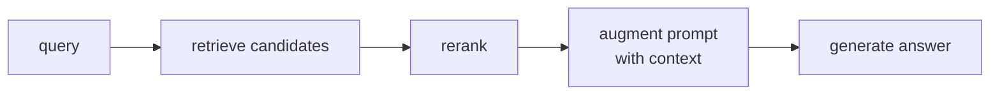

Basic RAG retrieves passages using a query embedding, then passes them to an LLM<FN n="1" />. Several
failure modes motivate extensions: query-document mismatch (the query is short and
keyword-sparse while documents are verbose), poor passage ranking (relevant but non-top
passages missed), and disconnected facts (answers requiring multi-hop reasoning across
multiple documents). Three techniques address these systematically.

## HyDE: Hypothetical Document Embeddings

**HyDE (Gao et al., 2022)** inverts the retrieval direction: instead of searching for
documents similar to the query, first generate a **hypothetical answer** to the query,
then retrieve documents similar to that hypothetical answer.

```
1. Query: "What are the side effects of aspirin?"
2. LLM generates hypothetical document:
   "Aspirin commonly causes gastrointestinal side effects such as nausea, stomach
    pain, and bleeding. It can also cause tinnitus at high doses..."
3. Embed the hypothetical document.
4. Retrieve the actual documents most similar to this embedding.
```

**Why this helps:** the hypothetical document is in the same style and vocabulary as
the actual corpus, reducing the query-document distributional mismatch. The query embedding
is a short keyword cluster; the hypothetical document is in the space of possible answers.

**When it hurts:** if the LLM generates a hallucinated hypothetical answer far from the
truth, the retrieval will find passages near the hallucination rather than the correct answer.
HyDE works best when the LLM has enough prior knowledge to generate plausible hypotheticals.

## Reranking

After retrieving top-$K$ passages (e.g., $K=100$) with a bi-encoder, a **cross-encoder
reranker** rescores each passage jointly with the query:

$$
\text{score}(q, d) = \text{CrossEncoder}([q; d]) \in \mathbb{R}.
$$

The cross-encoder sees full interaction between query and document tokens, catching
fine-grained relevance signals that the independent bi-encoder embeddings cannot.
After reranking, keep top-$k'$ (e.g., $k'=5$) for the LLM context. Fusion-in-Decoder
encodes each retained passage separately and lets the decoder attend over the union,
scaling generation quality with the number of passages kept<FN n="2" />.

**Popular rerankers:** `BAAI/bge-reranker-large`, `cross-encoder/ms-marco-MiniLM-L-12-v2`,
Cohere Rerank API.

**Latency:** a cross-encoder on 100 passages adds ~100ms on a GPU; acceptable for
quality-sensitive use cases.

**Step-by-step retrieval + reranking:**

```
1. Embed query.
2. Retrieve top-100 from FAISS (bi-encoder).
3. Rerank top-100 with cross-encoder.
4. Keep top-5; include in LLM prompt.
```

## GraphRAG

Standard RAG retrieves independent passage chunks. For questions requiring multi-hop
reasoning ("What city was the founder of the company that made the first iPhone born in?"),
no single passage contains the full answer -- the answer requires chaining facts across
multiple documents.

**GraphRAG (Edge et al., 2024, Microsoft)** builds a **knowledge graph** from the
document corpus and retrieves subgraphs rather than flat passages.

### Building the graph

1. **Entity extraction:** run an LLM over each passage to extract entities and their
   relationships: `(Apple, founded_by, Steve Jobs)`, `(Steve Jobs, born_in, San Francisco)`.
2. **Graph construction:** nodes are entities; edges are relationships with source citations.
3. **Community detection:** cluster the graph into communities (related entity groups).
   Summarize each community with an LLM.

### Graph-based retrieval

Two modes:

**Local search:** find the entities mentioned in the query, retrieve their neighborhoods
in the graph (adjacent entities and relationships), and pass the structured subgraph to
the LLM.

**Global search:** for broad questions ("What are the main themes in this corpus?"), use
the community summaries rather than individual passages. The map-reduce pattern generates
partial answers per community, then aggregates.

### When GraphRAG helps

- Queries requiring multi-hop reasoning across disconnected documents.
- Summarization and theme identification over large corpora.
- Structured domain knowledge (biomedical pathways, legal entities, financial relationships).

**Cost:** building the graph requires many LLM calls (entity extraction per passage);
typically 10-30x more expensive than simple RAG indexing.

## Chunking and routing strategies

**Recursive retrieval:** retrieve a parent chunk (section) when a child chunk (paragraph)
matches; return both for more context.

**Query routing:** classify the query type (factual, analytical, conversational) and use
different retrieval strategies per type. Factual queries benefit from exact-match BM25;
analytical queries benefit from graph-based retrieval.

**Contextual compression:** after retrieval, use an LLM to compress each retrieved passage
to only the parts relevant to the query, reducing context window usage.



## Evaluation

RAG evaluation is a two-stage problem:
- **Retrieval quality:** Recall@k, NDCG@k on a labeled dataset.
- **Generation quality:** faithfulness (does the answer match the context?), answer
  relevance (does it answer the question?), context precision (is the retrieved context useful?).

**RAGAS** (Shahul et al.) is a popular framework for all three metrics using LLM-as-judge.

## Exercises

**Exercise 1.** A bi-encoder returns three passages for a query. The single relevant
passage sits at rank 2; the other two are irrelevant. A cross-encoder reranker promotes
the relevant passage to rank 1. Using binary relevance and
$\text{DCG} = \sum_i \text{rel}_i / \log_2(i + 1)$ with ranks $i = 1, 2, 3$, compute
NDCG@3 before and after reranking and state the improvement.

<details>
<summary>Solution</summary>

**Step 1.** Before reranking the relevances by rank are $(0, 1, 0)$. The only nonzero
term is at rank 2:

$$
\text{DCG} = \frac{1}{\log_2(2 + 1)} = \frac{1}{\log_2 3} \approx \frac{1}{1.585} \approx 0.631.
$$

**Step 2.** The ideal ranking puts the relevant passage at rank 1, giving
$\text{IDCG} = 1 / \log_2 2 = 1$. So NDCG@3 before is $0.631 / 1 = 0.631$.

**Step 3.** After reranking the relevances are $(1, 0, 0)$, so
$\text{DCG} = 1 / \log_2 2 = 1$ and NDCG@3 $= 1.0$.

**Step 4.** The reranker lifts NDCG@3 from $0.631$ to $1.0$, a gain of $0.369$, by
moving the relevant passage from rank 2 to rank 1. The reranker could not have helped if
the relevant passage had been absent from the bi-encoder's top 3, since it only reorders
what it is given.

</details>

**Exercise 2.** HyDE retrieves documents similar to a generated hypothetical answer
rather than to the raw query. For each of these two queries, decide whether HyDE is
likely to help or hurt, and justify it from the mechanism: (a) "What are the common side
effects of ibuprofen?" on a medical corpus; (b) "What was the exact closing share price
of an obscure startup on 3 March 2019?"

<details>
<summary>Solution</summary>

**Step 1.** HyDE helps when the model can generate a plausible answer in the corpus's
vocabulary and style, closing the query-document mismatch. For (a), ibuprofen side
effects are well-represented in pretraining, so the hypothetical document ("nausea,
stomach pain, bleeding...") lands in the same region as the real passages and improves
retrieval.

**Step 2.** HyDE hurts when the model lacks the knowledge and hallucinates. For (b), an
exact share price of an obscure startup on a specific date is not something the model
reliably knows, so the hypothetical answer will invent a number. Retrieval then chases
passages near the hallucination rather than the truth.

**Step 3.** The deciding factor is whether the LLM has enough prior knowledge to produce
a hypothetical close to the real answer. Factual recall queries on well-covered topics
benefit; precise, long-tail factoid queries do not.

</details>

**Exercise 3.** A corpus has 50,000 passages. Simple RAG indexing embeds each passage
once. GraphRAG additionally runs one LLM entity-extraction call per passage at a cost of
0.002 dollars per call, and the lesson notes GraphRAG indexing is 10 to 30 times more
expensive than simple RAG. Estimate the extraction cost, and argue when this cost is
justified despite being far larger than a plain embedding pass.

<details>
<summary>Solution</summary>

**Step 1.** One extraction call per passage at 0.002 dollars over 50,000 passages costs
$50000 \times 0.002 = 100$ dollars for the entity-extraction stage alone, before
community detection and summarization, which add more LLM calls and push toward the upper
end of the 10-to-30x range.

**Step 2.** The cost is justified for queries that no single passage can answer:
multi-hop questions ("what city was the founder of the company that made the first
iPhone born in?") need facts chained across documents, and corpus-wide questions ("what
are the main themes?") need community summaries. Both are failure modes of flat
passage retrieval.

**Step 3.** For a corpus answering mostly single-passage factual queries, the graph
build is wasted; flat RAG suffices. The graph pays off only when the expected query mix
is dominated by multi-hop or global-summarization questions that recover more than the
one-time indexing premium.

</details>

<Footnotes>
  <FNItem n="1">**Lewis, P., et al.** (2020). "Retrieval-augmented generation for knowledge-intensive NLP tasks". *NeurIPS*. [arXiv:2005.11401](https://arxiv.org/abs/2005.11401). The basic retrieve-then-generate pipeline these techniques extend.</FNItem>
  <FNItem n="2">**Izacard, G., & Grave, E.** (2021). "Leveraging passage retrieval with generative models for open-domain question answering". *EACL*. [arXiv:2007.01282](https://arxiv.org/abs/2007.01282). Fusion-in-Decoder, which improves with the number of retrieved passages.</FNItem>
</Footnotes>
