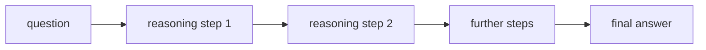

LLMs solve easy questions well but struggle with tasks requiring multiple reasoning steps.
The failure mode is systematic: the model "jumps to the answer" without explicitly working
through intermediate steps. **Chain-of-thought (CoT) prompting** makes the intermediate
steps part of the output, dramatically improving accuracy on multi-step tasks.

## Chain-of-thought prompting

**Few-shot CoT (Wei et al., 2022):** include exemplars in the prompt that demonstrate
reasoning step by step, not just the final answer<FN n="1" />.

**Standard prompting:**
```
Q: Roger has 5 tennis balls. He buys 2 more cans of tennis balls. Each can has 3 balls.
   How many tennis balls does he have now?
A: 11.
```

**Chain-of-thought prompting:**
```
Q: Roger has 5 tennis balls. He buys 2 more cans of tennis balls. Each can has 3 balls.
   How many tennis balls does he have now?
A: Roger starts with 5 balls. 2 cans × 3 balls = 6 balls from cans.
   5 + 6 = 11. The answer is 11.
```

The model learns from the exemplar that it should reason through steps before answering.

**Zero-shot CoT:** add "Let's think step by step" to the prompt without exemplars.
Surprisingly effective; works because this phrase is strongly associated with careful
reasoning in the pretraining corpus.

**Why CoT works:** reasoning through steps allocates more computation (more tokens) to
the problem. Each token generation is one inference step; a 100-step solution uses 100x
more compute than a one-token answer. This is a form of test-time compute scaling.

## Implementation: CoT prompting

```python
def build_cot_prompt(question, exemplars):
    """
    exemplars: list of (question, chain_of_thought, answer) tuples
    """
    prompt = ""
    for q, cot, a in exemplars:
        prompt += f"Q: {q}\nA: {cot} The answer is {a}.\n\n"
    prompt += f"Q: {question}\nA:"
    return prompt

exemplars = [
    (
        "Sarah has 3 apples. She gives 1 to Tom and buys 4 more. How many does she have?",
        "Sarah starts with 3 apples. She gives 1 away: 3 - 1 = 2. She buys 4 more: 2 + 4 = 6.",
        "6"
    ),
    (
        "A car travels 60 mph for 2.5 hours. How far does it travel?",
        "Distance = speed × time = 60 × 2.5 = 150 miles.",
        "150 miles"
    ),
]

question = "A store has 48 oranges. They sell 3/4 of them in the morning. How many are left?"
prompt = build_cot_prompt(question, exemplars)
print(prompt)
```

## Self-consistency (Wang et al., 2023)

A single reasoning chain can make errors. **Self-consistency** addresses this by sampling
$n$ diverse reasoning paths and taking a **majority vote** over the final answers<FN n="2" />:

1. Set temperature $> 0$ (e.g., $T = 0.7$).
2. Sample $n$ completions (e.g., $n = 10$).
3. Extract the final answer from each.
4. Return the most frequent answer.

**Why diversity helps:** different reasoning paths may commit different errors, but correct
paths are more likely to converge on the same answer.

```python
from collections import Counter

def self_consistent_answer(llm_fn, prompt, n_samples=10, temperature=0.7):
    """
    llm_fn: (prompt, temperature) -> completion string
    Returns: (best_answer, all_answers)
    """
    answers = []
    for _ in range(n_samples):
        completion = llm_fn(prompt, temperature)
        # Extract answer (assume format "The answer is X.")
        if "The answer is" in completion:
            ans = completion.split("The answer is")[-1].strip().rstrip(".")
            answers.append(ans)
    counter = Counter(answers)
    best    = counter.most_common(1)[0][0] if counter else None
    return best, answers

# Simulate (replace with real LLM calls)
import random
def mock_llm(prompt, temperature):
    # Simulate 80% chance of correct answer "12", 20% chance of error
    if random.random() < 0.8:
        return "12 apples / 4 friends = 3 each. The answer is 3."
    else:
        return "I count 12 apples. The answer is 12."  # wrong

random.seed(42)
best, all_answers = self_consistent_answer(mock_llm, "Some prompt", n_samples=10)
print(f"Best answer: {best}")
print(f"All answers: {Counter(all_answers)}")
```

Self-consistency improves accuracy on arithmetic (GSM8K, MATH) and commonsense
reasoning (StrategyQA, ARC) by 5-20% over single-sample greedy decoding.



## Variants and extensions

**Least-to-most prompting:** decompose a hard problem into easier subproblems, solve
them sequentially, then compose.

**Auto-CoT (Zhang et al.):** automatically generate CoT exemplars using the model
itself (zero-shot), cluster questions, and sample representative exemplars.

**Program-of-thought (PoT):** generate Python code as the reasoning chain and execute
it. Offloads arithmetic and combinatorics to a Python interpreter, eliminating calculation
errors.

**Tree-of-thought (ToT):** explore multiple reasoning paths simultaneously as a tree
(using BFS or DFS), evaluating intermediate states and pruning unpromising branches.
Generalization of self-consistency to structured search.

## Exercises

**Exercise 1.** A self-consistency run samples 7 reasoning chains. Their extracted
final answers are $3, 5, 3, 3, 5, 3, 7$. What does the majority vote return, and how
many votes does the winning answer hold? State the rule that breaks the tie if two
answers had been level.

<details>
<summary>Solution</summary>

**Step 1.** Tally the answers: $3$ appears four times, $5$ appears twice, $7$ appears
once.

**Step 2.** Majority vote returns the most frequent answer, so it returns $3$ with
$4$ of the $7$ votes.

**Step 3.** With a tie, `Counter.most_common` returns the answer that was inserted
first (first-seen order), so the chain that produced that answer earliest would win.
A robust implementation breaks ties deterministically rather than relying on sampling
order.

</details>

**Exercise 2.** Each reasoning chain in a self-consistency run is correct
independently with probability $p = 0.6$. With $n = 3$ chains and a majority vote,
compute the probability the vote is correct. Compare it to a single chain and explain
why diversity helps.

<details>
<summary>Solution</summary>

**Step 1.** A 3-way majority is correct when at least 2 of the 3 chains are correct.
The number correct is $\text{Binomial}(3, 0.6)$.

**Step 2.** Sum the two favorable cases:

$$
P(\ge 2) = \binom{3}{2}(0.6)^2(0.4) + \binom{3}{3}(0.6)^3 = 3(0.36)(0.4) + 0.216 = 0.432 + 0.216 = 0.648.
$$

**Step 3.** A single chain is correct with probability $0.6$, so voting lifts accuracy
to $0.648$. The gain comes from independence: wrong chains spread their errors across
different answers, while correct chains concentrate on one, so the mode tracks the
correct answer more often than any single draw.

</details>

**Exercise 3 (code).** Implement majority voting and confirm the closed-form number
from Exercise 2 by simulating many self-consistency runs of $n = 3$ chains at
$p = 0.6$, where a correct chain returns the true answer and a wrong chain returns one
of two distinct distractors.

<details>
<summary>Solution</summary>

```python
import numpy as np

rng = np.random.default_rng(0)
n_runs, n_chains, p = 200_000, 3, 0.6

# A majority vote is correct exactly when more than half the chains are correct,
# i.e. at least 2 of 3 here (wrong chains can scatter, so they never form a
# stricter majority than the correct ones once the correct ones are in the majority).
correct_counts = (rng.random((n_runs, n_chains)) < p).sum(axis=1)
acc = np.mean(correct_counts >= 2)

print(f"simulated vote accuracy: {acc:.4f}  (closed form 0.648)")
assert np.isclose(acc, 0.648, atol=0.01)
assert acc > p          # voting beats a single chain
```

The simulated accuracy lands near $0.648$, matching the binomial calculation and
beating the single-chain rate of $0.6$.

</details>

<Footnotes>
  <FNItem n="1">**Wei, J., et al.** (2022). "Chain-of-thought prompting elicits reasoning in large language models". *NeurIPS*. [arXiv:2201.11903](https://arxiv.org/abs/2201.11903). The few-shot CoT exemplar format used here.</FNItem>
  <FNItem n="2">**Wang, X., et al.** (2023). "Self-consistency improves chain of thought reasoning in language models". *ICLR*. [arXiv:2203.11171](https://arxiv.org/abs/2203.11171). Sample-and-majority-vote over reasoning paths.</FNItem>
</Footnotes>
