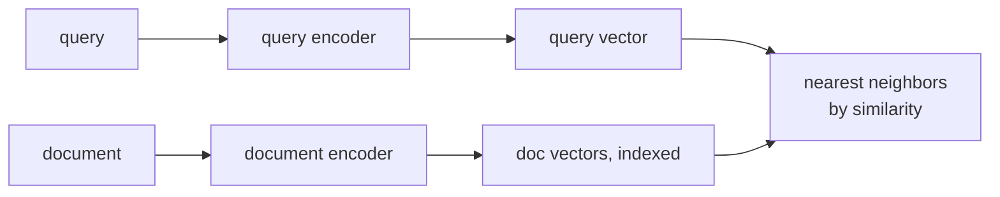

The "toy embedding" in RAG fundamentals used a random mapping. Real retrieval requires
a trained embedding model that places semantically similar texts near each other.
**Dense Passage Retrieval (DPR, Karpukhin et al., 2020)** trains a **bi-encoder** with
a contrastive loss on (question, relevant passage) pairs<FN n="1" />.

## Bi-encoder architecture

A bi-encoder has two encoder towers (often sharing weights or initialized from the same
pretrained model) that independently embed the query and the document:

$$
\mathbf{e}_q = \text{Enc}_Q(q), \qquad \mathbf{e}_d = \text{Enc}_D(d).
$$

At inference, documents are embedded offline and stored in an index. Query embedding and
index lookup happen online.

**Why separate towers?** Shared weights sometimes hurt recall because query and document
texts have different statistical properties (short vs. long, keyword-style vs. verbose).
Asymmetric encoders (different weights for Q and D) often work better.

## Training with in-batch negatives

For each positive (question, passage) pair, use the other passages in the same mini-batch
as **negative examples** (in-batch negatives). For batch size $B$:

$$
\mathcal{L} = -\frac{1}{B} \sum_{i=1}^{B} \log \frac{\exp(\mathbf{e}_{q_i} \cdot \mathbf{e}_{d_i} / \tau)}{\sum_{j=1}^{B} \exp(\mathbf{e}_{q_i} \cdot \mathbf{e}_{d_j} / \tau)},
$$

where $\tau$ is a temperature. This is the InfoNCE loss (also used by CLIP in vision).

**Hard negatives:** in-batch negatives are random, often easy (very different from the
query). Adding **hard negatives** -- passages retrieved by BM25 that are similar but
wrong -- significantly improves retrieval recall.

## FAISS index construction

After training, embed all passages and store in a FAISS index for fast ANN search.

**Flat L2 / inner product:** exact search by brute force. Accurate; $O(N)$ per query.

**IVF (Inverted File Index):** cluster passages into $C$ clusters (using k-means);
at query time, search only the $n_{\text{probe}}$ nearest cluster centroids.
- Train time: $O(N)$ k-means.
- Query time: $O(n_{\text{probe}} \cdot N/C)$ -- $C/n_{\text{probe}}\times$ faster than flat.
- Recall: $n_{\text{probe}} = 4$ recovers ~95% of flat search at $C = \sqrt{N}$.

**HNSW (Hierarchical Navigable Small World):** a graph structure where each node is
connected to its $M$ nearest neighbors, organized in a hierarchical layer structure.
- High recall even at low search budget.
- Larger memory footprint than IVF (stores the graph connections).
- Used in Pinecone, Weaviate, Qdrant by default.

**Product Quantization (PQ):** compress each vector into a product-code representation,
reducing memory from $d \times 4$ bytes per vector to $m \times 1$ byte (where $m < d$).
Combined with IVF: IVFPQ indexes can store billions of vectors.

```python
import numpy as np

def cosine_sim_matrix(Q, D):
    """Q: (Nq, d), D: (Nd, d). Returns (Nq, Nd) cosine similarities."""
    Q_norm = Q / (np.linalg.norm(Q, axis=1, keepdims=True) + 1e-9)
    D_norm = D / (np.linalg.norm(D, axis=1, keepdims=True) + 1e-9)
    return Q_norm @ D_norm.T

def infonce_loss(q_embs, d_embs, temperature=0.05):
    """
    q_embs: (B, d) query embeddings
    d_embs: (B, d) positive document embeddings (row i matches query i)
    In-batch negatives: all d_embs serve as negatives for all queries.
    """
    logits = cosine_sim_matrix(q_embs, d_embs) / temperature   # (B, B)
    labels = np.arange(len(q_embs))
    # Cross-entropy: diagonal is the positive pair
    log_softmax = logits - np.log(np.exp(logits).sum(axis=1, keepdims=True) + 1e-9)
    loss = -log_softmax[np.arange(len(labels)), labels].mean()
    return loss

# Demo: 4 query-document pairs, d=8
B, d = 4, 8
rng = np.random.default_rng(0)
q_embs = rng.normal(0, 1, (B, d))
# Make positive doc embeddings similar to queries (add small noise)
d_embs = q_embs + rng.normal(0, 0.2, (B, d))

loss = infonce_loss(q_embs, d_embs, temperature=0.1)
print(f"InfoNCE loss: {loss:.4f}  (lower = positive pairs more similar than negatives)")

# Flat cosine similarity retrieval
class FlatIndex:
    def __init__(self, embeddings, texts):
        self.embeddings = embeddings
        self.texts = texts

    def search(self, query_emb, k=3):
        sims = cosine_sim_matrix(query_emb[None, :], self.embeddings)[0]
        top_k = sims.argsort()[::-1][:k]
        return [(sims[i], self.texts[i]) for i in top_k]

# Build index with d_embs
texts = [f"Document {i}" for i in range(B)]
index = FlatIndex(d_embs, texts)

# Query with first query embedding
results = index.search(q_embs[0], k=2)
print("\nRetrieval results:")
for sim, text in results:
    print(f"  sim={sim:.3f}: {text}")
```

## Recall evaluation

The standard metric for retrieval is **Recall@k**: the fraction of questions for which
the correct passage appears in the top-$k$ results.

- DPR achieves Recall@1 = 45.9% and Recall@5 = 68.8% on Natural Questions<FN n="1" />.
- BM25 achieves Recall@1 = 40.0% and Recall@5 = 65.2%.
- Hybrid (BM25 + DPR) with reciprocal rank fusion: Recall@5 ~72%.

**Hybrid retrieval:** combine sparse (BM25) and dense (DPR) retrieval by merging ranked
lists. BM25 excels at exact keyword matches; dense retrieval excels at semantic similarity.
Reciprocal rank fusion combines scores without needing calibrated magnitudes.



## Bi-encoders vs cross-encoders

A **cross-encoder** processes query and document jointly through a single transformer:
$\text{score}(q, d) = f([q; d])$. This sees cross-attention between query and document
tokens, giving much higher accuracy than a bi-encoder. But it cannot precompute document
embeddings -- every query must process every document from scratch, making it $O(N)$ per
query.

Production systems use a two-stage approach: **bi-encoder retrieves top-100**, **cross-encoder
reranks** the 100 results to produce the final top-$k$. This balances accuracy and speed.

## Exercises

**Exercise 1.** A query embeds to $\mathbf{e}_q = (1, 2, 2)$. Two documents embed to
$\mathbf{e}_{d_1} = (2, 4, 4)$ and $\mathbf{e}_{d_2} = (2, 0, 0)$. Compute the cosine
similarity of each to the query by hand and state which document a top-1 dense
retriever returns.

<details>
<summary>Solution</summary>

**Step 1.** Compute the query norm: $\|\mathbf{e}_q\| = \sqrt{1 + 4 + 4} = \sqrt{9} = 3$.

**Step 2.** Document 1: the dot product is $1\cdot 2 + 2\cdot 4 + 2\cdot 4 = 18$, and
$\|\mathbf{e}_{d_1}\| = \sqrt{4 + 16 + 16} = \sqrt{36} = 6$, so

$$
\text{sim}(q, d_1) = \frac{18}{3 \cdot 6} = 1.0.
$$

$d_1$ is a positive scalar multiple of $q$, so cosine similarity is exactly 1.

**Step 3.** Document 2: the dot product is $1\cdot 2 + 2\cdot 0 + 2\cdot 0 = 2$, and
$\|\mathbf{e}_{d_2}\| = \sqrt{4} = 2$, so

$$
\text{sim}(q, d_2) = \frac{2}{3 \cdot 2} = \frac{1}{3} \approx 0.333.
$$

**Step 4.** The retriever ranks by similarity, so it returns $d_1$ first ($1.0 > 0.333$).

</details>

**Exercise 2.** A test set has 200 questions, each with one correct passage. A dense
retriever places the correct passage in the top 5 for 138 questions, and in the top 1
for 92. Compute Recall@1 and Recall@5. Then a cross-encoder reranks the top 5 and lifts
the correct passage into rank 1 for 124 of the 138. What is the reranked Recall@1, and
why can it never exceed the original Recall@5?

<details>
<summary>Solution</summary>

**Step 1.** Recall@k is the fraction of questions whose correct passage appears in the
top $k$. Recall@1 $= 92 / 200 = 0.46$ and Recall@5 $= 138 / 200 = 0.69$.

**Step 2.** The reranker only reorders the top 5 it was given, so it can only promote
passages that were already retrieved. Reranked Recall@1 $= 124 / 200 = 0.62$.

**Step 3.** A passage absent from the original top 5 is never seen by the reranker, so
the reranked Recall@1 is bounded above by the first-stage Recall@5 of $0.69$. Here
$0.62 \le 0.69$, as required. The reranker recovers most, not all, of the recall
headroom the bi-encoder left.

</details>

**Exercise 3 (code).** Implement Recall@k for a flat cosine retriever over a small
labeled set, then verify that Recall@k is monotonically nondecreasing in $k$ (a correct
passage in the top $k$ is also in the top $k+1$).

<details>
<summary>Solution</summary>

```python
import numpy as np

def cosine_sim_matrix(Q, D):
    Qn = Q / (np.linalg.norm(Q, axis=1, keepdims=True) + 1e-9)
    Dn = D / (np.linalg.norm(D, axis=1, keepdims=True) + 1e-9)
    return Qn @ Dn.T

def recall_at_k(queries, docs, gold, k):
    sims = cosine_sim_matrix(queries, docs)          # (Nq, Nd)
    topk = np.argsort(-sims, axis=1)[:, :k]          # k best doc indices per query
    hits = [gold[i] in topk[i] for i in range(len(queries))]
    return np.mean(hits)

rng = np.random.default_rng(0)
d, Nq, Nd = 16, 60, 500
docs = rng.normal(0, 1, (Nd, d))
gold = rng.integers(0, Nd, Nq)                       # one correct doc per query
# Build queries as the gold doc plus noise so retrieval is imperfect but meaningful
queries = docs[gold] + rng.normal(0, 1.5, (Nq, d))

recalls = [recall_at_k(queries, docs, gold, k) for k in range(1, 11)]
print("Recall@1..10:", [round(r, 3) for r in recalls])

# Monotone nondecreasing in k: widening the top-k can only add correct passages
assert all(recalls[i] <= recalls[i + 1] + 1e-12 for i in range(len(recalls) - 1))
assert recalls[0] < recalls[-1]                      # recall genuinely improves with k
```

The recall curve never drops as $k$ grows, because widening the retrieved set can only
add correct passages, never remove them.

</details>

<Footnotes>
  <FNItem n="1">**Karpukhin, V., et al.** (2020). "Dense passage retrieval for open-domain question answering". *EMNLP*. [arXiv:2004.04906](https://arxiv.org/abs/2004.04906). Source of the bi-encoder, in-batch negatives, and the reported Recall numbers.</FNItem>
</Footnotes>
