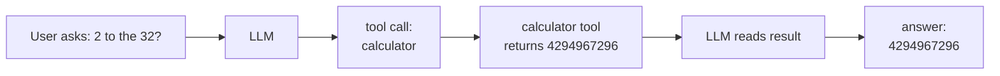

An LLM cannot access real-time data, run code, or interact with external systems. **Tool
use** (also called function calling) extends the model's capabilities by teaching it to
emit structured requests to external tools, receive their results, and continue reasoning<FN n="1" />.

## The function calling protocol

Tool use is implemented as a special conversation structure:

1. **System prompt:** list available tools in a structured format (JSON schema describing
   each tool's name, description, and parameters).
2. **Model turn:** instead of a natural language response, the model emits a structured
   `tool_use` message specifying which tool to call and with what arguments.
3. **Tool turn:** the application executes the tool and returns the result as a
   `tool_result` message.
4. **Model turn:** the model reads the result and generates a final response (or calls
   another tool).



## Tool definition schema

```json
{
  "name": "calculator",
  "description": "Evaluate a mathematical expression.",
  "input_schema": {
    "type": "object",
    "properties": {
      "expression": {
        "type": "string",
        "description": "A Python-evaluable math expression, e.g. '2**32' or 'sin(pi/4)'"
      }
    },
    "required": ["expression"]
  }
}
```

The model is trained to parse these schemas and emit valid JSON tool calls.

## Implementing a tool-use loop

```python
import json
import math

# Define tools
def calculator(expression: str) -> str:
    try:
        result = eval(expression, {"__builtins__": {}},
                      {"sin": math.sin, "cos": math.cos, "pi": math.pi,
                       "sqrt": math.sqrt, "log": math.log, "exp": math.exp})
        return str(result)
    except Exception as e:
        return f"Error: {e}"

def search(query: str) -> str:
    # Placeholder -- in production this calls a real search API
    results = {
        "python creator": "Python was created by Guido van Rossum in 1991.",
        "eiffel tower height": "The Eiffel Tower is 330 meters tall.",
    }
    for key, val in results.items():
        if any(w in query.lower() for w in key.split()):
            return val
    return "No results found."

TOOLS = {
    "calculator": calculator,
    "search": search,
}

def tool_use_loop(user_message, llm_fn, max_turns=5):
    """
    llm_fn: (messages, tools) -> (response_text, tool_calls_or_None)
    """
    messages = [{"role": "user", "content": user_message}]
    for _ in range(max_turns):
        response_text, tool_calls = llm_fn(messages, list(TOOLS.keys()))
        if not tool_calls:
            return response_text   # final answer
        # Execute each tool call
        tool_results = []
        for call in tool_calls:
            name   = call["name"]
            args   = call["arguments"]
            result = TOOLS[name](**args)
            tool_results.append({"tool": name, "result": result})
            print(f"[Tool] {name}({args}) -> {result}")
        # Append tool results and continue
        messages.append({"role": "assistant",
                          "content": response_text,
                          "tool_calls": tool_calls})
        messages.append({"role": "tool",
                          "content": json.dumps(tool_results)})
    return "Max turns reached."

# Simulated LLM function (replace with real API call)
def mock_llm(messages, available_tools):
    last_msg = messages[-1]["content"]
    if "2^32" in last_msg or "2**32" in last_msg:
        return ("", [{"name": "calculator", "arguments": {"expression": "2**32"}}])
    if "tool" in last_msg.lower() and "result" in str(messages):
        # After receiving tool result, generate final answer
        return (f"Based on the calculation: 2^32 = {2**32}", None)
    return ("I need to calculate this.", None)

print(tool_use_loop("What is 2^32?", mock_llm))
```

## Parallel function calling

When multiple independent tools are needed, modern APIs (Claude, GPT-4) support emitting
multiple tool calls in a single turn:

```json
{
  "tool_calls": [
    {"name": "search", "arguments": {"query": "Python creator"}},
    {"name": "calculator", "arguments": {"expression": "2024 - 1991"}}
  ]
}
```

Both tools are executed in parallel; results are returned together. This avoids
sequential round-trips when tools are independent.

## Agentic tool use patterns

**Single-turn tool use:** one tool call, one answer. Useful for augmenting a single
question with external data (e.g., weather, stock price).

**Multi-turn tool use (chaining):** the model makes a series of tool calls, using
each result to inform the next. Required for tasks like: "Find all papers by Y published
after 2020, then summarize their key findings."

**ReAct pattern** (next lesson): interleave reasoning and tool use explicitly -- the
model generates a "Thought" before each tool call and "Observation" after each result.

## Structured output enforcement

Tool call schemas are enforced by the API: if the model emits an invalid JSON tool call,
the API either rejects it or asks for a retry. This is implemented via constrained
generation (guide the sampling process to only produce tokens consistent with the JSON
schema) or post-hoc validation with retry.

Libraries: Outlines, Instructor, Guidance -- constrain LLM output to schemas, types, or
Pydantic models.

## Exercises

**Exercise 1.** A user asks: "How many days passed between the release of Python (1991)
and today (2024), and what is that span squared?" Trace the tool-use loop for an agent
with a `calculator` tool. List the message turns in order and say how many model turns
the loop takes if the agent issues one tool call per turn.

<details>
<summary>Solution</summary>

**Step 1.** Turn 1 (model): the agent reads the user message and emits a tool call,
arguments `expression = "2024 - 1991"`.

**Step 2.** Turn 2 (tool): the application runs the calculator and returns `33` as a
`tool_result`.

**Step 3.** Turn 3 (model): the agent reads `33`, then needs the square, so it emits a
second tool call, arguments `expression = "33**2"`.

**Step 4.** Turn 4 (tool): the calculator returns `1089`.

**Step 5.** Turn 5 (model): the agent reads `1089` and emits the final natural-language
answer with no tool call, ending the loop.

The loop takes three model turns (turns 1, 3, 5); the two tool turns are executed by the
application, not the model. Sequential calls are needed here because the second
expression depends on the first result.

</details>

**Exercise 2.** The two calls in the parallel-function-calling example, computing
`2024 - 1991` and searching "Python creator", are independent. Compare the total
latency of running them in parallel versus sequentially, given that one model round-trip
costs $r = 400$ ms and each tool costs $t = 100$ ms. Assume the parallel case issues
both calls in one model turn.

<details>
<summary>Solution</summary>

**Step 1.** Sequential: each tool needs its own model turn to request it and another to
consume its result. Two calls cost roughly $2$ requesting turns, $2$ tool executions,
and a final answering turn: $3r + 2t = 3(400) + 2(100) = 1400$ ms.

**Step 2.** Parallel: one model turn emits both calls, the two tools run concurrently
(cost $\max(t, t) = 100$ ms, not the sum), and one model turn produces the answer:
$2r + t = 2(400) + 100 = 900$ ms.

**Step 3.** Parallel calling saves $1400 - 900 = 500$ ms here. The win grows with the
number of independent tools, since their executions overlap instead of stacking and the
extra request round-trips collapse into one turn.

</details>

**Exercise 3 (code).** Implement the calculator tool and a deterministic two-step
tool-use loop for Exercise 1 (compute `2024 - 1991`, then square it). Drive it with a
scripted model function and assert the final answer is 1089.

<details>
<summary>Solution</summary>

```python
import numpy as np

def calculator(expression):
    return eval(expression, {"__builtins__": {}}, {})

def tool_use_loop(model_fn, max_turns=5):
    state = {"results": []}
    for _ in range(max_turns):
        call = model_fn(state)            # returns dict or None (final)
        if call is None:
            return state["results"][-1]   # final numeric answer
        result = calculator(call["expression"])
        state["results"].append(result)
    raise RuntimeError("max turns reached")

# Scripted model: first subtract, then square the previous result, then stop.
def model_fn(state):
    n = len(state["results"])
    if n == 0:
        return {"expression": "2024 - 1991"}
    if n == 1:
        prev = state["results"][-1]
        return {"expression": f"{prev}**2"}
    return None                            # done

answer = tool_use_loop(model_fn)
print("final answer:", answer)
assert answer == 1089
assert np.isclose(answer, (2024 - 1991) ** 2)
```

The loop chains two calculator calls, feeding the first result (33) into the second
expression, and lands on $33^2 = 1089$.

</details>

<Footnotes>
  <FNItem n="1">**Schick, T., et al.** (2023). "Toolformer: language models can teach themselves to use tools". *NeurIPS*. [arXiv:2302.04761](https://arxiv.org/abs/2302.04761). Shows an LLM can learn to emit API calls, splice in the results, and continue generating.</FNItem>
</Footnotes>
