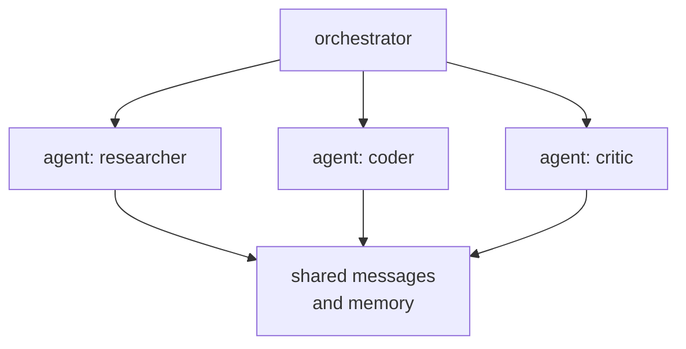

A single LLM agent can handle many tasks autonomously. For complex, long-horizon tasks that
require specialization, parallelism, or mutual validation, **multi-agent systems** decompose
the work across multiple agents that communicate and collaborate.

## Why multi-agent?

**Long-horizon tasks:** a single agent's context window limits how much state it can track.
Specialized sub-agents can handle sub-tasks with their own context.

**Specialization:** a coder agent, a reviewer agent, and a tester agent can each be
prompted and tooled for their specific role.

**Parallelism:** independent sub-tasks can run simultaneously across agents, reducing
wall-clock time.

**Mutual validation:** one agent can generate, another can verify, reducing hallucination
and error propagation.

## AutoGen: conversation-based multi-agent

**AutoGen** (Wu et al., Microsoft, 2023) organizes agents as **conversational participants**<FN n="1" />.
Agents exchange messages and can call tools or delegate to other agents. The basic unit is
a two-agent conversation: an **initiator** sends a message, an **executor** responds.

**Key agent types in AutoGen:**
- `AssistantAgent`: an LLM-powered agent with a system prompt and optional tools.
- `UserProxyAgent`: represents the human (or an executor that can run code, tools, etc.).
- `GroupChatManager`: routes messages among a group of agents.

**Two-agent example:**
```
UserProxy: Implement a function that checks if a number is prime.
Assistant: [generates Python code]
UserProxy: [executes code, sees output, sends back results]
Assistant: [sees the output, refines if needed]
UserProxy: [confirms the code works]
```

This cycle continues until the UserProxy signals `TERMINATE`.

**Group chat:**
Multiple agents in a round-table with a manager that routes messages:
- Coder agent: writes code.
- Reviewer agent: reviews it for bugs.
- Executor agent: runs tests.
- Manager: decides which agent speaks next based on conversation state.

## CrewAI: role-based orchestration

**CrewAI** takes a different abstraction: agents have explicit **roles**, **goals**, and
**backstories**. Tasks are assigned to agents, with defined dependencies and a sequential
or hierarchical execution order.

**Core concepts:**
- **Agent:** an LLM with a role, goal, backstory, and set of tools.
- **Task:** a specific piece of work assigned to an agent, with an expected output.
- **Crew:** a group of agents and their tasks, with an execution process (sequential, hierarchical).

**Example crew for research + writing:**
```python-static
researcher = Agent(
    role="Senior Research Analyst",
    goal="Find and analyze recent advances in {topic}",
    backstory="You are an expert at synthesizing complex research papers.",
    tools=[search_tool, arxiv_tool],
)
writer = Agent(
    role="Technical Writer",
    goal="Write a clear summary of the research findings",
    backstory="You specialize in making complex topics accessible.",
)
research_task = Task(
    description="Research the latest advances in {topic}",
    expected_output="A summary of 5 key papers with key findings",
    agent=researcher,
)
writing_task = Task(
    description="Write a blog post based on the research",
    expected_output="A 500-word technical blog post",
    agent=writer,
    context=[research_task],  # depends on research_task's output
)
crew = Crew(agents=[researcher, writer],
            tasks=[research_task, writing_task],
            process=Process.sequential)
```

## Communication protocols

**Shared message history:** all agents in a group see the full conversation. Simple, but
context grows without bound for long tasks.

**Structured handoffs:** each agent produces a typed artifact (JSON, markdown) that the
next agent receives. More modular; easier to validate and debug.

**Blackboard architecture:** agents write to and read from a shared structured store
(a JSON object or database). No direct agent-to-agent messages; coordination via shared state.

**Pub-sub events:** agents publish events to queues; other agents subscribe and react.
Used in production agent systems (Temporal, Vercel Queues) for durable, fault-tolerant
orchestration.

## Challenges

**Context accumulation:** long multi-agent conversations balloon the context window of
downstream agents. Mitigation: summarization agents, explicit state truncation.

**Error propagation:** a mistake in an early agent's output compounds as downstream agents
build on it. Mitigation: validation checkpoints, redundant agents for critical tasks.

**Cost:** each agent LLM call has latency and token cost. Hierarchical designs with a
fast router model dispatching to specialized agents reduce cost.

**Reliability:** multi-agent systems are brittle -- an agent may loop, produce malformed
output, or deviate from its role. Production systems require timeouts, retry logic, and
human-in-the-loop checkpoints.



## Emerging patterns

**LLM-as-orchestrator + specialized tools:** a central LLM orchestrates tool-calling
specialists (code executor, retriever, browser agent) via a router. Simpler and more
reliable than full multi-LLM systems.

**Supervisor-worker hierarchy:** a supervisor agent decomposes a task and delegates to
worker agents; reviews their outputs and decides when to stop or retry.

**Debate:** two agents argue opposing positions; a judge agent synthesizes the best answer.
Improves factual accuracy by forcing claims to be defended.

## Exercises

**Exercise 1.** A generator agent produces correct output with probability $0.7$. A
separate verifier agent catches an incorrect output with probability $0.8$ and never
flags a correct output as wrong (no false positives). The system accepts an output only
if the verifier passes it. Compute the probability that an accepted output is actually
correct.

<details>
<summary>Solution</summary>

**Step 1.** An output is accepted in two cases: it is correct (probability $0.7$, always
passed since there are no false positives), or it is incorrect (probability $0.3$) and
the verifier misses the error (probability $1 - 0.8 = 0.2$).

**Step 2.** The probability of accepting an incorrect output is
$0.3 \times 0.2 = 0.06$. The probability of accepting a correct output is $0.7$. The
total acceptance probability is $0.7 + 0.06 = 0.76$.

**Step 3.** By the conditional probability of correctness given acceptance:

$$
P(\text{correct} \mid \text{accepted}) = \frac{0.7}{0.76} \approx 0.921.
$$

The verifier raises the trustworthiness of accepted outputs from $0.7$ to about $0.92$,
which is the mutual-validation gain that motivates a separate reviewer agent.

</details>

**Exercise 2.** Compare shared message history against structured handoffs as the
communication protocol for a 6-agent pipeline running a long task. Give one concrete
advantage of each, and explain why context accumulation pushes long-running production
systems toward structured handoffs or a blackboard.

<details>
<summary>Solution</summary>

**Step 1.** Shared message history lets every agent see the full conversation, so no
coordination logic is needed and any agent can pick up context another produced. Its
weakness is that the transcript grows with every turn, so a downstream agent in a long
task pays to re-read the entire history each call.

**Step 2.** Structured handoffs pass a typed artifact (JSON or markdown) from one agent
to the next, so each agent receives only the relevant slice. This is modular and easy to
validate, but it requires defining the artifact schema and an explicit routing order.

**Step 3.** With 6 agents over a long task, shared history makes each agent's context,
and therefore its token cost and latency, grow without bound, and "lost in the middle"
degrades attention over the bloated transcript. Structured handoffs (or a blackboard
store read on demand) bound each agent's context to what it needs, which is why durable
production systems prefer them.

</details>

**Exercise 3.** Design a multi-agent system that writes and ships a small code change:
it must implement, review, and test the change, retry on failure, and stop cleanly.
Specify the agent roles, the communication protocol, and two safeguards against the
reliability failures named in the lesson (looping, error propagation).

<details>
<summary>Solution</summary>

**Step 1.** Roles: a supervisor that decomposes the task and decides when to stop; a
coder that writes the change; a reviewer that inspects it for bugs; an executor that
runs the test suite and reports pass or fail. This is the supervisor-worker hierarchy
with specialization.

**Step 2.** Protocol: structured handoffs. The coder emits a diff artifact, the reviewer
emits an annotated approve/reject artifact, and the executor emits a typed test report.
Typed artifacts keep each agent's context bounded and make every step validatable, which
also limits error propagation because a malformed artifact is caught at the handoff
boundary rather than silently consumed.

**Step 3.** Safeguard against looping: a hard cap on retry rounds (for example, three
implement-review-test cycles) enforced by the supervisor, plus a per-agent timeout, so a
stuck agent cannot spin forever. Safeguard against error propagation: a validation
checkpoint after the reviewer, so the change only reaches the executor once it passes
review, and the executor's pass/fail gate, so a failing change is sent back to the coder
with the failure report rather than shipped.

</details>

<Footnotes>
  <FNItem n="1">**Wu, Q., et al.** (2023). "AutoGen: enabling next-gen LLM applications via multi-agent conversation". [arXiv:2308.08155](https://arxiv.org/abs/2308.08155). The conversational multi-agent framework described here.</FNItem>
</Footnotes>
