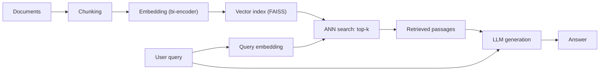

An LLM's knowledge is frozen at training time. For questions about recent events, private
documents, or domain-specific facts, the model will hallucinate or say "I don't know."

**Retrieval-Augmented Generation (RAG, Lewis et al., 2020)** grounds the model by
dynamically retrieving relevant documents at inference time and including them in the
context. The model generates its answer conditioned on both the question and the retrieved
passages.

## The RAG pipeline



### Step 1: Chunking

Documents are split into overlapping chunks (e.g., 512 tokens with 64-token overlap).
The overlap ensures that context is not lost at chunk boundaries.

**Chunking strategies:**
- **Fixed-size:** simplest; works for homogeneous documents.
- **Sentence-based:** split at sentence boundaries; more coherent chunks.
- **Recursive character splitting:** split on paragraph, sentence, and word boundaries
  in order of preference.
- **Semantic chunking:** split where the embedding similarity between adjacent sentences
  drops (topic change detection).

### Step 2: Embedding

Each chunk is embedded using a **bi-encoder**: a transformer that maps a text into a
fixed-dimensional vector. The same model is used for both documents and queries.

Popular embedding models: `text-embedding-3-large` (OpenAI), `BAAI/bge-m3` (multilingual),
`nomic-embed-text` (open-source), `E5-large`.

Similarity is measured with cosine similarity:

$$
\text{sim}(q, d) = \frac{\mathbf{e}_q \cdot \mathbf{e}_d}{\|\mathbf{e}_q\| \|\mathbf{e}_d\|}.
$$

### Step 3: Vector index

Store all chunk embeddings in a **vector database** for approximate nearest neighbor (ANN)
search. The key structures:

- **FAISS (flat):** exact brute-force search; $O(N \cdot d)$. Accurate but slow at scale.
- **FAISS HNSW:** hierarchical navigable small world graph; approximate, fast, high recall.
- **FAISS IVF:** inverted file index; clusters vectors, searches only the nearest clusters.

Vector databases (Pinecone, Weaviate, Qdrant, Chroma, pgvector) wrap these indices with
persistence, filtering, and metadata support.

### Step 4: Retrieval

At query time: embed the query, search for top-$k$ nearest chunks (typically $k = 5{-}10$),
return the chunks and their scores.

### Step 5: Generation

Prepend the retrieved chunks to the LLM's prompt:

```
Context:
[Retrieved passage 1]
[Retrieved passage 2]
...

Question: {user_question}
Answer:
```

The LLM generates an answer conditioned on the provided context.

## Implementation

```python
import numpy as np
from collections import defaultdict

# Toy embedding function (replace with a real bi-encoder)
def embed(text, d=16, seed=None):
    """Deterministic random embedding for demo."""
    rng = np.random.default_rng(hash(text) % (2**32))
    return rng.normal(0, 1, d)

def cosine_sim(a, b):
    return np.dot(a, b) / (np.linalg.norm(a) * np.linalg.norm(b) + 1e-9)

# Build index
documents = [
    "Backpropagation computes gradients by the chain rule on the computation graph.",
    "Transformers use self-attention to mix information across sequence positions.",
    "Gradient descent updates parameters in the direction of steepest loss decrease.",
    "The LSTM uses a cell state to maintain long-range dependencies.",
    "LoRA injects low-rank adapter matrices alongside frozen pretrained weights.",
    "KV cache stores computed keys and values to avoid recomputation during decoding.",
]

def chunk(doc, chunk_size=50, overlap=10):
    words = doc.split()
    chunks = []
    i = 0
    while i < len(words):
        chunk_words = words[i:i + chunk_size]
        chunks.append(" ".join(chunk_words))
        i += chunk_size - overlap
    return chunks

# Index all chunks
chunk_store = []   # (chunk_text, embedding)
for doc in documents:
    for c in chunk(doc):
        e = embed(c)
        chunk_store.append((c, e))

def retrieve(query, k=3):
    q_emb = embed(query)
    scores = [(cosine_sim(q_emb, e), text) for text, e in chunk_store]
    scores.sort(reverse=True)
    return scores[:k]

# Demo retrieval
query = "How do you update model weights?"
results = retrieve(query, k=3)
print(f"Query: {query}\nTop-3 results:")
for score, text in results:
    print(f"  [{score:.3f}] {text}")
```

## Common failure modes

**Retrieval failure:** the correct chunk is not retrieved (top-k miss). Caused by:
- Poor embedding model for the domain.
- Chunk size too small (loses context) or too large (dilutes relevance signal).
- Exact-keyword queries vs. semantic mismatch.

**Context too long:** retrieved chunks exceed the LLM's context window. Mitigation:
rerank and keep only the top-$k'$ most relevant chunks.

**Lost in the middle:** LLMs perform worse on information in the middle of long contexts
than at the beginning and end. Put the most relevant passage first.

**Hallucination despite retrieval:** the model ignores the retrieved context and
generates from parametric memory. Mitigation: explicit prompting ("answer only based
on the provided context") and self-consistency checks.

The next lesson introduces dense retrieval with trained bi-encoders and approximate
nearest neighbor search structures for real-scale deployment.
