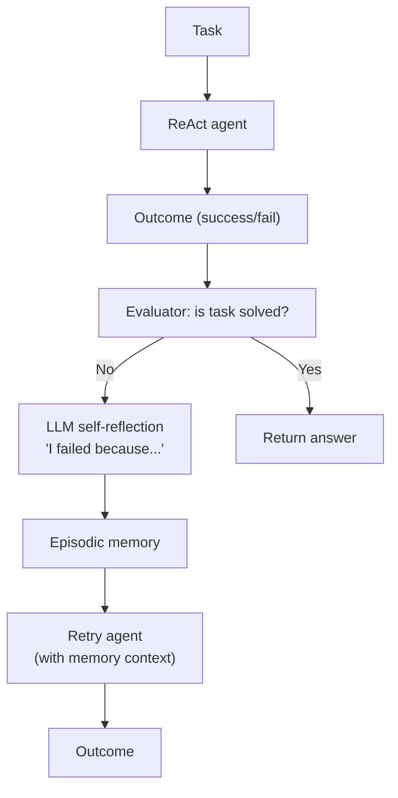

Chain-of-thought generates reasoning without external grounding; tool use grounds the
model in external information but lacks explicit reasoning structure. **ReAct** (Yao et al.,
2023) combines both: the model alternates between reasoning thoughts and grounded actions
in a structured loop<FN n="1" />.

## ReAct: Reason + Act

At each step the model generates one of:

- **Thought:** internal reasoning about the current state, what to do next, or how to
  interpret a previous observation.
- **Action:** a tool call (search, calculator, lookup) with arguments.
- **Observation:** the tool result (injected by the environment, not generated by the model).

The loop continues until the model generates a final answer.

**Example trajectory:**

```
Question: What is the elevation of the mountain that borders the country where
          the Eiffel Tower is located?

Thought: The Eiffel Tower is in France. I need to find a mountain bordering France.
Action: search("mountains bordering France")
Observation: The Alps and Pyrenees border France. The highest Alpine peak is Mont Blanc.

Thought: Mont Blanc is the tallest mountain in the Alps, which borders France.
         I should get its elevation.
Action: search("Mont Blanc elevation")
Observation: Mont Blanc is 4,808 meters (15,774 feet) above sea level.

Thought: I now have the answer.
Answer: 4,808 meters.
```

## Implementation

```python
import re

TOOLS = {
    "search": lambda q: f"[Search result for '{q}': fictional relevant fact]",
    "calculator": lambda expr: str(eval(expr, {"__builtins__": {}},
                                        {"__name__": ""})),
}

def react_loop(question, llm_fn, max_steps=6):
    """
    llm_fn: (trajectory_so_far) -> next model output (Thought/Action/Answer)
    """
    trajectory = f"Question: {question}\n"
    for step in range(max_steps):
        # Ask the model for the next step
        model_output = llm_fn(trajectory)
        trajectory += model_output + "\n"

        # Check for final answer
        if model_output.strip().startswith("Answer:"):
            answer = model_output.replace("Answer:", "").strip()
            return answer, trajectory

        # Check for tool action
        action_match = re.search(r'Action:\s*(\w+)\("([^"]+)"\)', model_output)
        if action_match:
            tool_name, tool_input = action_match.group(1), action_match.group(2)
            if tool_name in TOOLS:
                observation = TOOLS[tool_name](tool_input)
                trajectory += f"Observation: {observation}\n"
            else:
                trajectory += f"Observation: Tool '{tool_name}' not found.\n"

    return "Max steps reached.", trajectory

# Simulated LLM
step_counter = [0]
def mock_llm(trajectory):
    step_counter[0] += 1
    responses = [
        'Thought: I need to find the Eiffel Tower location.\nAction: search("Eiffel Tower location")',
        'Thought: It\'s in France. Now I need a bordering mountain.\nAction: search("mountains bordering France")',
        'Thought: Mont Blanc borders France. I need its elevation.\nAction: search("Mont Blanc elevation")',
        'Thought: I have the elevation.\nAnswer: 4,808 meters',
    ]
    idx = min(step_counter[0] - 1, len(responses) - 1)
    return responses[idx]

step_counter[0] = 0
answer, traj = react_loop(
    "What is the elevation of the mountain that borders the country of the Eiffel Tower?",
    mock_llm
)
print("Answer:", answer)
print("\nFull trajectory:")
print(traj)
```

## Reflexion: agents that learn from failure

**Reflexion (Shinn et al., 2023)** adds a **self-reflection** component: when an agent
fails a task, it reflects on why and stores the reflection in a memory buffer that
influences future attempts.

### The Reflexion loop



### Reflection generation

When a trial fails, prompt the model to generate a reflection:

```
You attempted the following task: {task}
Your trajectory:
{previous_trajectory}
Result: FAILED

Reflect on why you failed and what you should do differently next time.
Reflection: [model output]
```

The reflection is prepended to the agent's context on the next attempt:

```
Previous attempt reflection: I incorrectly searched for the population of Paris
when I should have searched for the population of France. Next time, I need to
be careful about whether the question asks about the city or the country.
```

### Memory variants

**Episodic buffer:** a list of past reflections (may be truncated to fit context).

**Semantic memory:** summaries of multiple episodes (compressed for long-running agents).

**External memory:** a vector database of past experience embeddings.

## Comparison: CoT vs ReAct vs Reflexion

| Method | External tools | Iterative refinement | Memory |
|--------|---------------|---------------------|--------|
| CoT | No | No | No |
| ReAct | Yes | No | Observation window |
| Reflexion | Yes | Yes | Episodic reflections |

## When to use each

**CoT:** pure reasoning tasks with no external information required.
**ReAct:** tasks requiring external data (web search, APIs, code execution).
**Reflexion:** tasks where the agent can evaluate its own success and where multiple
attempts are acceptable (HotpotQA, coding challenges, Alfworld).

## Exercises

**Exercise 1.** Write a ReAct trajectory for the question "How many years passed between
the founding of the company that makes the iPhone and the release of the first iPhone?"
using only a `search` tool and a `calculator` tool. Label every line as Thought, Action,
Observation, or Answer, and give the two facts your searches would return (Apple founded
1976; first iPhone released 2007).

<details>
<summary>Solution</summary>

**Step 1.** The trajectory interleaves reasoning, grounded tool calls, and injected
observations:

```
Question: How many years between Apple's founding and the first iPhone?

Thought: I need the iPhone's maker, then its founding year.
Action: search("company that makes the iPhone")
Observation: The iPhone is made by Apple, founded in 1976.

Thought: Now I need the first iPhone's release year.
Action: search("first iPhone release year")
Observation: The first iPhone was released in 2007.

Thought: The gap is 2007 minus 1976.
Action: calculator("2007 - 1976")
Observation: 31

Thought: I have the answer.
Answer: 31 years.
```

**Step 2.** The Observation lines are produced by the environment, not the model; the
model only emits Thought, Action, and the final Answer. The calculator offloads the
arithmetic so the reasoning step does not have to compute $2007 - 1976$ itself.

</details>

**Exercise 2.** Reflexion retries a task after failure, storing one reflection per
failed trial. Suppose each independent attempt succeeds with probability $0.5$, and the
reflection raises the success probability of each subsequent attempt to $0.7$. With a
budget of 3 attempts, compute the probability the task is eventually solved. Compare it
to 3 memoryless attempts at $0.5$ each.

<details>
<summary>Solution</summary>

**Step 1.** With memory: attempt 1 succeeds with probability $0.5$. If it fails
(probability $0.5$), attempts 2 and 3 each succeed with $0.7$. The task fails overall
only if all three fail:

$$
P(\text{fail}) = 0.5 \cdot 0.3 \cdot 0.3 = 0.045, \qquad P(\text{solve}) = 1 - 0.045 = 0.955.
$$

**Step 2.** Memoryless: each attempt is $0.5$, so failure is $0.5^3 = 0.125$ and
$P(\text{solve}) = 1 - 0.125 = 0.875$.

**Step 3.** Reflection lifts the solve rate from $0.875$ to $0.955$, a gain of $0.08$,
because each diagnosed failure makes the next attempt more likely to succeed rather than
repeating the same blind draw.

</details>

**Exercise 3 (code).** Implement the ReAct action parser from the lesson with a regex,
then drive a scripted ReAct loop on the iPhone question from Exercise 1 and assert the
final answer is the integer 31.

<details>
<summary>Solution</summary>

```python
import re

TOOLS = {
    "search": lambda q: {
        "company that makes the iphone": "Apple, founded in 1976.",
        "first iphone release year": "Released in 2007.",
    }.get(q.lower(), "No result."),
    "calculator": lambda expr: str(eval(expr, {"__builtins__": {}}, {})),
}

def step_action(model_output):
    m = re.search(r'Action:\s*(\w+)\("([^"]+)"\)', model_output)
    if not m:
        return None
    name, arg = m.group(1), m.group(2)
    return TOOLS[name](arg)

scripted = [
    'Thought: find the maker.\nAction: search("company that makes the iPhone")',
    'Thought: find release year.\nAction: search("first iPhone release year")',
    'Thought: subtract.\nAction: calculator("2007 - 1976")',
    'Answer: 31',
]

final = None
for out in scripted:
    if out.strip().startswith("Answer:"):
        final = int(out.split("Answer:")[1].strip())
        break
    obs = step_action(out)
    print("Observation:", obs)

assert final == 31
print("final answer:", final)
```

The parser extracts each tool call, the environment returns the observation, and the
loop terminates on the `Answer:` line with $2007 - 1976 = 31$.

</details>

ReAct and Reflexion are the conceptual basis for modern agent frameworks (LangGraph,
CrewAI, AutoGen). The next lesson covers test-time compute scaling, which scales this
pattern to much larger search trees.

<Footnotes>
  <FNItem n="1">**Yao, S., et al.** (2023). "ReAct: synergizing reasoning and acting in language models". *ICLR*. [arXiv:2210.03629](https://arxiv.org/abs/2210.03629). Introduces the Thought-Action-Observation loop this lesson implements.</FNItem>
</Footnotes>
