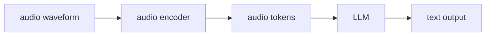

Language models operate on tokens -- discrete symbols from a fixed vocabulary. Audio is a
continuous 1D signal sampled at 16,000-44,100 Hz. **Audio LMs** bridge this gap by
converting the audio waveform to a structured representation, then applying transformer
architectures to generate text or audio tokens.

## From waveform to features

Raw waveform samples are too fine-grained and too redundant (adjacent samples are nearly
identical). The standard feature is the **log-mel spectrogram**:

1. **Short-Time Fourier Transform (STFT):** compute the magnitude spectrum over
   overlapping 25ms windows (typically with 10ms hop size). For 16kHz audio, this
   produces a spectrogram of shape $(T_{\text{frames}} \times F_{\text{freq}})$.

2. **Mel filterbank:** apply $M = 80$ triangular filters spaced on the mel scale
   (a perceptual frequency scale approximating human hearing). Low frequencies have
   finer resolution; high frequencies are coarser.

3. **Log compression:** take $\log(\max(\text{filterbank\_output}, \epsilon))$.
   Compresses the dynamic range; perceptually motivated.

Result: a log-mel spectrogram of shape $(T_{\text{frames}} \times 80)$ -- a 2D image
of the audio's frequency content over time.

```python
import numpy as np

def stft(waveform, n_fft=400, hop_length=160, win_length=400):
    """Simple STFT returning magnitude spectrogram."""
    window = np.hanning(win_length)
    frames = []
    for start in range(0, len(waveform) - n_fft, hop_length):
        frame = waveform[start:start + n_fft] * window[:n_fft]
        spectrum = np.abs(np.fft.rfft(frame))
        frames.append(spectrum)
    return np.array(frames)  # (T, n_fft//2 + 1)

def mel_filterbank(n_fft, n_mels=80, sample_rate=16000, fmin=0, fmax=8000):
    """Create mel filterbank matrix."""
    mel_min = 2595 * np.log10(1 + fmin / 700)
    mel_max = 2595 * np.log10(1 + fmax / 700)
    mel_points = np.linspace(mel_min, mel_max, n_mels + 2)
    hz_points  = 700 * (10 ** (mel_points / 2595) - 1)
    bin_points = np.floor((n_fft + 1) * hz_points / sample_rate).astype(int)
    fb = np.zeros((n_mels, n_fft // 2 + 1))
    for m in range(1, n_mels + 1):
        lo, center, hi = bin_points[m-1], bin_points[m], bin_points[m+1]
        fb[m-1, lo:center] = (np.arange(lo, center) - lo) / (center - lo)
        fb[m-1, center:hi] = (hi - np.arange(center, hi)) / (hi - center)
    return fb

def log_mel_spectrogram(waveform, n_fft=400, hop_length=160, n_mels=80, sr=16000):
    spec  = stft(waveform, n_fft, hop_length)           # (T, F)
    fb    = mel_filterbank(n_fft, n_mels, sr)           # (80, F)
    mel   = np.maximum(spec @ fb.T, 1e-9)               # (T, 80)
    return np.log(mel)

# Demo: 1 second of random audio at 16kHz
waveform = np.random.randn(16000).astype(np.float32)
log_mel  = log_mel_spectrogram(waveform)
print("Log-mel spectrogram shape:", log_mel.shape)   # (~100 frames, 80)
```

## Wav2Vec 2.0: self-supervised audio pretraining

**Wav2Vec 2.0** (Baevski et al., 2020) adapts BERT's masked language modeling to audio.

**Architecture:**
1. **Local encoder (CNN):** 7 convolutional blocks map the waveform to a sequence of
   contextual features at 20ms intervals.
2. **Quantizer:** discretize features into codes from a learned codebook.
3. **Transformer encoder (context network):** masked modeling over the quantized features.

**Pretraining:**
- Randomly mask 6.5% of time steps.
- Predict the discretized representation of masked positions from the context network output.
- Contrastive loss: the correct code must be ranked above $K = 100$ distractors.

This produces strong speech representations without any labeled data. Fine-tuning on 10
minutes of labeled speech (with a CTC output layer) achieves competitive word error rates.

## Whisper: multitask supervised pretraining

**Whisper** (Radford et al., OpenAI, 2022) takes the opposite approach: supervised
pretraining on 680,000 hours of weakly labeled audio-transcript pairs<FN n="1" />.

**Architecture:** encoder-decoder transformer.
- **Encoder:** 2D convolutions on the log-mel spectrogram (to reduce sequence length),
  then transformer encoder blocks. Produces contextual audio representations.
- **Decoder:** standard decoder-only transformer with cross-attention to encoder output.
  Generates text tokens autoregressively.

**Multitask training:** a single Whisper model is trained on multiple tasks simultaneously,
specified via special tokens prepended to the decoder:
- `<|transcribe|>`: transcription in the source language.
- `<|translate|>`: translation to English.
- `<|en|>`, `<|fr|>`, etc.: language identification tokens.
- `<|notimestamps|>` or timestamp tokens: with/without word-level timestamps.

**Key result:** a single Whisper model handles 99 languages, transcription, and
speech-to-English translation without task-specific fine-tuning.

```python-static
import whisper  # pip install openai-whisper

model = whisper.load_model("base")

# Transcribe an audio file
result = model.transcribe("audio.mp3")
print(result["text"])

# With language detection
result = model.transcribe("audio.mp3", task="transcribe")
print("Detected language:", result["language"])

# Translate to English
result = model.transcribe("audio_french.mp3", task="translate")
print("English translation:", result["text"])
```



## Audio LLMs and speech tokens

The next generation of audio models goes beyond transcription: **speech LLMs** generate
audio directly by predicting **discrete audio tokens** rather than text tokens.

- **EnCodec / DAC:** neural audio codecs that compress audio into discrete codes at
  75Hz. Each second of audio becomes 75 tokens at one codebook level (or 600 tokens
  with 8 codebook levels for higher fidelity).
- **AudioLM, SoundStorm:** transformer models trained to predict EnCodec codes
  autoregressively, enabling speech continuation, text-to-speech, and music generation.
- **Moshi (Kyutai), Qwen-Audio:** end-to-end models that process audio input and generate
  audio output (not just text), enabling real-time voice conversation.

The architecture mirrors LLaVA: a frozen audio encoder, a projection to the LLM's
token space, and a decoder-only LLM that generates text (or audio tokens)<FN n="2" />.

## Exercises

**Exercise 1.** A neural audio codec emits 75 tokens per second per codebook level. A
30-second clip is encoded with 8 codebook levels. How many discrete audio tokens does the
sequence contain? Compare that to the roughly 60 text tokens a transcript of the same clip
would use, and state the consequence for the LLM's context window.

<details>
<summary>Solution</summary>

**Step 1.** Tokens per second across all levels: $75 \times 8 = 600$ tokens/s.

**Step 2.** Over 30 seconds: $600 \times 30 = 18{,}000$ audio tokens.

**Step 3.** That is $18{,}000 / 60 = 300$ times more tokens than the 60-token transcript.
Generating audio directly is far more context-hungry than emitting text, which is why
speech LLMs need long-context decoders or coarser codebooks (fewer levels) and why timing
and streaming, not just accuracy, drive their design.

</details>

**Exercise 2.** The lesson's STFT slides a 400-sample window with a 160-sample hop and
keeps only window starts $s$ with $s < n - 400$, where $n$ is the number of samples. Derive
a formula for the number of frames, then evaluate it for 1 second of 16 kHz audio.

<details>
<summary>Solution</summary>

**Step 1.** The valid starts are $s = 0, 160, 320, \dots$ up to but not including
$n - 400$. The count is the number of multiples of the hop strictly below $n - 400$:

$$
T_{\text{frames}} = \left\lceil \frac{n - 400}{160} \right\rceil.
$$

**Step 2.** For 1 second at 16 kHz, $n = 16{,}000$:

$$
T_{\text{frames}} = \left\lceil \frac{16{,}000 - 400}{160} \right\rceil
= \left\lceil \frac{15{,}600}{160} \right\rceil = \lceil 97.5 \rceil = 98.
$$

So one second becomes a roughly $98 \times 80$ log-mel image, the input the audio encoder
consumes.

</details>

**Exercise 3 (code).** Implement the frame-count formula in numpy and confirm it matches the
explicit window-start loop for both 1 second and 30 seconds of 16 kHz audio.

<details>
<summary>Solution</summary>

```python
import numpy as np

def num_frames_loop(n_samples, n_fft=400, hop=160):
    # the same iteration the lesson's stft() uses
    return len(range(0, n_samples - n_fft, hop))

def num_frames_formula(n_samples, n_fft=400, hop=160):
    return int(np.ceil((n_samples - n_fft) / hop))

for seconds, expected in [(1, 98), (30, 2998)]:
    n = 16000 * seconds
    assert num_frames_loop(n) == num_frames_formula(n) == expected

print(num_frames_formula(16000), num_frames_formula(16000 * 30))  # 98 2998
```

The ceiling formula reproduces the loop exactly, so the spectrogram length is predictable
from the clip duration alone.

</details>

The key difference from VLMs follows from this token budget: audio is sequential and
temporal, so timing and streaming are first-class concerns the next pillar's deployment
lessons must handle.

<Footnotes>
  <FNItem n="1">**Radford, A., Kim, J. W., Xu, T., Brockman, G., McLeavey, C., & Sutskever, I.** (2023). "Robust speech recognition via large-scale weak supervision (Whisper)". *ICML*. [arXiv:2212.04356](https://arxiv.org/abs/2212.04356)</FNItem>
  <FNItem n="2">**Liu, H., Li, C., Wu, Q., & Lee, Y. J.** (2023). "Visual instruction tuning (LLaVA)". *NeurIPS*. [arXiv:2304.08485](https://arxiv.org/abs/2304.08485)</FNItem>
</Footnotes>
