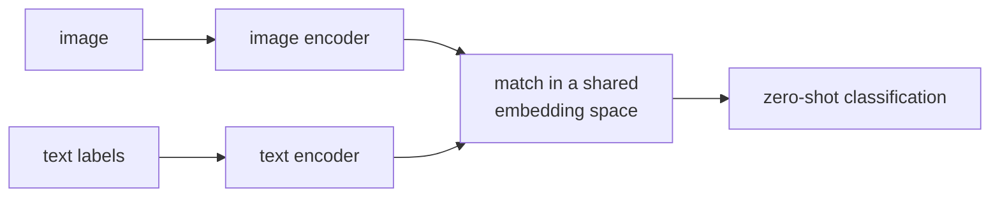

Image classification systems traditionally require labeled datasets ($\langle$image, class label$\rangle$
pairs) to train. **CLIP** (Contrastive Language-Image Pretraining; Radford et al., OpenAI, 2021)
sidesteps this by training on 400M image-caption pairs scraped from the internet<FN n="1" />. The result: a
model that can classify images into any category described in natural language -- zero-shot.

## Architecture

CLIP trains two encoders jointly:

- **Image encoder:** a Vision Transformer (ViT) or ResNet that maps an image $I$ to an
  embedding $\mathbf{v} \in \mathbb{R}^d$.
- **Text encoder:** a Transformer encoder that maps a text string $T$ to an embedding
  $\mathbf{t} \in \mathbb{R}^d$.

Both embeddings are L2-normalized. Similarity is measured with the dot product
(equivalent to cosine similarity after normalization).

## Contrastive pretraining

For a batch of $N$ (image, caption) pairs, construct an $N \times N$ similarity matrix:

$$
S_{ij} = \mathbf{v}_i \cdot \mathbf{t}_j.
$$

The diagonal entries $S_{ii}$ are positive pairs (matching image and caption). All
off-diagonal entries are negative pairs (mismatched images and captions).

The InfoNCE loss is applied symmetrically (image-to-text and text-to-image):

$$
\mathcal{L} = -\frac{1}{2N} \sum_{i=1}^{N} \left[\log \frac{e^{S_{ii}/\tau}}{\sum_j e^{S_{ij}/\tau}} + \log \frac{e^{S_{ii}/\tau}}{\sum_j e^{S_{ji}/\tau}}\right],
$$

where $\tau$ is a learned temperature (initialized to $\log(1/0.07)$).

## Zero-shot classification

Given $K$ class names, CLIP classifies an image without any labeled examples:

1. Construct a text prompt for each class: "a photo of a \{class\}."
2. Embed all $K$ prompts: $\mathbf{t}_1, \dots, \mathbf{t}_K$.
3. Embed the image: $\mathbf{v}$.
4. Compute cosine similarities: $s_k = \mathbf{v} \cdot \mathbf{t}_k$.
5. Predict the class with the highest similarity: $\hat{k} = \arg\max_k s_k$.

**Prompt engineering** matters significantly: "a photo of a \{class\}" outperforms just
"\{class\}" because the training data contained many such captions. More elaborate prompts
("a photo of a \{class\}, a type of food") improve fine-grained classification.

**Prompt ensembling:** average embeddings over multiple prompt templates:
"a photo of a \{class\}", "a blurry photo of a \{class\}", "art of a \{class\}", etc.
This reduces sensitivity to any single template and typically improves accuracy.

## Implementation (numpy)

```python
import numpy as np

def softmax(x, axis=-1):
    e = np.exp(x - x.max(axis=axis, keepdims=True))
    return e / e.sum(axis=axis, keepdims=True)

def clip_loss(image_embs, text_embs, log_temp=np.log(1/0.07)):
    """
    image_embs: (N, d) L2-normalized
    text_embs:  (N, d) L2-normalized
    """
    temp  = np.exp(log_temp)
    logits = image_embs @ text_embs.T * temp    # (N, N)
    labels = np.arange(len(image_embs))

    # Image-to-text loss
    log_probs_i2t = np.log(softmax(logits, axis=1))
    loss_i2t = -log_probs_i2t[labels, labels].mean()

    # Text-to-image loss
    log_probs_t2i = np.log(softmax(logits.T, axis=1))
    loss_t2i = -log_probs_t2i[labels, labels].mean()

    return (loss_i2t + loss_t2i) / 2

def zero_shot_classify(image_emb, class_names):
    """image_emb: (d,), class_names: list of strings. Returns predicted class index."""
    # In practice: encode prompts with the text encoder
    # Here: simulate with random embeddings (replace with real encoder)
    rng = np.random.default_rng(42)
    text_embs = np.array([rng.normal(0, 1, len(image_emb)) for _ in class_names])
    text_embs /= np.linalg.norm(text_embs, axis=1, keepdims=True)  # L2 normalize
    sims = image_emb @ text_embs.T                                   # (K,)
    return class_names[sims.argmax()], softmax(sims)

# Demo
N, d = 8, 16
rng = np.random.default_rng(0)
img_embs = rng.normal(0, 1, (N, d))
txt_embs = img_embs + rng.normal(0, 0.5, (N, d))  # similar to images
img_embs /= np.linalg.norm(img_embs, axis=1, keepdims=True)
txt_embs /= np.linalg.norm(txt_embs, axis=1, keepdims=True)

loss = clip_loss(img_embs, txt_embs)
print(f"CLIP loss (paired): {loss:.4f}")

# Zero-shot classification demo
test_img = img_embs[0]
classes  = ["cat", "dog", "bird", "fish"]
pred_cls, probs = zero_shot_classify(test_img, classes)
print(f"Predicted class: {pred_cls}")
print(f"Probabilities: {dict(zip(classes, probs.round(3)))}")
```



## What CLIP learns and where it fails

**Learns:** object categories, scenes, textures, styles, relationships -- essentially
whatever the image-caption pairs contain.

**Fails:**
- **Counting:** "an image with exactly 3 dogs" -- CLIP does not count reliably.
- **Negation:** "an image without a tree" -- CLIP cannot reason about absence.
- **Spatial relationships:** "the cat is to the left of the dog" -- weak.
- **Fine-grained:** satellite imagery, medical scans, specialist domains rare in web captions.

**CLIP as a backbone:** CLIP image features are powerful representations for downstream
tasks. Fine-tuning on a labeled dataset consistently outperforms supervised pretraining
on ImageNet. CLIP embeddings serve as the visual front-end for vision-language models
(LLaVA, BLIP-2)<FN ns="2, 3" />.

## Exercises

**Exercise 1.** A CLIP batch has $N = 4$ image-caption pairs. How many entries does the
similarity matrix $S$ have, how many are positive pairs, and how many are negative pairs?
Generalize to arbitrary $N$.

<details>
<summary>Solution</summary>

**Step 1.** $S$ is $N \times N$, so it has $N^2 = 16$ entries.

**Step 2.** The positive pairs are the diagonal entries $S_{ii}$, one per row: $N = 4$ of them.

**Step 3.** Everything off-diagonal is a negative pair: $N^2 - N = 16 - 4 = 12$. In general
$S$ has $N^2$ entries, $N$ positives, and $N(N-1)$ negatives, so each image is contrasted
against $N - 1$ wrong captions inside the batch. This is why CLIP wants a large batch:
more in-batch negatives sharpen the contrastive signal.

</details>

**Exercise 2.** Take the smallest non-trivial batch, $N = 2$, with embeddings already
L2-normalized and orthogonal: $\mathbf{v}_1 = \mathbf{t}_1 = (1, 0)$ and
$\mathbf{v}_2 = \mathbf{t}_2 = (0, 1)$. Using temperature $\tau = 1$, compute the symmetric
InfoNCE loss by hand.

<details>
<summary>Solution</summary>

**Step 1.** The similarity matrix is $S_{ij} = \mathbf{v}_i \cdot \mathbf{t}_j$, which here
is the identity:

$$
S = \begin{pmatrix} 1 & 0 \\ 0 & 1 \end{pmatrix}.
$$

**Step 2.** With $\tau = 1$ the logits equal $S$. Row 0 of the image-to-text softmax has
the positive at logit $1$ and the negative at logit $0$, so the probability on the diagonal is

$$
\frac{e^{1}}{e^{1} + e^{0}} = \frac{e}{e + 1}.
$$

**Step 3.** By symmetry every row and column gives the same diagonal probability, so both the
image-to-text and text-to-image terms equal $-\log\frac{e}{e+1}$, and so does their average:

$$
\mathcal{L} = -\log \frac{e}{e + 1} = \log\!\left(1 + e^{-1}\right) \approx 0.313 \text{ nats}.
$$

The loss is positive even with perfectly matched, orthogonal pairs because a finite
temperature never drives the off-diagonal probability fully to zero.

</details>

**Exercise 3 (code).** Implement the symmetric CLIP loss in numpy and verify the closed-form
result from Exercise 2.

<details>
<summary>Solution</summary>

```python
import numpy as np

def softmax(x, axis=-1):
    e = np.exp(x - x.max(axis=axis, keepdims=True))
    return e / e.sum(axis=axis, keepdims=True)

def clip_loss(img, txt, tau=1.0):
    logits = (img @ txt.T) / tau          # (N, N) similarity / temperature
    n = len(img)
    labels = np.arange(n)
    l_i2t = -np.log(softmax(logits, axis=1))[labels, labels].mean()
    l_t2i = -np.log(softmax(logits.T, axis=1))[labels, labels].mean()
    return (l_i2t + l_t2i) / 2

img = np.array([[1.0, 0.0], [0.0, 1.0]])   # normalized, orthogonal
txt = img.copy()                            # text == image
loss = clip_loss(img, txt, tau=1.0)

expected = np.log(1 + np.exp(-1.0))         # -log(e/(e+1))
assert np.isclose(loss, expected)
print(round(loss, 4), "nats")               # 0.3133
```

The numpy loss matches the hand derivation to floating-point precision.

</details>

These aligned embeddings are exactly what the next lesson reuses: a vision-language model
wires CLIP's frozen image encoder to an LLM so it can generate text, not just match it.

<Footnotes>
  <FNItem n="1">**Radford, A., et al.** (2021). "Learning transferable visual models from natural language supervision (CLIP)". *ICML*. [arXiv:2103.00020](https://arxiv.org/abs/2103.00020)</FNItem>
  <FNItem n="2">**Liu, H., Li, C., Wu, Q., & Lee, Y. J.** (2023). "Visual instruction tuning (LLaVA)". *NeurIPS*. [arXiv:2304.08485](https://arxiv.org/abs/2304.08485)</FNItem>
  <FNItem n="3">**Li, J., Li, D., Savarese, S., & Hoi, S.** (2023). "BLIP-2: bootstrapping language-image pre-training with frozen image encoders and large language models". *ICML*. [arXiv:2301.12597](https://arxiv.org/abs/2301.12597)</FNItem>
</Footnotes>
