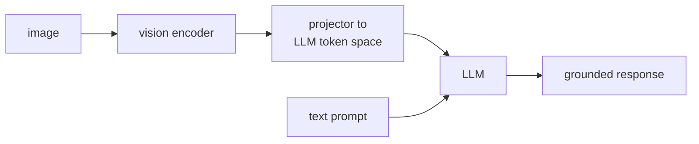

A pretrained VLM like LLaVA-1.0 (after stage 1 feature alignment) can describe images
but cannot follow visual instructions ("Point out the errors in this code shown in the
image"). **Visual instruction tuning** fine-tunes the model to follow natural language
instructions about images<FN n="1" />.

## Visual instruction tuning data

High-quality instruction data is the bottleneck for LMM fine-tuning.

### GPT-4-generated instruction data

LLaVA-Instruct-158K was generated by prompting GPT-4 with:
1. Image caption (from a caption dataset).
2. Dense object annotations (bounding boxes from COCO).

GPT-4 was prompted to generate three types of QA pairs:
- **Conversation:** multi-turn Q&A about image content.
- **Detailed description:** a long, rich description of the image.
- **Complex reasoning:** multi-step reasoning about the image.

GPT-4 did not see the actual image (text-only GPT-4 at the time); it used the textual
annotations as proxy. This is a form of "textual image grounding."

### ShareGPT4V and data scaling

Later datasets use GPT-4V (vision-enabled) to generate more accurate, visually-grounded
annotations. ShareGPT4V (Chen et al., 2023) collected 1.2M high-quality captions using
GPT-4V and found that a smaller amount of GPT-4V-generated data outperforms a larger
amount of GPT-4-text-generated data.

### Diverse task coverage

Effective instruction tuning datasets cover:
- **Captioning:** describe the image.
- **VQA (Visual Question Answering):** answer specific questions about the image.
- **OCR:** read text in the image.
- **Chart/diagram understanding:** interpret graphs, tables, flowcharts.
- **Document QA:** answer questions about document screenshots.
- **Coding:** interpret code screenshots and explain or fix them.
- **Spatial reasoning:** "What is to the left of the dog?"

## Two-stage training schedule

### Stage 1: Feature alignment

**Frozen:** image encoder, LLM.
**Trained:** only the projection/bridge module.
**Data:** image-caption pairs (LAION, CC3M, ShareGPT4V captions).
**Goal:** align visual feature space with LLM token embedding space.

**Why freeze?** The image encoder already has good CLIP representations; the LLM has
good language representations. We only need to teach the projection how to translate
between them. Freezing prevents catastrophic forgetting<FN n="2" />.

### Stage 2: Instruction fine-tuning

**Frozen:** image encoder.
**Trained:** projection module + LLM.
**Data:** visual instruction datasets (LLaVA-Instruct, ShareGPT4V, etc.).
**Goal:** teach the model to follow visual instructions.

Unfreezing the LLM in stage 2 allows it to adapt to processing visual tokens. The image
encoder remains frozen to preserve CLIP's representations.

### LoRA for LMM fine-tuning

Full fine-tuning of the LLM in stage 2 is memory-intensive. LoRA is commonly applied
to the LLM's attention matrices, with the full LLM parameters frozen. The tradeoff:
LoRA converges faster but may plateau below full fine-tuning quality on complex reasoning.

## GPT-4V's approach (what's known)

OpenAI's GPT-4V (released September 2023) is a multimodal extension of GPT-4. Little is
publicly known about its architecture, but the GPT-4V technical report and subsequent
research suggest:

- **Multiple resolution encodings:** images are tiled into multiple resolution levels
  to handle high-resolution inputs without token explosion.
- **Interleaved image and text tokens** throughout the model (not just prepended visual
  tokens).
- **Large-scale visual instruction tuning** with human-annotated safety data.

GPT-4V significantly outperforms open-source VLMs on chart understanding, OCR, and
document QA -- tasks requiring fine-grained visual detail -- suggesting higher-resolution
encoding and a larger underlying LLM.

## Evaluation benchmarks

| Benchmark | Tests |
|-----------|-------|
| VQAv2 | Natural image question answering |
| MMBench | Multi-modal understanding |
| MMMU | Multi-discipline multi-modal reasoning |
| TextVQA | Text reading in natural images |
| ChartQA | Chart and plot understanding |
| ScienceQA | Science questions with diagrams |

**MMMU (Massive Multidisciplinary Multimodal Understanding)** is the hardest: it requires
college-level domain knowledge and image understanding together. GPT-4V achieves ~56%;
open-source models range 35-50%.

## Active research directions

**Dynamic resolution:** tile high-resolution images into multiple sub-images processed
separately, then concatenated. Enables reading small text and fine-grained details.

**Video LMMs:** extend to video by encoding frames at regular intervals (VideoChat, Video-LLaVA).
Long-video understanding requires additional temporal modeling.

**Grounded generation:** output bounding box coordinates and segmentation masks, not
just text. Requires training on detection and segmentation datasets.

## Exercises

**Exercise 1.** In the two-stage schedule, stage 1 freezes both the image encoder and the
LLM and trains only the projection, while stage 2 unfreezes the LLM but keeps the image
encoder frozen. Explain why the image encoder stays frozen in both stages, and what would
go wrong if it were unfrozen in stage 1.

Solution

**Step 1.** The image encoder is a pretrained CLIP model whose features are already well
aligned with language from contrastive pretraining on 400M pairs. That alignment is the
asset the VLM is built on; there is nothing to gain by re-learning it.

**Step 2.** In stage 1 only the projection is trained, on a relatively small set of
image-caption pairs. If the image encoder were also unfrozen, the gradient from this small,
noisy alignment objective would flow into its millions of parameters and pull them away from
the broad CLIP representation, a form of catastrophic forgetting.

**Step 3.** The result would be an encoder overfit to the caption data and weaker on the
diverse downstream tasks (OCR, charts, spatial reasoning) the VLM must handle. Freezing it
preserves the general-purpose visual features and lets the small projection do the cheap job
of translating them into the LLM's token space.

**Exercise 2.** ShareGPT4V found that a smaller amount of GPT-4V-generated (vision-grounded)
instruction data outperformed a larger amount of GPT-4-text-generated data, where text-only
GPT-4 never saw the image and worked from captions plus bounding boxes. Give two distinct
mechanisms by which the text-only pipeline injects errors that vision-grounded annotation
avoids, and name one task category where this gap would be largest.

Solution

**Step 1.** Mechanism one is hallucinated detail: text-only GPT-4 fills gaps the captions
leave with plausible-but-wrong content (a color, a count, an object never actually present),
because it is generating from a lossy textual proxy rather than the pixels.

**Step 2.** Mechanism two is missing or mislocated detail: anything the caption and bounding
boxes did not record (small text, fine textures, exact spatial layout) is invisible to the
text-only model, so its answers cannot reference it and its spatial claims drift. Vision-
grounded GPT-4V reads these directly off the image.

**Step 3.** The gap is largest on tasks that hinge on fine-grained pixel evidence: OCR /
TextVQA and chart or document understanding, where the answer is literally the small text or
plotted values that never survive into a caption.

**Exercise 3.** A team fine-tunes a 7B-parameter VLM for stage 2. Option A is full
fine-tuning of the LLM; option B applies LoRA to the LLM's attention matrices with the base
weights frozen. The lesson notes LoRA "converges faster but may plateau below full
fine-tuning quality on complex reasoning." Recommend an option for (a) a startup adapting the
model to a narrow document-QA domain on a single GPU, and (b) a lab pushing state of the art
on MMMU, and justify each from the stated trade-off.

Solution

**Step 1.** Restate the trade-off: LoRA trains a small number of low-rank adapter parameters,
so it is far cheaper in memory and converges quickly, but its limited capacity can cap
quality on hard, broad reasoning. Full fine-tuning updates all LLM weights, costing much more
memory and time but reaching the higher ceiling.

**Step 2.** Case (a), narrow document-QA on one GPU, favors LoRA. The domain is narrow, so
the capacity ceiling is unlikely to bind, and the single-GPU budget makes full fine-tuning's
memory cost the binding constraint. Fast convergence and low memory match the situation.

**Step 3.** Case (b), pushing MMMU, favors full fine-tuning. MMMU is the hardest benchmark,
requiring college-level multi-discipline reasoning, exactly where LoRA is said to plateau. A
lab chasing state of the art has the compute budget and should pay for the higher quality
ceiling rather than accept LoRA's cap.

These data and schedule choices set up the generation side of multimodality: the next
lessons turn the conditioning around and synthesize images and video from text.

<Footnotes>
  <FNItem n="1">**Liu, H., Li, C., Wu, Q., & Lee, Y. J.** (2023). "Visual instruction tuning (LLaVA)". *NeurIPS*. [arXiv:2304.08485](https://arxiv.org/abs/2304.08485)</FNItem>
  <FNItem n="2">**Li, J., Li, D., Savarese, S., & Hoi, S.** (2023). "BLIP-2: bootstrapping language-image pre-training with frozen image encoders and large language models". *ICML*. [arXiv:2301.12597](https://arxiv.org/abs/2301.12597)</FNItem>
</Footnotes>
