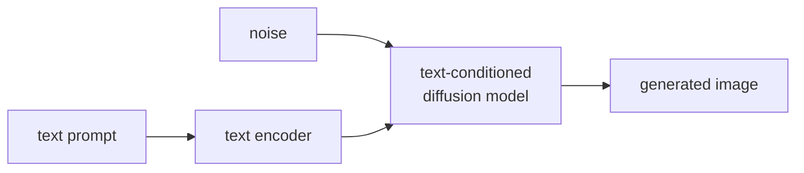

Text-to-image generation is the task of synthesizing a photorealistic (or stylized) image
from a natural language description<FN n="1" />. The three dominant approaches -- DALL-E 2, Stable
Diffusion, and Midjourney -- share a foundation in diffusion models and CLIP-based text
conditioning, but differ in architecture and training.

## Text conditioning: the core mechanism

A diffusion model learns to denoise images. Without conditioning, it samples from the
image marginal distribution $p(x)$. To condition on text $y$, we sample from
$p(x \mid y)$: images that match the text description.

The text string $y$ is encoded by a CLIP text encoder or a language model into a fixed-
dimensional embedding $\mathbf{c} = \text{TextEnc}(y)$. This embedding is injected into
the diffusion model's denoising network at each step.

**Injection via cross-attention:** the denoising network (typically a U-Net or DiT) uses
cross-attention layers where the image features (queries) attend to the text embedding
(keys and values):

$$
\text{CrossAttn}(Q, K, V) = \text{softmax}\!\left(\frac{Q_\text{img} K_\text{text}^\top}{\sqrt{d}}\right) V_\text{text}.
$$

This mechanism is the same as in the Transformer encoder-decoder (E3), but now the
"source sequence" is the text embedding and the "target" is the noisy image.

## Classifier-free guidance (CFG)

Training the diffusion model conditional on text $y$ requires paired (text, image) data.
But we also want to **amplify** the conditioning effect at inference time.

**Classifier-free guidance** (Ho and Salimans, 2022) trains a single model on both
conditional ($y$) and unconditional ($y = \emptyset$, text dropped out randomly at training)
inputs. At inference, combine both predictions:

$$
\hat{\epsilon}(x_t, y) = \epsilon(x_t, \emptyset) + w \cdot [\epsilon(x_t, y) - \epsilon(x_t, \emptyset)],
$$

where $w > 1$ is the **guidance scale**. The second term amplifies the difference between
conditional and unconditional predictions, steering the sample toward high-fidelity text
alignment at the cost of diversity.

- $w = 1$: standard conditional generation.
- $w = 7{-}10$: strong text alignment but lower diversity (typical for DALL-E 2, SD).
- $w \to \infty$: overfit to the text; outputs lose realism.

## DALL-E 2 (OpenAI, 2022)

**Two-stage pipeline:**

1. **CLIP prior:** given the text embedding $\mathbf{c}_\text{text}$, train a diffusion
   model to generate the corresponding CLIP **image embedding** $\mathbf{c}_\text{img}$:
   $p(\mathbf{c}_\text{img} \mid \mathbf{c}_\text{text})$.

2. **Unclip decoder:** given $\mathbf{c}_\text{img}$, generate the image pixels with a
   second diffusion model: $p(x \mid \mathbf{c}_\text{img})$.

The CLIP image embedding captures semantic content but not photographic details, so the
decoder has freedom in style, lighting, and composition.

**Variations:** fixing $\mathbf{c}_\text{text}$ and sampling different $\mathbf{c}_\text{img}$
values produces semantically similar images with different visual styles.

## Stable Diffusion: latent diffusion

**Stable Diffusion (Rombach et al., 2022)** reduces compute by running the diffusion
process in a compressed **latent space** rather than pixel space<FN n="2" />.

1. **VAE encoder:** compress the image $x \in \mathbb{R}^{H \times W \times 3}$ to a latent
   $z \in \mathbb{R}^{H/8 \times W/8 \times 4}$ (8x spatial compression, 4 latent channels).

2. **Diffusion in latent space:** train the denoising U-Net on $z$ with text conditioning
   via cross-attention:
   $$z_{t-1} \leftarrow \text{Denoise}(z_t, \mathbf{c}_\text{text}, t).$$

3. **VAE decoder:** decode the final latent $z_0$ back to pixel space.

**Efficiency:** operating on $64 \times 64$ latents (for a 512px image) vs. $512 \times 512$
pixels reduces memory and compute by 64x, enabling training on consumer GPUs and inference
in seconds.

**Text encoder:** Stable Diffusion 1.x uses CLIP ViT-L text encoder; SD 2.x uses OpenCLIP;
SD 3 uses three text encoders (CLIP-L, OpenCLIP-G, and T5-XXL) whose embeddings are
concatenated. Conditioning on a large frozen language model (T5) for stronger text
alignment was introduced by Imagen<FN n="3" />.

## SDXL and SD 3: scaling up

**SDXL (2023):** larger U-Net (2.6B parameters) with an additional refiner diffusion model
for high-frequency details. Second-stage refinement conditions on the base model's output.

**SD 3 and SD 3.5 (2024):** replace the U-Net with a **Diffusion Transformer (DiT)**:
- Patch the latent into tokens.
- Apply transformer blocks with multi-modal attention (image patches and text tokens in
  the same attention operation).
- Separate streams for image and text that merge via attention.

DiT-based models scale better with parameters and produce more coherent text in images.

## Midjourney

Midjourney's architecture is proprietary. Known characteristics:
- Strong artistic style; optimized for aesthetic quality over photorealism.
- Rumored to use a proprietary diffusion model trained on curated aesthetic data.
- RLHF-style feedback (users can upscale/vary; winning variants are used in training).
- V6 shows significantly improved text rendering and prompt adherence.

## Evaluation

| Metric | Measures |
|--------|---------|
| FID (Frechet Inception Distance) | Distribution match between real and generated images |
| CLIP score | Text-image alignment |
| Human preference (ELO) | Aesthetic quality and instruction following |
| DrawBench | Compositional generation (count, color, position) |

All three systems score high on CLIP and FID but differ substantially on human preference
and compositional accuracy. Text rendering (letters in images) remains an active challenge,
partially addressed by SD 3 and DALL-E 3.

## Exercises

**Exercise 1.** At a denoising step the unconditional noise prediction is
$\epsilon(x_t, \emptyset) = 0.4$ and the conditional prediction is $\epsilon(x_t, y) = 0.9$
(for one coordinate). Compute the classifier-free guided prediction $\hat{\epsilon}$ for
guidance scales $w = 1$, $w = 7.5$, and $w = 0$. Interpret what each value means for the
generated sample.

Solution

**Step 1.** The CFG formula is
$\hat{\epsilon} = \epsilon(x_t, \emptyset) + w\,[\epsilon(x_t, y) - \epsilon(x_t, \emptyset)]$.
The bracket is the conditioning direction, here $0.9 - 0.4 = 0.5$.

**Step 2.** Substitute each scale:

$$
\begin{aligned}
w = 1: &\quad 0.4 + 1 \cdot 0.5 = 0.9, \\
w = 7.5: &\quad 0.4 + 7.5 \cdot 0.5 = 4.15, \\
w = 0: &\quad 0.4 + 0 \cdot 0.5 = 0.4.
\end{aligned}
$$

**Step 3.** At $w = 1$ the guided prediction equals the plain conditional one, standard
text-conditioned generation. At $w = 0$ it collapses to the unconditional prediction, the
text is ignored. At $w = 7.5$ the prediction is pushed far past the conditional value,
amplifying text alignment at the cost of diversity and, if pushed further, realism. CFG is
an extrapolation along the conditioning direction, not an interpolation.

**Exercise 2.** Stable Diffusion runs diffusion on $z \in \mathbb{R}^{H/8 \times W/8 \times 4}$
instead of pixels $x \in \mathbb{R}^{H \times W \times 3}$. For a $512 \times 512$ image,
compute the spatial grid the U-Net operates on, the factor by which the number of spatial
positions shrinks, and the ratio of total tensor elements (latent vs pixel). Explain why the
lesson quotes a "64x" reduction rather than the element ratio.

Solution

**Step 1.** The latent grid is $512/8 \times 512/8 = 64 \times 64$ spatial positions, versus
$512 \times 512$ pixels.

**Step 2.** Spatial positions shrink by $\frac{512 \times 512}{64 \times 64} = \frac{262144}{4096} = 64$.
The self-attention and convolution cost scales with the number of spatial positions, so this
$64\times$ is the figure that governs compute.

**Step 3.** Counting channels too, total elements go from $512 \times 512 \times 3 = 786{,}432$
to $64 \times 64 \times 4 = 16{,}384$, a ratio of $48$. The element ratio is smaller because
the latent adds a channel (3 to 4). The lesson quotes $64\times$ because compute and memory
in the spatial attention scale with spatial positions, not channel count.

**Exercise 3.** DALL-E 2 uses a two-stage pipeline (a CLIP prior mapping text embedding to a
CLIP image embedding, then an unCLIP decoder to pixels), while Stable Diffusion conditions a
single latent-diffusion U-Net directly on the text embedding via cross-attention. Give one
capability the DALL-E 2 design buys from the intermediate CLIP image embedding, and one
practical advantage Stable Diffusion's design has.

Solution

**Step 1.** DALL-E 2's intermediate $\mathbf{c}_{\text{img}}$ is a full CLIP image embedding.
Holding the text fixed and resampling the prior produces different image embeddings, hence
semantically equivalent but visually varied outputs (different style, lighting, composition).
The embedding also supports image variations and embedding arithmetic, capabilities that come
directly from operating in CLIP's image space.

**Step 2.** Stable Diffusion's single-stage latent design is simpler and cheaper: there is no
separate prior model to train or run, and diffusion happens in an 8x-compressed latent, so
training fits on consumer GPUs and inference takes seconds. One model, conditioned by
cross-attention, end to end.

**Step 3.** The trade-off is modularity and embedding-level control (DALL-E 2) versus
simplicity and efficiency (Stable Diffusion); both reach high CLIP and FID scores, so the
choice is driven by these system properties rather than raw quality.

The same latent-diffusion and DiT machinery, with cross-attention text conditioning, extends
in the next lesson from a single image to temporally coherent video.

<Footnotes>
  <FNItem n="1">**Ramesh, A., et al.** (2021). "Zero-shot text-to-image generation (DALL-E)". *ICML*. [arXiv:2102.12092](https://arxiv.org/abs/2102.12092)</FNItem>
  <FNItem n="2">**Rombach, R., et al.** (2022). "High-resolution image synthesis with latent diffusion models (Stable Diffusion)". *CVPR*. [arXiv:2112.10752](https://arxiv.org/abs/2112.10752)</FNItem>
  <FNItem n="3">**Saharia, C., et al.** (2022). "Photorealistic text-to-image diffusion models with deep language understanding (Imagen)". *NeurIPS*. [arXiv:2205.11487](https://arxiv.org/abs/2205.11487)</FNItem>
</Footnotes>
