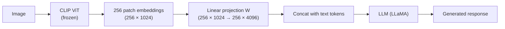
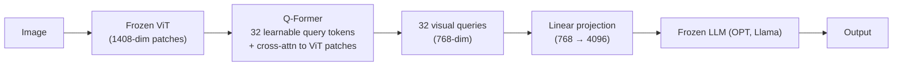

CLIP aligns image and text embeddings in a shared space but cannot generate text.
**Vision-language models (VLMs)** wire a visual encoder to a language model, enabling
tasks like visual question answering, image captioning, and visual instruction following.

## The architecture challenge

Two mismatched components:

- **Image encoder (CLIP ViT):** outputs a sequence of patch embeddings, typically
  256 patches of dimension 1024 for a ViT-L.
- **LLM (LLaMA, Vicuna, GPT-4):** expects token embeddings of dimension $d_{\text{LLM}}$
  (typically 4096 for 7B models).

The design choices are: (1) how to reduce/project the visual features to the LLM's
dimension and (2) how to interleave visual and text tokens.

## LLaVA: linear projection

**LLaVA (Liu et al., 2023)** uses the simplest possible bridge: a **single linear
projection layer** $W \in \mathbb{R}^{d_{\text{LLM}} \times d_{\text{CLIP}}}$.



**Training:**
- Stage 1 (feature alignment): freeze both CLIP and LLM; train only $W$ on
  image-caption pairs. Goal: align visual features to text token space.
- Stage 2 (end-to-end fine-tuning): freeze CLIP; train $W$ and the LLM on
  visual instruction following data (LLaVA-Instruct-158K: GPT-4-generated QA pairs
  from image-description data).

**Visual tokens in the LLM:** the 256 projected patch embeddings are prepended to the
text token embeddings as if they were 256 extra tokens. The LLM then performs
self-attention over all visual + text tokens jointly.

**LLaVA-1.5** improvements: replace the linear projection with a 2-layer MLP, use a
CLIP-ViT encoder with higher resolution (336×336 vs 224×224), and scale the instruction
tuning data.

## BLIP-2: Q-Former bottleneck

**BLIP-2 (Li et al., 2023)** uses a learned bottleneck -- the **Querying Transformer
(Q-Former)** -- to compress 256 patch embeddings into a small fixed number of query
embeddings (typically 32).



**Q-Former architecture:**
- 32 **learnable query tokens** $Q \in \mathbb{R}^{32 \times d}$ (initialized randomly,
  trained end-to-end).
- Self-attention among query tokens.
- Cross-attention to ViT patch embeddings (queries attend to patches).
- Shared self-attention between query tokens and text tokens during pretraining.

The Q-Former is pretrained with three objectives:
1. **ITC (Image-Text Contrastive):** align query output with text representation.
2. **ITM (Image-Text Matching):** classify whether image and text match.
3. **ITG (Image-grounded Text Generation):** generate text conditioned on query outputs.

Only 32 visual tokens are passed to the LLM (vs 256 for LLaVA), dramatically reducing
the LLM's context usage. The LLM can be entirely frozen; only the Q-Former is trained.

## Forward pass: visual question answering

For LLaVA (simplified):

```python-static
# Conceptual forward pass (not runnable -- requires GPU and model weights)
import torch
from PIL import Image

def llava_forward(image, question, clip_model, projection, llm_model, llm_tokenizer):
    # 1. Extract visual features
    with torch.no_grad():
        image_features = clip_model.encode_image(image)  # (256, 1024)

    # 2. Project to LLM dimension
    visual_tokens = projection(image_features)            # (256, 4096)

    # 3. Tokenize question
    text_tokens = llm_tokenizer(question, return_tensors="pt")
    text_embeddings = llm_model.embed_tokens(text_tokens.input_ids)  # (T, 4096)

    # 4. Prepend visual tokens to text embeddings
    combined = torch.cat([visual_tokens.unsqueeze(0), text_embeddings], dim=1)
    # combined: (1, 256 + T, 4096)

    # 5. LLM forward pass (visual tokens attend to each other and to text)
    output = llm_model.generate(inputs_embeds=combined, max_new_tokens=256)
    return llm_tokenizer.decode(output[0])
```

## Comparison

| Model | Visual encoder | Bridge | LLM | Visual tokens |
|-------|---------------|--------|-----|---------------|
| LLaVA 1.0 | CLIP ViT-L | Linear | Vicuna-13B | 256 |
| LLaVA 1.5 | CLIP ViT-L/336 | 2-layer MLP | Vicuna-13B | 576 |
| BLIP-2 | EVA-CLIP ViT-G | Q-Former (32 queries) | OPT-6.7B / Flan-T5 | 32 |
| InstructBLIP | EVA-CLIP ViT-G | Q-Former (32 queries) | Vicuna-13B | 32 |
| GPT-4V | Unknown ViT | Unknown | GPT-4 | Unknown |

**Trend:** more recent models (LLaVA-NeXT, InternVL, Qwen-VL) use higher-resolution image
tiles, dynamic resolution encoding, and larger LLMs. GPT-4V and Claude 3 are proprietary.
