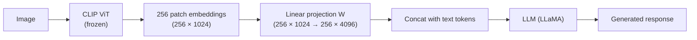
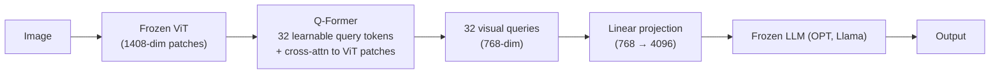

CLIP aligns image and text embeddings in a shared space but cannot generate text.
**Vision-language models (VLMs)** wire a visual encoder to a language model, enabling
tasks like visual question answering, image captioning, and visual instruction following<FN n="3" />.

## The architecture challenge

Two mismatched components:

- **Image encoder (CLIP ViT):** outputs a sequence of patch embeddings, typically
  256 patches of dimension 1024 for a ViT-L.
- **LLM (LLaMA, Vicuna, GPT-4):** expects token embeddings of dimension $d_{\text{LLM}}$
  (typically 4096 for 7B models).

The design choices are: (1) how to reduce/project the visual features to the LLM's
dimension and (2) how to interleave visual and text tokens.

## LLaVA: linear projection

**LLaVA (Liu et al., 2023)** uses the simplest possible bridge: a **single linear
projection layer** $W \in \mathbb{R}^{d_{\text{LLM}} \times d_{\text{CLIP}}}$<FN n="1" />.



**Training:**
- Stage 1 (feature alignment): freeze both CLIP and LLM; train only $W$ on
  image-caption pairs. Goal: align visual features to text token space.
- Stage 2 (end-to-end fine-tuning): freeze CLIP; train $W$ and the LLM on
  visual instruction following data (LLaVA-Instruct-158K: GPT-4-generated QA pairs
  from image-description data).

**Visual tokens in the LLM:** the 256 projected patch embeddings are prepended to the
text token embeddings as if they were 256 extra tokens. The LLM then performs
self-attention over all visual + text tokens jointly.

**LLaVA-1.5** improvements: replace the linear projection with a 2-layer MLP, use a
CLIP-ViT encoder with higher resolution (336×336 vs 224×224), and scale the instruction
tuning data.

## BLIP-2: Q-Former bottleneck

**BLIP-2 (Li et al., 2023)** uses a learned bottleneck -- the **Querying Transformer
(Q-Former)** -- to compress 256 patch embeddings into a small fixed number of query
embeddings (typically 32)<FN n="2" />.



**Q-Former architecture:**
- 32 **learnable query tokens** $Q \in \mathbb{R}^{32 \times d}$ (initialized randomly,
  trained end-to-end).
- Self-attention among query tokens.
- Cross-attention to ViT patch embeddings (queries attend to patches).
- Shared self-attention between query tokens and text tokens during pretraining.

The Q-Former is pretrained with three objectives:
1. **ITC (Image-Text Contrastive):** align query output with text representation.
2. **ITM (Image-Text Matching):** classify whether image and text match.
3. **ITG (Image-grounded Text Generation):** generate text conditioned on query outputs.

Only 32 visual tokens are passed to the LLM (vs 256 for LLaVA), dramatically reducing
the LLM's context usage. The LLM can be entirely frozen; only the Q-Former is trained.

## Forward pass: visual question answering

For LLaVA (simplified):

```python-static
# Conceptual forward pass (not runnable -- requires GPU and model weights)
import torch
from PIL import Image

def llava_forward(image, question, clip_model, projection, llm_model, llm_tokenizer):
    # 1. Extract visual features
    with torch.no_grad():
        image_features = clip_model.encode_image(image)  # (256, 1024)

    # 2. Project to LLM dimension
    visual_tokens = projection(image_features)            # (256, 4096)

    # 3. Tokenize question
    text_tokens = llm_tokenizer(question, return_tensors="pt")
    text_embeddings = llm_model.embed_tokens(text_tokens.input_ids)  # (T, 4096)

    # 4. Prepend visual tokens to text embeddings
    combined = torch.cat([visual_tokens.unsqueeze(0), text_embeddings], dim=1)
    # combined: (1, 256 + T, 4096)

    # 5. LLM forward pass (visual tokens attend to each other and to text)
    output = llm_model.generate(inputs_embeds=combined, max_new_tokens=256)
    return llm_tokenizer.decode(output[0])
```

## Comparison

| Model | Visual encoder | Bridge | LLM | Visual tokens |
|-------|---------------|--------|-----|---------------|
| LLaVA 1.0 | CLIP ViT-L | Linear | Vicuna-13B | 256 |
| LLaVA 1.5 | CLIP ViT-L/336 | 2-layer MLP | Vicuna-13B | 576 |
| BLIP-2 | EVA-CLIP ViT-G | Q-Former (32 queries) | OPT-6.7B / Flan-T5 | 32 |
| InstructBLIP | EVA-CLIP ViT-G | Q-Former (32 queries) | Vicuna-13B | 32 |
| GPT-4V | Unknown ViT | Unknown | GPT-4 | Unknown |

**Trend:** more recent models (LLaVA-NeXT, InternVL, Qwen-VL) use higher-resolution image
tiles, dynamic resolution encoding, and larger LLMs. GPT-4V and Claude 3 are proprietary.

## Exercises

**Exercise 1.** LLaVA prepends 256 projected patch tokens to the text tokens. LLaVA-1.5 uses
a $336 \times 336$ image with a patch size of $14 \times 14$. How many patches does that
image produce, and how does it compare to the 256 of the lower-resolution model? Then count
how many visual tokens BLIP-2's Q-Former would emit for the same image.

<details>
<summary>Solution</summary>

**Step 1.** A $14 \times 14$ patch tiles a $336 \times 336$ image into a grid of
$336 / 14 = 24$ patches per side, so $24 \times 24 = 576$ patches. This matches the "576"
in the comparison table for LLaVA-1.5.

**Step 2.** The lower-resolution model used a $224 \times 224$ image:
$224 / 14 = 16$ per side, $16 \times 16 = 256$ patches. So raising resolution from 224 to
336 multiplies visual tokens by $576 / 256 = 2.25$.

**Step 3.** The Q-Former is a fixed bottleneck: it always outputs its 32 learned query
tokens regardless of input resolution. So BLIP-2 emits 32 visual tokens for this image,
$576 / 32 = 18$ times fewer than LLaVA-1.5, which is why its LLM context cost is nearly
resolution-independent.

</details>

**Exercise 2.** LLaVA's linear projection $W$ maps each CLIP patch embedding of dimension
$d_{\text{CLIP}} = 1024$ to the LLM dimension $d_{\text{LLM}} = 4096$. How many parameters
does $W$ have (ignore the bias)? If LLaVA-1.5 replaces it with a 2-layer MLP
$1024 \to 4096 \to 4096$ with GELU between, how many weight parameters does the bridge now
hold?

<details>
<summary>Solution</summary>

**Step 1.** A linear map from 1024 to 4096 is a $4096 \times 1024$ matrix:
$4096 \times 1024 = 4{,}194{,}304 \approx 4.19$M parameters.

**Step 2.** The 2-layer MLP stacks two such matrices: $4096 \times 1024$ for the first layer
and $4096 \times 4096$ for the second.

$$
4096 \times 1024 + 4096 \times 4096 = 4{,}194{,}304 + 16{,}777{,}216 = 20{,}971{,}520 \approx 21\text{M}.
$$

The MLP bridge is about 5 times larger, still tiny next to the multi-billion-parameter LLM
it feeds, which is why the projection is cheap to train in stage 1.

</details>

**Exercise 3 (code).** Implement the LLaVA bridge in numpy: project a stack of patch
embeddings through $W$, prepend them to text token embeddings, and confirm the combined
sequence length and the projection's parameter count.

<details>
<summary>Solution</summary>

```python
import numpy as np

rng = np.random.default_rng(0)
n_patches, d_clip, d_llm = 256, 8, 16   # small stand-in dims (real: 1024 -> 4096)

patches = rng.standard_normal((n_patches, d_clip))
W = rng.standard_normal((d_llm, d_clip))            # projection (d_llm x d_clip)

# Project each patch to the LLM dimension: (n_patches, d_llm)
visual_tokens = np.einsum("nd,kd->nk", patches, W)
assert visual_tokens.shape == (n_patches, d_llm)

# Prepend the visual tokens to T text token embeddings
T = 40
text_tokens = rng.standard_normal((T, d_llm))
combined = np.concatenate([visual_tokens, text_tokens], axis=0)
assert combined.shape == (n_patches + T, d_llm) == (296, d_llm)

# Real LLaVA projection parameter count (1024 -> 4096, no bias)
proj_params = 4096 * 1024
assert proj_params == 4_194_304

print(combined.shape[0], "tokens;", proj_params, "projection params")
```

The LLM then runs self-attention over all 296 tokens jointly, exactly as the forward pass
describes.

</details>

The next lesson takes this two-stage, freeze-then-unfreeze bridge and asks what data and
schedule turn a feature-aligned VLM into one that follows visual instructions.

<Footnotes>
  <FNItem n="1">**Liu, H., Li, C., Wu, Q., & Lee, Y. J.** (2023). "Visual instruction tuning (LLaVA)". *NeurIPS*. [arXiv:2304.08485](https://arxiv.org/abs/2304.08485)</FNItem>
  <FNItem n="2">**Li, J., Li, D., Savarese, S., & Hoi, S.** (2023). "BLIP-2: bootstrapping language-image pre-training with frozen image encoders and large language models". *ICML*. [arXiv:2301.12597](https://arxiv.org/abs/2301.12597)</FNItem>
  <FNItem n="3">**Alayrac, J.-B., et al.** (2022). "Flamingo: a visual language model for few-shot learning". *NeurIPS*. [arXiv:2204.14198](https://arxiv.org/abs/2204.14198)</FNItem>
</Footnotes>
