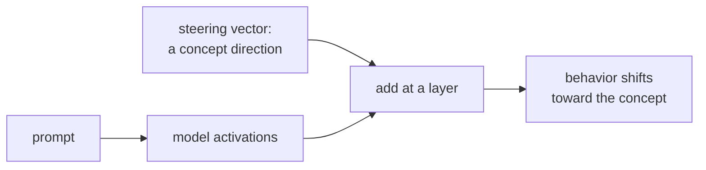

Probing is correlational: it shows what information is encoded. **Activation patching** is
causal: it intervenes on specific activations and observes the effect on output, identifying
which components causally mediate a behavior. **Representation engineering** uses this to
control model behavior at inference time by adding direction vectors to residual stream
activations.

## Activation patching (causal tracing)

**Setup:** choose a factual statement, e.g., "The Eiffel Tower is located in the city of ___".
The model should predict "Paris."

**Corrupted run:** replace "Eiffel Tower" with a noisy scramble (e.g., random tokens).
The model predicts a random city.

**Patching experiment:** run both the clean and corrupted forward passes. For each component
$C$ (attention head or MLP layer at position $t$):

1. Take the activation of $C$ from the **clean run**.
2. Patch it into the **corrupted run** (replace the corrupted activation with the clean one).
3. Measure: does the output recover toward "Paris"?

The component that, when patched, restores the most probability to "Paris" is the component
causally most responsible for storing/retrieving this fact.

**Meng et al. (ROME, 2022)** found that MLP layers at **early-to-middle layers** causally
store factual associations, while **late attention layers** retrieve and route those facts
to the output position.

## Implementation (toy model)

```python
import numpy as np

def softmax(x):
    e = np.exp(x - x.max())
    return e / e.sum()

class ToyTransformer:
    def __init__(self, d=8, V=10, seed=0):
        rng = np.random.default_rng(seed)
        self.W_emb = rng.normal(0, 0.1, (V, d))
        self.W_mlp = rng.normal(0, 0.1, (d, d))
        self.W_out = rng.normal(0, 0.1, (V, d))
        self.residuals = {}  # cache

    def forward(self, token_ids, cache_key=None):
        x = self.W_emb[token_ids].mean(axis=0)   # mean-pool tokens for simplicity
        x_after_mlp = x + np.tanh(self.W_mlp @ x)
        logits = self.W_out @ x_after_mlp
        if cache_key is not None:
            self.residuals[cache_key] = {"pre_mlp": x.copy(), "post_mlp": x_after_mlp.copy()}
        return softmax(logits), x_after_mlp

    def patched_forward(self, token_ids, patch_key, component):
        x = self.W_emb[token_ids].mean(axis=0)
        if component == "post_mlp":
            # Replace post-MLP activation with cached value from clean run
            x_after_mlp = self.residuals[patch_key]["post_mlp"]
        else:
            x_after_mlp = x + np.tanh(self.W_mlp @ x)
        return softmax(self.W_out @ x_after_mlp)

V, d = 10, 8
model = ToyTransformer(d=d, V=V)
clean_ids     = np.array([0, 1, 2])   # "Eiffel Tower is in"
corrupted_ids = np.array([5, 6, 7])   # scrambled
target_token  = 3                     # "Paris"

clean_probs, _   = model.forward(clean_ids,     cache_key="clean")
corrupt_probs, _ = model.forward(corrupted_ids, cache_key="corrupt")

print(f"Clean:     P(Paris) = {clean_probs[target_token]:.4f}")
print(f"Corrupted: P(Paris) = {corrupt_probs[target_token]:.4f}")

# Patch post-MLP activation from clean run into corrupted run
patched_probs = model.patched_forward(corrupted_ids, "clean", "post_mlp")
print(f"Patched:   P(Paris) = {patched_probs[target_token]:.4f}  (recovered?)")

# --- Representation engineering ---
# Steer the model by adding a concept direction to the residual stream.

def steer(model, token_ids, direction, alpha, layer_idx):
    """Add alpha * direction to the post-MLP residual. direction: (d,) unit vector."""
    x = model.W_emb[token_ids].mean(axis=0)
    x_after_mlp = x + np.tanh(model.W_mlp @ x)
    x_steered = x_after_mlp + alpha * direction / (np.linalg.norm(direction) + 1e-9)
    return softmax(model.W_out @ x_steered)

# Find a direction (honest vs. dishonest activations, simulated)
rng = np.random.default_rng(0)
honest_acts    = rng.normal(0.5, 0.1, (20, d))   # simulated
dishonest_acts = rng.normal(-0.5, 0.1, (20, d))
direction = honest_acts.mean(0) - dishonest_acts.mean(0)

# Steer generation
for alpha in [-2.0, 0.0, 2.0]:
    probs = steer(model, clean_ids, direction, alpha, layer_idx=1)
    print(f"alpha={alpha:+.1f}: P(target) = {probs[target_token]:.4f}")
```

## Representation engineering

**Representation engineering (Zou et al., 2023)** uses activation patching ideas in
reverse: instead of diagnosing where a behavior comes from, *insert* it by adding a
direction vector.

### Finding a concept direction

1. Collect pairs of prompts that differ on a concept (e.g., honest vs. dishonest statements).
2. Extract residual stream activations for both conditions.
3. Compute the **difference in mean activations**: $\mathbf{d} = \mu_{\text{honest}} - \mu_{\text{dishonest}}$.
4. The unit vector $\hat{\mathbf{d}} = \mathbf{d} / \|\mathbf{d}\|$ is the "honesty direction."

### Steering generation

At inference, add a multiple of the concept direction to the residual stream at a target layer:

$$
h_t^{(\ell)} \leftarrow h_t^{(\ell)} + \alpha \hat{\mathbf{d}},
$$

where $\alpha > 0$ steers toward the concept; $\alpha < 0$ steers away.

Empirically, adding the "honesty" direction reduces dishonest outputs; adding "happiness"
direction makes the model generate more positive text<FN n="1" />. The steering is graded and reversible.
The runnable demo above shows all three steps: patching, direction extraction, and steering.



## Relation to SAEs

SAEs extract monosemantic feature directions. Representation engineering steers along
any linear direction in activation space. The two complement each other:
- SAEs identify which direction corresponds to a concept.
- Representation engineering uses that direction to control behavior.

This combined toolkit (identify a feature with SAE → steer with RepE) is the foundation
of **activation-level model editing** without retraining the model.

<Footnotes>
  <FNItem n="1">**Turner, A. M., et al.** (2023). "Activation addition: steering language models without optimization". [arXiv:2308.10248](https://arxiv.org/abs/2308.10248). Steers generation by adding a contrastive direction to the residual stream.</FNItem>
</Footnotes>
