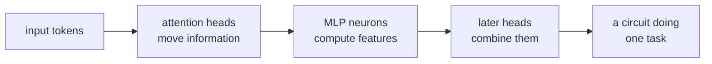

Probing tells us what information is encoded; it does not tell us how the model computes
with it. **Mechanistic interpretability** (mech interp) decomposes the transformer into
computational components -- attention heads and MLP layers -- and discovers which components
implement which sub-tasks, how they communicate, and how they combine to produce outputs.

## The residual stream

The transformer processes a sequence as a **residual stream**: each layer reads from and
writes to the same stream $x \in \mathbb{R}^{T \times d}$. Crucially, every attention
head and MLP layer contributes an **additive update** to the stream:

$$
x \leftarrow x + \text{Attn}(x) + \text{MLP}(x).
$$

This means the residual stream at any layer is a sum of contributions from all previous
layers. The key insight: **the full residual stream equals the sum of contributions from
every component**. This linearity makes it tractable to analyze each component's contribution
independently<FN n="1" />.

## Attention head as a function

Each attention head $h$ in layer $\ell$ performs three operations:

1. **Query-key matching:** compute attention weights from the residual stream.
2. **Value reading:** read information from specific positions (those with high attention weight).
3. **Output writing:** write an additive update to the residual stream at each query position.

The **OV circuit** of an attention head describes what information it moves where:
$W_{OV} = W^V W^O$ maps input tokens (at attended positions) to output contributions.
If the singular vectors of $W_{OV}$ are interpretable (e.g., boosting certain token types),
the head's function becomes clear.

## The indirect object identification (IOI) circuit

**Wang et al. (2022)** analyzed GPT-2's mechanism for completing sentences like:

> "When Mary and John went to the store, John gave a drink to ___"

The correct completion is "Mary" (the indirect object). GPT-2 solves this reliably.

Three types of heads collaborate:

**Duplicate token heads (DT heads):** these heads, in early layers, find the positions
of repeated tokens. In the example, they find "John" appearing twice (subject and repeated name).

**S-inhibition heads (SI heads):** these heads use DT head outputs to suppress the
prediction of the repeated name ("John"), reducing its logit.

**Name mover heads (NM heads):** in the final layers, these heads copy the name at the
indirect object position ("Mary") to the output. They are the heads that directly boost
the logit of the correct answer.

Together: DT finds duplicates, SI suppresses the repeated name, NM copies the indirect
object.

## Analyzing heads by attention patterns

Attention patterns reveal function:
- **Previous token heads:** attend to position $t-1$. Typical in early layers.
- **First token heads:** attend heavily to the first token (`[BOS]`). Act as "sink" heads.
- **Copying heads:** attend to the same token across different positions (useful for IOI).
- **Induction heads:** attend to a past occurrence of the current token (explained in the next lesson)<FN n="2" />.

## Implementation: attention pattern analysis

```python
import numpy as np

def get_attention_patterns(model_output):
    """
    In practice: extract attn_weights from model.
    Here: simulate for demo.
    Returns (n_layers, n_heads, T, T) attention patterns.
    """
    pass   # replaced by actual extraction below

def analyze_head(attn_pattern, threshold=0.5):
    """
    attn_pattern: (T, T) -- rows are queries, cols are keys.
    Classify head type based on pattern.
    """
    T = attn_pattern.shape[0]
    # Check if previous-token head: high weight on diagonal-1
    prev_token_score = np.mean([attn_pattern[t, t-1] for t in range(1, T)])
    # Check if uniform/sink head: all weights roughly equal
    entropy = -np.sum(attn_pattern * np.log(attn_pattern + 1e-9), axis=-1).mean()
    max_entropy = np.log(T)
    uniform_score = entropy / max_entropy
    return {
        "prev_token": float(prev_token_score),
        "uniform": float(uniform_score),
    }

# Simulate attention patterns for 3 types of heads
T = 8
rng = np.random.default_rng(0)

def softmax(x, axis=-1):
    e = np.exp(x - x.max(axis=axis, keepdims=True))
    return e / e.sum(axis=axis, keepdims=True)

# Previous token head: attends to t-1
logits_prev = np.full((T, T), -10.0)
for t in range(1, T):
    logits_prev[t, t-1] = 5.0
logits_prev[0, 0] = 5.0
pattern_prev = softmax(logits_prev)

# Uniform head
pattern_uniform = softmax(np.zeros((T, T)))

# Copying head (attends to same token at another position)
logits_copy = rng.normal(0, 1, (T, T))
logits_copy[T//2:, :T//2] = 5.0  # later positions attend to early duplicates
pattern_copy = softmax(logits_copy)

for name, pattern in [("prev-token", pattern_prev),
                       ("uniform", pattern_uniform),
                       ("copying", pattern_copy)]:
    analysis = analyze_head(pattern)
    print(f"{name:12s}: prev_token={analysis['prev_token']:.3f}, uniform={analysis['uniform']:.3f}")
```



## Activation patching to validate circuits

Once a circuit is hypothesized, validate it by **activation patching**: run the model on
a corrupted input (e.g., replace "John" with a different name), then patch specific
components back from the original run and measure whether the output recovers.

If patching head $h$ restores the correct answer, that head is causally necessary for
the behavior. This is the key experiment that distinguishes mechanistic interpretation
from probing (which only shows correlation).

## Exercises

**Exercise 1.** The residual stream update is $x \leftarrow x + \text{Attn}(x) + \text{MLP}(x)$,
applied once per layer. Starting from an input embedding $x_0$, write the residual stream after
$L$ layers as an explicit sum of component contributions, and explain why this additive
structure is what lets you attribute a logit to individual heads.

<details>
<summary>Solution</summary>

**Step 1.** Unroll the recurrence. Writing $a_\ell = \text{Attn}_\ell(x_{\ell-1})$ and
$m_\ell = \text{MLP}_\ell(x_{\ell-1})$ for the layer-$\ell$ contributions,

$$
x_L = x_0 + \sum_{\ell=1}^{L} \big( a_\ell + m_\ell \big).
$$

**Step 2.** The attention term itself splits over heads, $a_\ell = \sum_h a_\ell^{(h)}$, so the
final residual is a flat sum over the embedding, every head, and every MLP.

**Step 3.** The output logit for token $v$ is the linear readout $\mathbf{u}_v^\top x_L$. By
linearity of the inner product it distributes over the sum: each component contributes an
additive, independently measurable term $\mathbf{u}_v^\top(\cdot)$ to the logit. That is what
makes per-component attribution well defined; a multiplicative mixing of contributions would
not decompose this way.

</details>

**Exercise 2.** In the IOI circuit, name-mover heads boost the indirect object while
S-inhibition heads suppress the repeated subject. Consider raw name-mover logits
$\ell_{\text{Mary}} = 2.0$ and $\ell_{\text{John}} = 2.3$ over the two candidate names. The
S-inhibition mechanism subtracts a penalty $\rho$ from the repeated subject "John". Find the
smallest $\rho$ that makes "Mary" the argmax, and explain in circuit terms why the model needs
suppression rather than relying on the name-mover heads alone.

<details>
<summary>Solution</summary>

**Step 1.** Without suppression the argmax is "John" since $2.3 > 2.0$, the wrong answer. After
suppression the John logit is $2.3 - \rho$, and "Mary" wins once

$$
2.3 - \rho < 2.0 \quad\Longrightarrow\quad \rho > 0.3.
$$

The smallest penalty is any $\rho$ just above $0.3$.

**Step 2.** The name-mover heads copy whatever name is salient; because "John" appears twice it
is more salient and gets the larger raw logit, so name movers alone point at the wrong token.
The S-inhibition heads, fed by the duplicate-token heads, remove exactly the salience advantage
of the repeated name, letting the name movers land on the indirect object. Suppression and
copying are separate sub-tasks handled by separate head families.

</details>

**Exercise 3 (code).** Reproduce the suppression step as a small circuit. Start from name-mover
logits where the repeated subject wrongly wins, apply an S-inhibition penalty, and assert that
the argmax flips to the indirect object. Report the resulting probabilities.

<details>
<summary>Solution</summary>

```python
import numpy as np

def softmax(x):
    e = np.exp(x - x.max())
    return e / e.sum()

# Candidates: 0 = Mary (indirect object), 1 = John (repeated subject).
base = np.array([2.0, 2.3])        # name-mover heads: John wrongly favored
assert np.argmax(base) == 1        # without suppression the circuit errs

penalty = 1.0                      # S-inhibition subtracts from the repeated name
inhibited = base.copy()
inhibited[1] -= penalty
probs = softmax(inhibited)

assert np.argmax(inhibited) == 0   # Mary now wins (penalty > 0.3 threshold)
print("P(Mary) =", round(probs[0], 4), " P(John) =", round(probs[1], 4))
```

With $\rho = 1.0 > 0.3$ the argmax flips to "Mary" and the softmax assigns it the larger
probability, the suppression step the exercise above derives.

</details>

The next lesson focuses on **induction heads**, the specific head type that implements
in-context learning.

<Footnotes>
  <FNItem n="1">**Elhage, N., et al.** (2021). "A mathematical framework for transformer circuits". *Transformer Circuits Thread*. [transformer-circuits.pub](https://transformer-circuits.pub/2021/framework/index.html). The residual-stream and OV/QK-circuit decomposition.</FNItem>
  <FNItem n="2">**Olsson, C., et al.** (2022). "In-context learning and induction heads". *Transformer Circuits Thread*. [transformer-circuits.pub](https://transformer-circuits.pub/2022/in-context-learning-and-induction-heads/index.html). Characterizes induction heads as a circuit.</FNItem>
</Footnotes>
