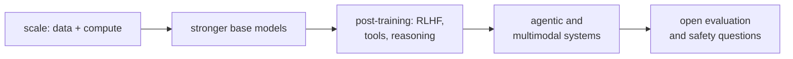

This lesson closes the interpretability and alignment-science track by naming the open
problems it leads into. The aim is orientation, not answers: where the active questions are
as of the mid-2020s, and which earlier lessons each one builds on. Treat specifics as a
snapshot of a fast-moving field.

## 1. Reasoning models and test-time compute

The sharpest recent shift is models trained to spend variable inference compute on a
chain of reasoning before answering. The training signal is reinforcement learning against
*verifiable* rewards (a correct final answer, a passing test), optimized with a
group-relative baseline rather than a learned reward model. This is the
[RLVR / GRPO](/pillar/E/E4/grpo) line, and it reopens old questions: what the long reasoning trace
represents internally, whether it is faithful to the computation that produced the answer,
and how to interpret a model that allocates its own compute.

## 2. Interpretability at scale

The circuits program works cleanly on small models. Scaling it is open on two fronts.
[Sparse autoencoders](sparse-autoencoders) extract monosemantic features from the
[residual stream](residual-stream)<FN ns="1, 2" />, but training them on frontier models, choosing the
dictionary size, and evaluating feature quality without ground truth are unsolved at scale.
Automating circuit discovery, finding the relevant heads and features for a behavior without
hand-analysis, is the second front, and progress here is what would let interpretability
keep pace with capability rather than lag a model generation behind.

## 3. Alignment that scales with capability

Once a model is more capable than its human supervisor on a task, direct human feedback
stops being a reliable signal. The [scalable oversight](scalable-oversight) program (debate,
amplification, recursive reward modeling) and the weak-to-strong generalization experiments
are the current empirical handles on this. The open question is whether any of these methods
hold as the capability gap widens, or whether they degrade in ways that only appear past the
point where they are needed.

## 4. The throughline

These problems share a structure: a quantity that scales smoothly (loss, capability) sits
underneath behaviors and risks that are hard to measure and hard to predict. The
[emergent-abilities](emergent-abilities) debate is one instance; faithfulness of reasoning
traces and the reliability of oversight are others. The interpretability tools in this
subsection exist to convert "the model does this" into "the model does this *because* of
that mechanism," which is the form of understanding the open problems require.

The most direct way to make these abstractions concrete is to build a model and watch the
mechanisms appear. The [capstone](/pillar/E/E9/nanogpt-setup) does exactly that, training a
small GPT from scratch and modernizing it.

<Footnotes>
  <FNItem n="1">**Templeton, A., et al.** (2024). "Scaling monosemanticity: extracting interpretable features from Claude 3 Sonnet". *Transformer Circuits Thread*. [transformer-circuits.pub](https://transformer-circuits.pub/2024/scaling-monosemanticity/index.html). Pushes SAEs to a frontier model.</FNItem>
  <FNItem n="2">**Cunningham, H., Ewart, A., Riggs, L., Huben, R., & Sharkey, L.** (2023). "Sparse autoencoders find highly interpretable features in language models". [arXiv:2309.08600](https://arxiv.org/abs/2309.08600). Open evaluation of SAE feature quality.</FNItem>
</Footnotes>
