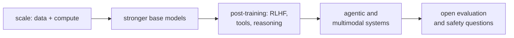

This lesson closes the interpretability and alignment-science track by naming the open
problems it leads into. The aim is orientation, not answers: where the active questions are
as of the mid-2020s, and which earlier lessons each one builds on. Treat specifics as a
snapshot of a fast-moving field.

## 1. Reasoning models and test-time compute

The sharpest recent shift is models trained to spend variable inference compute on a
chain of reasoning before answering. The training signal is reinforcement learning against
*verifiable* rewards (a correct final answer, a passing test), optimized with a
group-relative baseline rather than a learned reward model. This is the
[RLVR / GRPO](/pillar/E/E4/grpo) line, and it reopens old questions: what the long reasoning trace
represents internally, whether it is faithful to the computation that produced the answer,
and how to interpret a model that allocates its own compute.

## 2. Interpretability at scale

The circuits program works cleanly on small models. Scaling it is open on two fronts.
[Sparse autoencoders](sparse-autoencoders) extract monosemantic features from the
[residual stream](residual-stream)<FN ns="1, 2" />, but training them on frontier models, choosing the
dictionary size, and evaluating feature quality without ground truth are unsolved at scale.
Automating circuit discovery, finding the relevant heads and features for a behavior without
hand-analysis, is the second front, and progress here is what would let interpretability
keep pace with capability rather than lag a model generation behind.

## 3. Alignment that scales with capability

Once a model is more capable than its human supervisor on a task, direct human feedback
stops being a reliable signal. The [scalable oversight](scalable-oversight) program (debate,
amplification, recursive reward modeling) and the weak-to-strong generalization experiments
are the current empirical handles on this. The open question is whether any of these methods
hold as the capability gap widens, or whether they degrade in ways that only appear past the
point where they are needed.

## 4. The throughline

These problems share a structure: a quantity that scales smoothly (loss, capability) sits
underneath behaviors and risks that are hard to measure and hard to predict. The
[emergent-abilities](emergent-abilities) debate is one instance; faithfulness of reasoning
traces and the reliability of oversight are others. The interpretability tools in this
subsection exist to convert "the model does this" into "the model does this *because* of
that mechanism," which is the form of understanding the open problems require.

## Exercises

**Exercise 1.** Reasoning models are trained with reinforcement learning against *verifiable*
rewards (a correct final answer, a passing test) rather than a learned reward model. Give one
concrete advantage and one concrete failure mode of a verifiable reward compared to a learned
reward model, and name a task domain where verifiable rewards are hard to construct.

Solution

**Step 1.** Advantage: a verifiable reward is not itself a learned model, so it cannot be
*reward-hacked* by exploiting the reward model's blind spots; a passing unit test or a checked
numeric answer is a ground-truth signal that does not drift as the policy changes.

**Step 2.** Failure mode: the reward checks only the final answer, not the trace, so the model
can reach a correct answer through an unfaithful or invalid chain of reasoning and still be
rewarded. Correctness of the outcome is not correctness of the process, which is exactly why
faithfulness of reasoning traces is an open problem.

**Step 3.** A hard domain: open-ended generation with no checkable answer (essay quality, summary
faithfulness, dialogue helpfulness). There is no automatic verifier, so these fall back to
learned reward models or human judgment, reintroducing the reward-hacking risk.

**Exercise 2.** The lesson says automating circuit discovery is what would let interpretability
"keep pace with capability rather than lag a model generation behind." Sketch what an automated
circuit-discovery procedure must produce to validate a hypothesized circuit, and explain why
this is harder on a frontier model than on the small models where the circuits program works
cleanly.

Solution

**Step 1.** To validate a circuit, the procedure must identify the relevant components (heads,
MLP neurons, or features) for a behavior and then show they are *causally* responsible, by
intervening (ablation or activation patching) and measuring that the behavior breaks when the
candidate components are removed and survives when irrelevant ones are. Correlation (a probe
that reads the feature) is not enough.

**Step 2.** On a frontier model the search space is vastly larger: many more layers, heads, and
features, so brute-force patching over every component is intractable, and behaviors are
distributed across redundant components rather than localized. Features also lack ground-truth
labels, so the procedure must judge feature quality without an answer key. Hand-analysis does
not scale to that size, which is why the automation is the bottleneck.

**Exercise 3.** Scalable oversight methods (debate, amplification, weak-to-strong
generalization) are tested while the capability gap between model and supervisor is still
modest. Explain why "the method works in today's experiments" is weak evidence that it will hold
when the gap is large, and propose one property a method would need for the extrapolation to be
trustworthy. (Design/analysis; no computation.)

Solution

**Step 1.** Today's experiments run in the regime where the human (or weak supervisor) can still
mostly check the strong model's work, so a method can succeed by leaning on residual direct
supervision that will not exist once the model is far more capable. Success in-regime does not
test the failure mode the method is meant to handle, which only appears past the point where
supervision is no longer reliable.

**Step 2.** A trustworthy method would need a property that does not depend on the supervisor
being able to evaluate the answer directly: for example, decomposing a hard judgment into
sub-claims each checkable by a weaker verifier, or a guarantee that the protocol's incentives
make honesty the equilibrium even when the supervisor cannot verify the final output. Without
some such gap-independent guarantee, the method may degrade exactly when it is needed.

The most direct way to make these abstractions concrete is to build a model and watch the
mechanisms appear. The [capstone](/pillar/E/E9/nanogpt-setup) does exactly that, training a
small GPT from scratch and modernizing it.

<Footnotes>
  <FNItem n="1">**Templeton, A., et al.** (2024). "Scaling monosemanticity: extracting interpretable features from Claude 3 Sonnet". *Transformer Circuits Thread*. [transformer-circuits.pub](https://transformer-circuits.pub/2024/scaling-monosemanticity/index.html). Pushes SAEs to a frontier model.</FNItem>
  <FNItem n="2">**Cunningham, H., Ewart, A., Riggs, L., Huben, R., & Sharkey, L.** (2023). "Sparse autoencoders find highly interpretable features in language models". [arXiv:2309.08600](https://arxiv.org/abs/2309.08600). Open evaluation of SAE feature quality.</FNItem>
</Footnotes>
