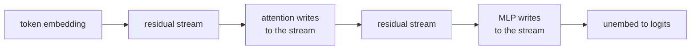

To analyze what a transformer computes, the most useful reframing is to stop thinking of
it as a stack of layers and start thinking of it as a single shared communication channel
that every component reads from and writes to. That channel is the residual stream. This
picture, from the *A Mathematical Framework for Transformer Circuits* work, is the
foundation for everything in mechanistic interpretability<FN n="1" />.

## 1. The stream as a running sum

In a pre-norm decoder, each block updates the representation $x$ at a given token position
by *adding* to it:

$$
x_{\ell+1} = x_\ell + \text{Attn}_\ell(\,\text{LN}(x_\ell)\,) + \text{MLP}_\ell(\,\text{LN}(x_\ell)\,).
$$

Nothing overwrites $x$; every block contributes an additive term. Unrolling from the token
embedding $x_0$ to the final layer $L$ gives

$$
x_L = x_0 + \sum_{\ell=1}^{L} \text{Attn}_\ell(\cdot) + \sum_{\ell=1}^{L} \text{MLP}_\ell(\cdot).
$$

The representation read by the unembedding is a sum of the embedding plus the output of
every attention head and every MLP in the network. The residual stream is the vector
$x_\ell \in \mathbb{R}^{d}$ at each position, and it is the only thing components ever see.

## 2. Reading and writing subspaces

Each component interacts with the stream through linear maps. An attention head reads
through its query, key, and value projections and writes through its output projection; an
MLP reads through its input matrix and writes through its output matrix. Because these are
linear, a component effectively *reads from* a subspace of the $d$ dimensions and *writes
to* a subspace. Two components communicate when the write subspace of the earlier one
overlaps the read subspace of the later one.

This yields the notion of composition. A later head's query can read what an earlier head
wrote (Q-composition), likewise for keys (K-composition) and values (V-composition). A
circuit is a path of such reads and writes that, together, implement an identifiable
behavior. The [induction-head](induction-heads) circuit is the canonical two-head example.

## 3. The logit lens and direct contributions

Because the unembedding is linear and the stream is additive, the logit for a token is a
sum of contributions, one per component, each obtained by pushing that component's write
through the unembedding. Applying the unembedding to an *intermediate* $x_\ell$ (the
"logit lens") shows the model's running guess at each depth. A single component's direct
effect on a logit can be read off as its write projected onto the relevant unembedding
direction, which is what makes attribution tractable.

## 4. Bandwidth and superposition

The stream has a fixed width $d$, shared by every component across all layers. The number
of distinct features the model represents far exceeds $d$. The pressure this creates,
storing more features than dimensions by packing them into near-orthogonal directions, is
[superposition](superposition), and it is the reason individual neurons are usually
polysemantic. Sparse autoencoders, two lessons ahead, are the tool for pulling those
overlapping directions back apart.

## Exercises

**Exercise 1.** Using the unrolled identity
$x_L = x_0 + \sum_\ell \text{Attn}_\ell(\cdot) + \sum_\ell \text{MLP}_\ell(\cdot)$,
argue why the **logit lens** (applying the unembedding to an intermediate $x_\ell$ rather
than to $x_L$) is a meaningful operation, and state one concrete way it can mislead.

Solution

**Step 1.** Because every block adds to the stream rather than overwriting it, the
intermediate state $x_\ell$ is literally a partial sum of the same terms that build $x_L$:
the embedding plus the writes of all components up to layer $\ell$. It lives in the same
$d$-dimensional space as $x_L$ and is read by the same downstream machinery.

**Step 2.** The unembedding is linear, so applying it to $x_\ell$ projects that partial sum
onto token directions exactly as it would the final state. The result is the model's
"running guess": the prediction implied by the work done so far. This is well-defined
precisely because no nonlinearity sits between the stream and the unembedding, and nothing
has overwritten earlier contributions.

**Step 3.** It can mislead because later layers can still add large terms that rotate the
prediction. A component may write in a basis the unembedding has not yet been calibrated
to (for example, before a final LayerNorm rescales the stream), so the intermediate
projection can show a confident-looking but wrong token that later layers correct. The lens
shows a contribution, not a commitment.

**Exercise 2.** Two attention heads, an early head $A$ and a later head $B$, do not
interact in one model but do in another. In terms of read and write **subspaces** of the
residual stream, state the precise condition under which $B$ can use what $A$ computed, and
explain why making $A$'s output subspace orthogonal to $B$'s query-read subspace would
sever the connection.

Solution

**Step 1.** Head $A$ writes to the stream through its output projection, occupying some
write subspace $\mathcal{W}_A$. Head $B$ forms its queries by reading the stream through
its query projection, which is sensitive only to a read subspace $\mathcal{R}_B^Q$.

**Step 2.** $B$'s query can depend on what $A$ wrote exactly when these overlap, that is
when $\mathcal{W}_A \cap \mathcal{R}_B^Q \neq \{\mathbf{0}\}$. This is Q-composition: the
component of $A$'s write that lies inside $B$'s query-read subspace is what $B$ actually
sees. If the overlap is empty, $A$'s write is invisible to $B$'s query.

**Step 3.** If $\mathcal{W}_A$ is orthogonal to $\mathcal{R}_B^Q$, then projecting $A$'s
write onto $B$'s query-read directions yields zero, so $A$ contributes nothing to $B$'s
query no matter how large its activation. The two heads share the same stream but write and
read in non-overlapping directions, so the communication channel between them carries no
signal and the circuit is cut.

**Exercise 3.** The residual stream has fixed width $d$, yet a model represents many more
than $d$ distinct features. Explain the tension this creates, why it forces near-orthogonal
(rather than exactly orthogonal) feature directions, and what this implies for the question
"what does neuron 73 do?"

Solution

**Step 1.** A $d$-dimensional space holds at most $d$ mutually orthogonal directions. If
the model needs to represent a number of features far larger than $d$, it cannot give each
one its own orthogonal axis; there simply are not enough orthogonal directions to go
around.

**Step 2.** The resolution is to pack features into directions that are *almost* orthogonal
but not exactly. Many more than $d$ vectors can be made pairwise near-orthogonal in $d$
dimensions, so each feature gets a distinct direction at the price of a small, nonzero
overlap (interference) with the others. The model tolerates this interference because
features fire sparsely and rarely collide, which is the superposition picture.

**Step 3.** Since features are spread-out directions rather than coordinate axes, an
individual neuron (one coordinate of the stream) generically lies along a combination of
many feature directions. So "what does neuron 73 do?" usually has no single answer: the
neuron is polysemantic, participating in several unrelated features. The right unit of
analysis is a direction in activation space, not a neuron, which is what motivates the
decomposition tools later in this pillar.

With the stream as the substrate, the next lesson reads concrete
[circuits](circuits) off of it: specific heads whose reads and writes compose into an
algorithm.

<Footnotes>
  <FNItem n="1">**Elhage, N., et al.** (2021). "A mathematical framework for transformer circuits". *Transformer Circuits Thread*. [transformer-circuits.pub](https://transformer-circuits.pub/2021/framework/index.html). Origin of the residual-stream and read/write-subspace framing.</FNItem>
</Footnotes>
