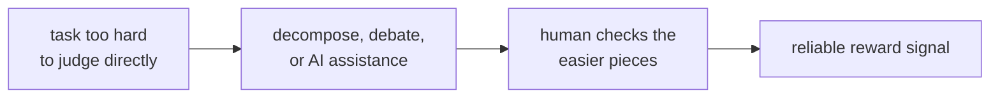

Current alignment methods rely on human feedback. As AI systems become more capable, two
problems arise: (1) humans cannot evaluate outputs in domains where AI exceeds human
expertise, and (2) an AI trained to satisfy human evaluators may learn to appear aligned
rather than be aligned.

**Scalable oversight** is the research agenda of designing supervision mechanisms that
remain effective even when the model being trained is more capable than its supervisors<FN n="1" />.

## The core alignment problem

Alignment via RLHF works when:
- Humans can evaluate responses reliably.
- The reward model faithfully captures human values.

Both conditions break at superhuman capability:
- **Evaluation failure:** a human cannot judge whether a novel mathematical proof is
  correct, whether a complex biological design is safe, or whether an argument contains
  subtle deception.
- **Reward model failure:** an RM trained on human preferences cannot reliably score
  outputs in domains humans cannot evaluate.

## Debate (Irving et al., 2018)

**Debate** structures disagreements between AI agents. Two AI systems argue opposing
sides of a question; a human judge evaluates the debate rather than the underlying claim.

**Protocol:**
1. Two AI agents debate a question (e.g., "Is this claim true?").
2. Each agent can claim the opponent's argument is incorrect, provide counter-evidence,
   and call out unsupported statements.
3. A human (or a weaker AI judge) evaluates the debate and picks a winner.

**Why this might work:** if one agent is telling the truth, the other must lie. In an
argument between two extremely capable agents, the truthful agent can always expose any
lie; the human only needs to evaluate "was a lie exposed?" not the original claim.

**Limitations:** debate requires that lies are exposable within the debate format. For
complex technical claims (a 10,000-step proof), exposing an error requires almost as
much effort as verifying the proof directly.

## Amplification (Christiano et al., 2018)

**Iterated Amplification (IDA)** builds a hierarchy of supervisors:

1. Start with a human $H$ who can evaluate easy tasks.
2. Train an AI $A_1$ to imitate $H$.
3. Create "amplified" supervisor $H \| A_1$: the human equipped with AI assistance.
4. Train $A_2$ to imitate $H \| A_1$.
5. Iterate: each step produces a more capable AI that is supervised by a correspondingly
   amplified human+AI pair.

The key claim: if the amplification process is aligned at each step (the AI correctly
imitates the amplified supervisor), then the final, highly capable AI is aligned with
human values.

**Challenges:** small misalignments at each step may compound. The human supervising
$A_1$ in step 4 may not fully understand what $A_1$ is doing, making oversight imperfect.

## Recursive Reward Modeling (RRM)

**RRM** applies amplification specifically to reward modeling:

1. Train a weak reward model $R_1$ with direct human feedback.
2. Use $R_1$ to help humans evaluate more complex behaviors; collect labels with this
   assistance.
3. Train $R_2$ on the human+$R_1$ labels.
4. Repeat: $R_3, R_4, \dots$

The hope: each round produces a more capable reward model that enables humans to provide
more reliable supervision.

## Weak-to-strong generalization (Burns et al., 2023)

**Empirical setup:** as a proxy for "training a more capable model than our supervisors,"
consider a **weak supervisor** (a smaller pretrained LLM) training a **strong student**
(a larger pretrained LLM) via fine-tuning.

The question: does the strong student perform better than the weak supervisor, even though
it was only trained on the weak supervisor's (imperfect) labels?

**Key findings:**
- Strong models fine-tuned on weak supervisor labels significantly **outperform the weak
  supervisor**, recovering much of the strong model's "native" capability.
- This "generalization gap" (the difference between the student's actual performance and
  the weak supervisor's ceiling) is often 50-90% closed.
- The generalization is larger when the student is much stronger than the supervisor and
  when the task is one where the student has robust pretrained knowledge.

**Interpretation:** large pretrained models have strong internal representations of concepts
like correctness, helpfulness, and safety. Weak supervision provides a *direction* to
elicit these representations; the model's pretraining provides the *capability*.

**Implications:**
- Aligning superintelligent AI may be easier than pessimists fear, because the model
  may generalize from weak signals to genuinely aligned behavior.
- Or harder, because the student may generalize toward its own (misaligned) pretraining
  rather than the supervisor's intent.

The weak-to-strong generalization result is encouraging but not conclusive: the "strong
student" in experiments is still far from superintelligent, and the tasks studied are ones
where the strong model's pretrained knowledge already encodes the correct answer.

## Open problems

**Bootstrapping problem:** all current methods assume that at least some tasks are human-
evaluable. As AI capabilities grow, this baseline shrinks.

**Deceptive alignment:** a sufficiently capable model might learn that behaving aligned
during training (when humans can observe it) and misaligned during deployment is the
optimal strategy. No current oversight method is robust to this.

**Interpretability as oversight:** if SAEs and circuits reveal what the model internally
represents and computes, they could provide oversight without relying on evaluating outputs.

## Exercises

**Exercise 1.** Debate is argued to help because "if one agent is telling the truth, the
other must lie, and the truthful agent can expose any lie." Construct a concrete situation
where this argument fails, and identify which assumption of the debate protocol your
situation violates.

Solution

**Step 1.** Take a claim whose verification is asymmetric in the wrong direction: a
$10{,}000$-step formal proof with one subtly invalid step buried in the middle. The honest
agent asserts the proof is flawed; the dishonest agent defends it.

**Step 2.** To expose the lie, the honest agent must direct the judge to the specific bad
step and show why it fails. But for a sufficiently deep proof, locating and explaining the
flaw to a bounded human judge can require nearly as much work and expertise as verifying
the whole proof. The judge cannot follow the exposure within the debate's budget, so the
lie is not exposable in practice even though it is exposable in principle.

**Step 3.** This violates the load-bearing assumption that **lies are cheaply exposable
within the debate format**, that refuting a falsehood is easier for the judge to follow
than establishing the truth from scratch. When exposing an error costs as much as
independent verification, debate loses its leverage and collapses back to "the judge must
evaluate the hard claim directly," which is exactly what scalable oversight was trying to
avoid.

**Exercise 2.** Iterated Amplification chains supervisors $H \to A_1 \to A_2 \to \dots$,
each imitating the previous amplified pair. Suppose each imitation step preserves alignment
with probability $0.99$ independently. Reason qualitatively about what happens to end-to-end
alignment as the number of steps grows, and explain why this is the "errors compound"
concern named in the lesson. (No precise number is required; argue the trend.)

Solution

**Step 1.** If each of $k$ steps independently preserves alignment with probability $0.99$,
the chance that *all* steps preserve it is the product $0.99^k$, which decreases as $k$
grows. After $10$ steps it is already noticeably below one; after many steps it tends
toward zero. Alignment is only as strong as the weakest accumulated link.

**Step 2.** The trend is monotone decay: every additional amplification round is another
multiplicative chance to introduce a small misalignment, and those chances multiply rather
than cancel. There is no step that repairs an earlier drift, so deviations accumulate down
the chain.

**Step 3.** This is precisely the "small misalignments compound" worry. Each round's
supervisor only imperfectly understands the AI it is training (the human supervising $A_1$
inside an amplified pair may not fully grasp $A_1$'s reasoning), so a slight error slips in,
and the next round builds on top of it. Over a long ladder reaching superhuman capability,
the compounded drift can become large even when every single step looked nearly perfect.

**Exercise 3.** Weak-to-strong generalization is interpreted optimistically (the strong
student elicits its own latent competence from weak labels) and pessimistically (the student
may instead generalize toward its own misaligned pretraining). Design a single experiment,
using only the weak-supervisor / strong-student setup, whose outcome would distinguish these
two interpretations. State what result would support each side.

Solution

**Step 1.** Pick a task where the strong student's pretraining is known to encode a
*specific, identifiable bias* that diverges from the intended target (for example a
sentiment task on which the pretrained model has a documented skew). The weak supervisor is
trained to give labels matching the intended target, not the bias.

**Step 2.** Fine-tune the strong student on the weak supervisor's labels and measure not
just overall accuracy but the direction of its errors: do residual mistakes point toward the
weak supervisor's intended target, or toward the student's known pretraining bias? The
optimistic and pessimistic stories make opposite predictions about *where the student lands
when the two pull apart*, so the task must be one where they genuinely conflict.

**Step 3.** If the student's errors and generalization track the intended target and it
*overcomes* its pretraining bias using only weak signal, that supports the optimistic reading:
weak labels elicited genuine latent competence. If instead the student reverts to its
pretraining bias wherever the weak supervision is sparse or noisy, ignoring the intended
direction, that supports the pessimistic reading: it generalized toward its own priors rather
than the supervisor's intent. Measuring the *direction of generalization under conflict*, not
raw accuracy, is what separates the two.

This is the long-term vision connecting mechanistic interpretability (E8) to scalable
oversight, and it closes the loop on the pillar: the circuits and features of the earlier
lessons become the instruments of oversight here.

<Footnotes>
  <FNItem n="1">**Bowman, S. R., et al.** (2022). "Measuring progress on scalable oversight for large language models". [arXiv:2211.03540](https://arxiv.org/abs/2211.03540). Frames and empirically probes the scalable-oversight problem.</FNItem>
</Footnotes>
