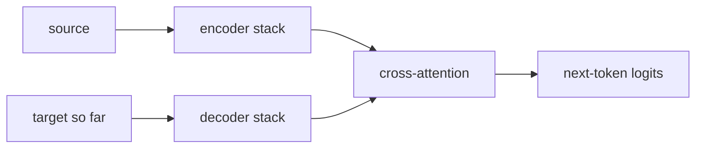

The capstone began with abstractions and ended with a trained, aligned model. The best way
to consolidate it is to re-read Vaswani et al. (2017), *Attention Is All You Need*<FN n="1" />,
now that every component in the paper corresponds to code you have written. This lesson is a guided
re-read: each paper element mapped to its implementation and to the lesson that derived it.

## 1. The component map

| Paper (2017) | This capstone | Derived in |
|---|---|---|
| Scaled dot-product attention | `Head.forward`, the `q @ k.T / sqrt(d_k)` score | [self-attention](/pillar/E/E3/self-attention) |
| Multi-head attention | `MultiHeadAttention`, parallel heads then a projection | [multi-head-attention](/pillar/E/E3/multi-head-attention) |
| Position-wise FFN | `FeedForward`, the two-layer MLP | [transformer-block](/pillar/E/E3/transformer-block) |
| Residual + normalization | the two residual branches in `Block` | [residual stream](/pillar/E/E8/residual-stream) |
| Positional encoding | the position embedding, later RoPE | [positional encodings](/pillar/E/E3/positional-encodings) |
| Encoder-decoder, cross-attention | omitted: this is decoder-only | [decoder-only](/pillar/E/E3/decoder-only) |

## 2. What the paper has that the capstone dropped

The 2017 model was an encoder-decoder for translation, with cross-attention linking the two
stacks. The capstone is decoder-only, the design that GPT established for language modeling,
so the encoder and cross-attention are absent. The paper's sinusoidal positional encoding
was replaced first by a learned table and then by RoPE. Post-norm in the paper became
pre-norm, the arrangement that trains stably at depth.

## 3. What the capstone has that the paper did not

The pieces added after 2017 are the ones that define a current LLM: a subword or
character tokenizer and the autoregressive objective on a large corpus
([pretraining](/pillar/E/E4/pretraining-data)), RMSNorm and gated FFNs as architectural
refinements, the KV cache for efficient decoding, and a preference-tuning stage
([DPO](mini-rlhf-dpo)) that turns a next-token predictor into an instruction follower. The
attention mechanism at the center is unchanged; almost everything around it is new.

## Exercises

**Exercise 1.** The component map in §1 lists six paper elements and where each
was implemented in the capstone. One row reads "omitted: this is decoder-only".
Name the paper element that row refers to, and state the single architectural
decision that makes it unnecessary.

Solution

**Step 1.** The omitted row is the encoder-decoder structure with
cross-attention. In the 2017 model the encoder reads the full source sentence
and the decoder attends to it through a cross-attention sublayer.

**Step 2.** The decision that removes it is choosing a decoder-only design. A
decoder-only language model has a single stack that attends causally to its own
prefix, so there is no separate source sequence to encode and nothing for
cross-attention to bridge. The task is next-token prediction over one stream,
not mapping a source stream to a target stream.

**Exercise 2.** §2 states that post-norm in the paper became pre-norm in the
capstone. Explain, at the level of the residual stream, why pre-norm is the
arrangement that trains stably at depth, and what specifically goes wrong with
post-norm as the stack grows.

Solution

**Step 1.** Pre-norm normalizes the input of each sublayer branch and adds the
branch output back to the stream: $x \leftarrow x + \text{sublayer}(\text{norm}(x))$.
The residual path itself is never normalized, so the identity connection passes
the stream through unscaled from input to output.

**Step 2.** Because that identity path is clean, the gradient of the loss with
respect to an early layer flows back through an unbroken chain of additions. The
gradient magnitude does not get repeatedly rescaled by a normalization Jacobian
at every layer, so it neither vanishes nor explodes as depth grows.

**Step 3.** Post-norm instead normalizes the sum: $x \leftarrow \text{norm}(x + \text{sublayer}(x))$.
The normalization now sits on the main path, so every layer rescales both the
forward activations and the backward gradient. Stacked over many layers these
rescalings compound, and deep post-norm models need warmup and careful
initialization to train at all. Pre-norm avoids the compounding by keeping the
residual highway free of normalization.

**Exercise 3.** §3 lists pieces the capstone added after 2017 and claims "the
attention mechanism at the center is unchanged; almost everything around it is
new." Pick RoPE and the KV cache, and for each argue whether it changes the
attention computation itself or only its surrounding machinery. Use the
distinction to defend or qualify the lesson's claim.

Solution

**Step 1.** Scaled dot-product attention computes scores $q \cdot k / \sqrt{d_k}$,
masks, softmaxes, and reads a weighted sum of values. The "mechanism at the
center" is this score-softmax-aggregate operation.

**Step 2.** RoPE rotates each query and key by an angle proportional to its
position before the dot product is taken. It changes the *inputs* to the score,
making the score depend on the relative offset $m - n$, but the
score-softmax-aggregate operation it feeds is identical. So RoPE modifies how
position enters, not the attention operation itself. This qualifies the claim
slightly: the operation is unchanged, but what is fed into it is not.

**Step 3.** The KV cache stores past keys and values so that decoding the next
token reuses them instead of recomputing the whole prefix. It changes nothing
about the mathematical result of attention; it is an efficiency rearrangement of
the same computation. This is the clean case of "machinery around it is new"
while the mechanism is untouched.

**Step 4.** The claim holds in its strong form for the KV cache and in a
softened form for RoPE: the attention operation is the same, while its
positional inputs and its execution schedule are what the post-2017 era changed.

## 4. Where to go next

Reading the paper now should feel like reading documentation for code you own. The natural
continuations are the parts the capstone simplified: the
[inference and serving](/pillar/E/E5/decoding) stack that makes decoding fast, the
[modern architectures](/pillar/E/E3/decoder-only) that scale the block, and the
[interpretability](/pillar/E/E8/probing) tools that open the trained model back up. Each is
now grounded in a model you built end to end.

<Footnotes>
  <FNItem n="1">**Vaswani, A., et al.** (2017). "Attention is all you need". *NeurIPS*. [arXiv:1706.03762](https://arxiv.org/abs/1706.03762). The paper this lesson re-reads against the capstone code.</FNItem>
</Footnotes>
