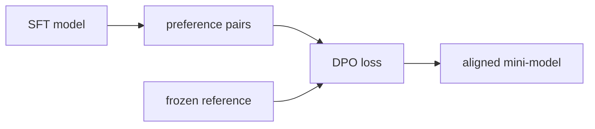

The pretrained model from the [previous lessons](rope-rmsnorm) imitates its training
distribution; it has no notion of preferred output. Alignment closes that gap. This lesson
runs the smallest faithful version of [Direct Preference Optimization](/pillar/E/E4/dpo)<FN n="1" />
on the tiny GPT: a reference copy, a handful of preference pairs, and one gradient step on the
DPO loss. It is the offline counterpart to the human-feedback fine-tuning that InstructGPT
introduced<FN n="2" />.

## 1. The setup DPO needs

DPO optimizes a policy $\pi_\theta$ against a frozen reference $\pi_{\text{ref}}$ using pairs
$(x, y_w, y_l)$ where $y_w$ is preferred over $y_l$ for prompt $x$. It needs two ingredients
beyond the base model:

- a frozen copy of the pretrained model as the reference, and
- preference pairs. At toy scale these can be synthetic: pick a property to prefer (say,
  lines that end in punctuation over lines that do not) and label pairs accordingly.

```python-static
import copy
import torch
import torch.nn.functional as F

policy = model                       # the pretrained tiny GPT
ref = copy.deepcopy(model)           # frozen reference
for p in ref.parameters():
    p.requires_grad_(False)
ref.eval()
```

## 2. Sequence log-probabilities

DPO scores a completion by the policy's total log-probability of its tokens. Run the model,
take log-softmax over the vocabulary, and gather the log-prob of each realized next token.

```python-static
def seq_logprob(m, idx, targets):
    logits, _ = m(idx)                                  # (B,T,V)
    logp = F.log_softmax(logits, dim=-1)
    tok_logp = logp.gather(-1, targets.unsqueeze(-1)).squeeze(-1)  # (B,T)
    return tok_logp.sum(dim=-1)                          # (B,) sum over the sequence
```

## 3. The DPO loss

The objective raises the policy's log-prob of the winner relative to the loser, each
measured against the reference, inside a logistic loss with temperature $\beta$:

$$
\mathcal{L}_{\text{DPO}} = -\,\mathbb{E}\Big[\log \sigma\big(\beta\,(r_\theta(x,y_w) - r_\theta(x,y_l))\big)\Big],
\quad
r_\theta(x,y) = \log\frac{\pi_\theta(y\mid x)}{\pi_{\text{ref}}(y\mid x)}.
$$

The implicit reward $r_\theta$ is the log-ratio of policy to reference, which is why DPO
needs no separately trained reward model. In code:

```python-static
def dpo_loss(policy, ref, win, lose, beta=0.1):
    # win, lose: (idx, targets) tensors for preferred and dispreferred completions
    pi_w = seq_logprob(policy, *win)
    pi_l = seq_logprob(policy, *lose)
    with torch.no_grad():
        ref_w = seq_logprob(ref, *win)
        ref_l = seq_logprob(ref, *lose)
    logits = beta * ((pi_w - ref_w) - (pi_l - ref_l))
    return -F.logsigmoid(logits).mean()

opt = torch.optim.AdamW(policy.parameters(), lr=1e-5)
loss = dpo_loss(policy, ref, win_batch, lose_batch, beta=0.1)
opt.zero_grad(set_to_none=True)
loss.backward()
opt.step()
```

The reference terms are inside `torch.no_grad()` because only the policy is trained. The
$\beta$ term controls how far the policy may move from the reference: small $\beta$ keeps it
close, large $\beta$ lets preferences dominate, the same KL-control knob that the
[RLHF KL penalty](/pillar/E/E4/ppo-rlhf) provides in the PPO route.



## 4. What to expect

After a few steps on the synthetic pairs, sample again and compare to the reference: the
policy shifts toward the preferred property while staying fluent, because the reference
ratio penalizes drifting away from the pretrained distribution. This is the entire shape of
preference tuning, minus the scale and the human labels.

The model has now been pretrained, modernized, and aligned. The
[final lesson](aiayn-revisited) closes the loop by re-reading the original Transformer paper
against the code written across this capstone.

<Footnotes>
  <FNItem n="1">**Rafailov, R., et al.** (2023). "Direct preference optimization (DPO)". *NeurIPS*. [arXiv:2305.18290](https://arxiv.org/abs/2305.18290).</FNItem>
  <FNItem n="2">**Ouyang, L., et al.** (2022). "Training language models to follow instructions with human feedback (InstructGPT)". *NeurIPS*. [arXiv:2203.02155](https://arxiv.org/abs/2203.02155).</FNItem>
</Footnotes>
