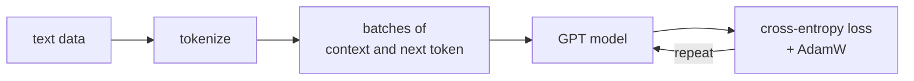

This capstone builds a working decoder-only language model from scratch, following
Karpathy's nanoGPT<FN n="1" />, itself a minimal reimplementation of the GPT-2 recipe<FN n="2" />.
It introduces no new theory; it turns the abstractions from pillars D
and E into code that trains on a laptop. This first lesson builds the scaffold every later
lesson reuses: tokenizer, data batching, and the training loop. The model itself is a
black box here and gets filled in next.

## 1. Character-level tokenization

The smallest tokenizer that works is a character vocabulary: map each distinct character to
an integer. It produces long sequences and a tiny vocabulary, which is the right tradeoff
for a teaching model on TinyShakespeare (a 1 MB text file of Shakespeare).

```python-static
with open("input.txt", "r", encoding="utf-8") as f:
    text = f.read()

chars = sorted(set(text))
vocab_size = len(chars)                      # ~65 for TinyShakespeare
stoi = {c: i for i, c in enumerate(chars)}
itos = {i: c for i, c in enumerate(chars)}
encode = lambda s: [stoi[c] for c in s]
decode = lambda ids: "".join(itos[i] for i in ids)
```

## 2. Data as next-token targets

Language modeling is next-token prediction, so a training example is a context block `x`
and the same block shifted left by one as targets `y`. Encode the corpus once, hold out the
last 10% for validation, and sample random offsets to form a batch.

```python-static
import torch

data = torch.tensor(encode(text), dtype=torch.long)
n = int(0.9 * len(data))
train_data, val_data = data[:n], data[n:]

batch_size = 64       # independent sequences per step
block_size = 256      # context length in tokens
device = "cuda" if torch.cuda.is_available() else "cpu"

def get_batch(split):
    d = train_data if split == "train" else val_data
    ix = torch.randint(len(d) - block_size, (batch_size,))
    x = torch.stack([d[i : i + block_size] for i in ix])
    y = torch.stack([d[i + 1 : i + block_size + 1] for i in ix])
    return x.to(device), y.to(device)
```

Each row of `y` is `x` advanced by one position, so predicting `y[:, t]` from `x[:, :t+1]`
is exactly the autoregressive objective.

## 3. The estimate-loss helper

Training loss on a single batch is noisy. Average over several batches, under
`torch.no_grad()` and `model.eval()`, to get a stable read on train and validation loss.

```python-static
@torch.no_grad()
def estimate_loss(model, eval_iters=200):
    out = {}
    model.eval()
    for split in ("train", "val"):
        losses = torch.zeros(eval_iters)
        for k in range(eval_iters):
            xb, yb = get_batch(split)
            _, loss = model(xb, yb)
            losses[k] = loss.item()
        out[split] = losses.mean().item()
    model.train()
    return out
```



## 4. The training loop

The loop is the standard one from [optimizers for deep learning](/pillar/D/D1/dl-optimizers):
sample a batch, forward to a loss, backprop, step AdamW. The model returns `(logits, loss)`,
a contract the next lesson implements.

```python-static
def train(model, max_iters=5000, eval_interval=500, lr=3e-4):
    opt = torch.optim.AdamW(model.parameters(), lr=lr)
    for it in range(max_iters):
        if it % eval_interval == 0:
            m = estimate_loss(model)
            print(f"step {it}: train {m['train']:.3f}, val {m['val']:.3f}")
        xb, yb = get_batch("train")
        _, loss = model(xb, yb)
        opt.zero_grad(set_to_none=True)
        loss.backward()
        opt.step()
    return model
```

A useful sanity check before any real architecture: a model that ignores context and
predicts a uniform distribution has loss $\ln(\text{vocab\_size})$, about $4.17$ for a
65-character vocabulary. Any working model must beat that.

## Exercises

**Exercise 1.** §2 forms targets `y` as `x` shifted left by one position, so
predicting `y[:, t]` from `x[:, :t+1]` is the autoregressive objective. For a
single contiguous slice of the encoded corpus starting at offset $i$ with block
size $T$, write down exactly which corpus indices fill `x[t]` and `y[t]`, and
explain why `len(d) - block_size` is the correct upper bound for the random
offset in `get_batch`.

<details>
<summary>Solution</summary>

**Step 1.** The slice for `x` is `d[i : i + T]`, so `x[t] = d[i + t]` for
$t = 0, \dots, T-1$. The slice for `y` is `d[i + 1 : i + T + 1]`, so
`y[t] = d[i + t + 1]`. Each target is the corpus token one position after the
corresponding input token, which is the next character to predict.

**Step 2.** The largest index `y` touches is `d[i + T]`. For that to be in range
the offset must satisfy $i + T \le \text{len}(d) - 1$, i.e. $i \le \text{len}(d) - T - 1$.

**Step 3.** `torch.randint(len(d) - block_size, ...)` draws $i$ uniformly from
$\{0, \dots, \text{len}(d) - T - 1\}$, since `randint`'s upper bound is
exclusive. That is exactly the valid range from Step 2, so every sampled batch
has a fully in-bounds target slice.

</details>

**Exercise 2 (code).** Verify the uniform-baseline claim: a model that predicts a
uniform distribution over a vocabulary of size $V$ incurs cross-entropy
$\ln V$. Compute it in numpy for $V = 65$ and check it against $4.17$.

<details>
<summary>Solution</summary>

```python
import numpy as np

V = 65
# Uniform predicted distribution over V classes.
probs = np.full(V, 1.0 / V)

# Cross-entropy of the true (one-hot) label under the uniform prediction is
# -log(prob assigned to the true class) = -log(1/V) = log(V), the same for
# whichever class is the target.
true_class = 7
loss = -np.log(probs[true_class])

assert np.isclose(loss, np.log(V))
assert np.isclose(loss, 4.17, atol=0.01)
print("uniform baseline loss:", round(float(loss), 4))
```

The per-token cross-entropy of a context-blind uniform model is $\ln 65 \approx 4.174$,
the floor every trained model must beat.

</details>

**Exercise 3 (code).** The training loop minimizes mean cross-entropy over the
flattened `(B*T)` predictions. Implement softmax cross-entropy in numpy for a
small batch of logits and integer targets, and verify it matches the manual
`-log(softmax prob of the target)` averaged over the batch.

<details>
<summary>Solution</summary>

```python
import numpy as np

rng = np.random.default_rng(0)

def cross_entropy(logits, targets):
    # logits: (N, V), targets: (N,) integer class ids
    z = logits - logits.max(axis=1, keepdims=True)      # stabilize
    logsumexp = np.log(np.exp(z).sum(axis=1))
    logp_true = z[np.arange(len(targets)), targets] - logsumexp
    return -logp_true.mean()

N, V = 4, 65
logits = rng.standard_normal((N, V))
targets = rng.integers(0, V, size=N)

ce = cross_entropy(logits, targets)

# Manual check via an explicit softmax.
e = np.exp(logits - logits.max(axis=1, keepdims=True))
softmax = e / e.sum(axis=1, keepdims=True)
manual = -np.log(softmax[np.arange(N), targets]).mean()

assert np.isclose(ce, manual)
print("cross-entropy:", round(float(ce), 4))
```

The stabilized log-sum-exp form agrees with the direct softmax computation,
which is the loss the AdamW step descends each iteration.

</details>

The next lesson builds the model
that beats the baseline, [the transformer block from scratch](transformer-block-from-scratch).

<Footnotes>
  <FNItem n="1">**Karpathy, A.** (2022). *nanoGPT.* GitHub repository, [github.com/karpathy/nanoGPT](https://github.com/karpathy/nanoGPT). The reference implementation this capstone follows.</FNItem>
  <FNItem n="2">**Radford, A., Wu, J., Child, R., Luan, D., Amodei, D., & Sutskever, I.** (2019). "Language models are unsupervised multitask learners (GPT-2)". *OpenAI*. The decoder-only recipe nanoGPT reproduces.</FNItem>
</Footnotes>
