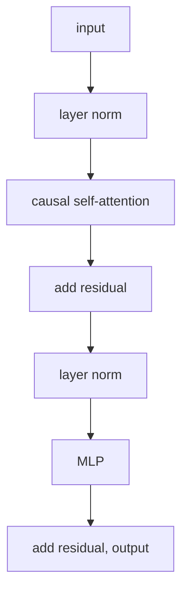

This lesson implements the [transformer block](/pillar/E/E3/transformer-block) as runnable
PyTorch, one component at a time, then assembles them. The math was derived in E3; here the
goal is a correct module whose shapes line up with the batching from the
[setup lesson](nanogpt-setup).

## 1. One attention head

A single causal self-attention head projects the input to queries, keys, and values, scores
each query against all keys, masks out future positions, softmaxes, and reads a weighted sum
of values. For input of shape `(B, T, C)` (batch, time, channels):

```python-static
import torch
import torch.nn as nn
from torch.nn import functional as F

class Head(nn.Module):
    def __init__(self, n_embd, head_size, block_size, dropout=0.2):
        super().__init__()
        self.key = nn.Linear(n_embd, head_size, bias=False)
        self.query = nn.Linear(n_embd, head_size, bias=False)
        self.value = nn.Linear(n_embd, head_size, bias=False)
        # a lower-triangular mask, registered as a non-parameter buffer
        self.register_buffer("tril", torch.tril(torch.ones(block_size, block_size)))
        self.dropout = nn.Dropout(dropout)

    def forward(self, x):
        B, T, C = x.shape
        k, q, v = self.key(x), self.query(x), self.value(x)
        wei = q @ k.transpose(-2, -1) * k.shape[-1] ** -0.5      # (B,T,T), scaled
        wei = wei.masked_fill(self.tril[:T, :T] == 0, float("-inf"))
        wei = F.softmax(wei, dim=-1)
        wei = self.dropout(wei)
        return wei @ v                                          # (B,T,head_size)
```

The `1/sqrt(head_size)` scaling and the `-inf` causal mask are exactly the choices derived
in E3, following the original Transformer<FN n="1" />; here they are two lines.

## 2. Multi-head attention and the MLP

Multiple heads run in parallel and concatenate, followed by an output projection. The
position-wise MLP is the gated-or-plain FFN; the plain version is used here.

```python-static
class MultiHeadAttention(nn.Module):
    def __init__(self, n_head, n_embd, block_size, dropout=0.2):
        super().__init__()
        head_size = n_embd // n_head
        self.heads = nn.ModuleList(
            [Head(n_embd, head_size, block_size, dropout) for _ in range(n_head)]
        )
        self.proj = nn.Linear(n_embd, n_embd)
        self.dropout = nn.Dropout(dropout)

    def forward(self, x):
        out = torch.cat([h(x) for h in self.heads], dim=-1)
        return self.dropout(self.proj(out))

class FeedForward(nn.Module):
    def __init__(self, n_embd, dropout=0.2):
        super().__init__()
        self.net = nn.Sequential(
            nn.Linear(n_embd, 4 * n_embd),
            nn.ReLU(),
            nn.Linear(4 * n_embd, n_embd),
            nn.Dropout(dropout),
        )

    def forward(self, x):
        return self.net(x)
```



## 3. The block: pre-norm residuals

The block wires attention and the MLP as residual branches, each preceded by a LayerNorm.
Pre-norm (normalize the branch input, add the branch output to the stream) is the
arrangement that trains stably at depth, and it is the additive
[residual stream](/pillar/E/E8/residual-stream) the interpretability track analyzes.

```python-static
class Block(nn.Module):
    def __init__(self, n_embd, n_head, block_size, dropout=0.2):
        super().__init__()
        self.sa = MultiHeadAttention(n_head, n_embd, block_size, dropout)
        self.ffwd = FeedForward(n_embd, dropout)
        self.ln1 = nn.LayerNorm(n_embd)
        self.ln2 = nn.LayerNorm(n_embd)

    def forward(self, x):
        x = x + self.sa(self.ln1(x))     # residual branch 1: attention
        x = x + self.ffwd(self.ln2(x))   # residual branch 2: MLP
        return x
```

Each `forward` returns the input plus a branch output, never an overwrite, which is the
property that lets gradients flow through deep stacks and lets later analysis read each
block's additive contribution.

## Exercises

**Exercise 1.** The head scales scores by $1/\sqrt{d_k}$ before the softmax
(`k.shape[-1] ** -0.5`). Assume the query and key coordinates are independent
with mean zero and unit variance. Show that an unscaled dot product
$q \cdot k$ over $d_k$ dimensions has variance $d_k$, and explain why dividing by
$\sqrt{d_k}$ is the correction that keeps the score variance at $1$ regardless of
head size.

<details>
<summary>Solution</summary>

**Step 1.** The dot product is $q \cdot k = \sum_{i=1}^{d_k} q_i k_i$. Each term
$q_i k_i$ is a product of two independent mean-zero unit-variance variables, so
$\mathbb{E}[q_i k_i] = 0$ and $\text{Var}(q_i k_i) = \mathbb{E}[q_i^2]\mathbb{E}[k_i^2] = 1$.

**Step 2.** The terms are independent across $i$, so variances add:
$\text{Var}(q \cdot k) = \sum_{i=1}^{d_k} 1 = d_k$. The unscaled score therefore
has standard deviation $\sqrt{d_k}$, which grows with head size.

**Step 3.** Dividing by $\sqrt{d_k}$ rescales the score to
$\text{Var}\big(q \cdot k / \sqrt{d_k}\big) = d_k / (\sqrt{d_k})^2 = 1$. Holding
the variance at $1$ keeps the softmax in a sensitive regime: without the
correction, large-$d_k$ scores would have large magnitude, pushing the softmax
toward a near one-hot distribution with vanishing gradients. The scaling makes
attention behave the same way across head sizes.

</details>

**Exercise 2 (code).** Reimplement one causal attention head in numpy (no
learned projections; take `q`, `k`, `v` directly) and verify two structural
facts on a small sequence: each row of the attention weights sums to $1$, and
position $t$ places zero weight on any future position $> t$.

<details>
<summary>Solution</summary>

```python
import numpy as np

rng = np.random.default_rng(0)

def softmax(z, axis=-1):
    z = z - z.max(axis=axis, keepdims=True)
    e = np.exp(z)
    return e / e.sum(axis=axis, keepdims=True)

def causal_head(q, k, v):
    T, d = q.shape
    wei = q @ k.T / np.sqrt(d)                  # (T, T) scaled scores
    mask = np.tril(np.ones((T, T)))             # 1 on/below diagonal
    wei = np.where(mask == 0, -np.inf, wei)     # block future positions
    wei = softmax(wei, axis=-1)
    return wei @ v, wei

T, d = 5, 4
q, k, v = rng.standard_normal((3, T, d))
out, wei = causal_head(q, k, v)

# Each query's weights form a distribution.
assert np.allclose(wei.sum(axis=-1), 1.0)
# Strictly-upper-triangular weights (future positions) are zero.
upper = wei[np.triu_indices(T, k=1)]
assert np.allclose(upper, 0.0)

print("row sums:", np.round(wei.sum(axis=-1), 4))
print("max future weight:", float(upper.max()))
```

The weight rows sum to $1$ and every future-position weight is zero, the two
properties the `-inf` mask plus softmax enforce in the PyTorch head.

</details>

**Exercise 3 (code).** Demonstrate the sharpening effect from Exercise 1
numerically. Take a fixed query and a set of keys, and compare the softmax of the
raw scores against the softmax of the $1/\sqrt{d_k}$-scaled scores. Show that the
scaled distribution is flatter (higher entropy), confirming why the scaling
preserves gradient flow.

<details>
<summary>Solution</summary>

```python
import numpy as np

rng = np.random.default_rng(1)

def softmax(z):
    z = z - z.max()
    e = np.exp(z)
    return e / e.sum()

def entropy(p):
    nz = p[p > 0]
    return -np.sum(nz * np.log2(nz))

d = 64
q = rng.standard_normal(d)
keys = rng.standard_normal((6, d))

raw = keys @ q                       # unscaled scores
scaled = raw / np.sqrt(d)            # the head's scaling

p_raw = softmax(raw)
p_scaled = softmax(scaled)

# Scaling lowers the score spread, so the softmax is flatter: higher entropy.
assert entropy(p_scaled) > entropy(p_raw)

print("entropy raw:   ", round(float(entropy(p_raw)), 4), "bits")
print("entropy scaled:", round(float(entropy(p_scaled)), 4), "bits")
```

The scaled distribution carries more entropy than the raw one, so it sits away
from the saturated near one-hot regime where softmax gradients collapse.

</details>

With one block correct, the [next lesson](train-tinyshakespeare) stacks several into a full
model, adds the embedding and unembedding, and trains it.

<Footnotes>
  <FNItem n="1">**Vaswani, A., et al.** (2017). "Attention is all you need". *NeurIPS*. [arXiv:1706.03762](https://arxiv.org/abs/1706.03762). Scaled dot-product attention and the position-wise FFN.</FNItem>
</Footnotes>
