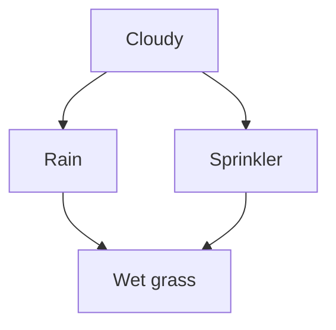

A joint distribution over $n$ variables has exponentially many parameters in the worst case.
A Bayesian network slashes that count by encoding conditional independence assumptions as
the structure of a directed acyclic graph (DAG): each variable depends only on its parents,
not on the full past.

## The DAG and its factorization

Let $\mathbf{X} = (X_1, \ldots, X_n)$ be a collection of random variables.
A Bayesian network is a pair $(\mathcal{G}, P)$ where $\mathcal{G}$ is a DAG
with one node per variable. The joint distribution factors as:

$$
P(X_1, \ldots, X_n) = \prod_{i=1}^{n} P(X_i \mid \mathrm{Pa}(X_i)),
$$

where $\mathrm{Pa}(X_i)$ denotes the parent set of node $X_i$ in $\mathcal{G}$.

This is not an approximation when $\mathcal{G}$ is chosen to encode the true independence
structure of $P$. The factorization follows from the chain rule of probability plus the
assumption that each variable is independent of its non-descendants given its parents
(the **local Markov condition**).

## A three-node example

Consider the graph $S \to C \leftarrow R$ (Sprinkler $S$, Rain $R$, Grass Wet $C$).
The joint factorizes as:

$$
P(S, R, C) = P(S) \cdot P(R) \cdot P(C \mid S, R).
$$

$S$ and $R$ are marginally independent: knowing it is raining tells you nothing
about whether the sprinkler is on, before observing $C$.
After observing $C = 1$, however, $S$ and $R$ become dependent (the collider pattern,
covered in the d-separation lesson).

## Conditional probability tables

For discrete variables, each factor $P(X_i \mid \mathrm{Pa}(X_i))$ is a table with
one row per configuration of $\mathrm{Pa}(X_i)$.
If $X_i$ has $k$ states and each parent has $k$ states, a node with $m$ parents
needs $k^m(k-1)$ free parameters rather than the $k^n - 1$ parameters in the full joint.

**Counting parameters.** For $n$ binary variables with parents of degree at most $d$,
the network stores at most $n \cdot 2^d$ parameters versus $2^n - 1$ for the unconstrained joint.
The savings are exponential in the maximum in-degree $d$.

## Forward sampling

Sampling from a Bayesian network is straightforward: traverse the nodes in any topological
order (parents before children) and sample each variable from its conditional distribution
given the already-sampled parents.



## Implementation

```python
import numpy as np

rng = np.random.default_rng(42)

# Sprinkler -> Cloud <- Rain
# P(S=1) = 0.4,  P(R=1) = 0.2
# P(C=1 | S, R): table indexed by (S, R)
p_s = 0.4
p_r = 0.2
p_c_given_sr = {
    (0, 0): 0.01,
    (1, 0): 0.90,
    (0, 1): 0.80,
    (1, 1): 0.99,
}

def sample_bn(n_samples: int) -> np.ndarray:
    s = (rng.random(n_samples) < p_s).astype(int)
    r = (rng.random(n_samples) < p_r).astype(int)
    p_c = np.array([p_c_given_sr[(si, ri)] for si, ri in zip(s, r)])
    c = (rng.random(n_samples) < p_c).astype(int)
    return np.column_stack([s, r, c])

samples = sample_bn(100_000)
s_col, r_col, c_col = samples[:, 0], samples[:, 1], samples[:, 2]

# Empirical P(C=1)
p_c_marginal = c_col.mean()
print(f"P(C=1) empirical: {p_c_marginal:.4f}")

# Theoretical P(C=1) by total probability
p_c_theory = sum(
    p_c_given_sr[(s, r)] * (p_s if s else 1 - p_s) * (p_r if r else 1 - p_r)
    for s in (0, 1) for r in (0, 1)
)
print(f"P(C=1) theoretical: {p_c_theory:.4f}")

# S and R independent a priori
corr_sr = np.corrcoef(s_col, r_col)[0, 1]
print(f"Corr(S,R) unconditional (should be ~0): {corr_sr:.4f}")

# S and R dependent given C=1
mask = c_col == 1
corr_sr_given_c = np.corrcoef(s_col[mask], r_col[mask])[0, 1]
print(f"Corr(S,R) | C=1 (explaining away): {corr_sr_given_c:.4f}")
```

The correlation between $S$ and $R$ is near zero unconditionally, but nonzero once
we condition on $C$: observing that the grass is wet makes rain and sprinkler negatively
correlated (each partly explains the other), confirming the collider pattern.

The next lesson introduces plate notation for compactly drawing models with repeated structure.
