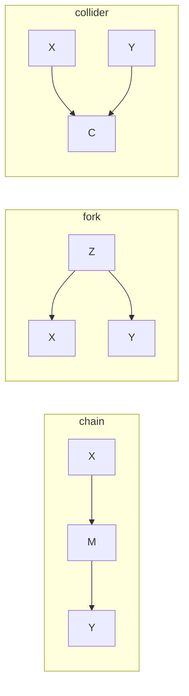

A Bayesian network encodes independence assumptions graphically.
Reading those assumptions without computing marginals requires a
purely graphical criterion: **d-separation**<FN n="1" />.
Two nodes $A$ and $B$ are d-separated by a set $\mathbf{E}$ (the observed evidence)
if every path between them is blocked by $\mathbf{E}$.

## The three motifs

Every undirected path between two nodes passes through intermediate nodes.
Each intermediate node $Z$ creates one of three patterns:

### Chain: $A \to Z \to B$

$Z$ transmits information from $A$ to $B$.
Conditioning on $Z$ blocks the path: $A \perp B \mid Z$.
Without conditioning, $A$ and $B$ are dependent (information flows through $Z$).

### Fork: $A \leftarrow Z \to B$

$Z$ is a common cause.
Conditioning on $Z$ blocks the path: $A \perp B \mid Z$.
Without conditioning, $A$ and $B$ share variation through their common parent $Z$.

### Collider: $A \to Z \leftarrow B$

$Z$ is a common effect.
The path is **blocked by default** (without conditioning).
Conditioning on $Z$ (or any descendant of $Z$) **unblocks** it: $A$ and $B$ become
dependent given $Z$, an effect called **explaining away** or Berkson's paradox.

## The blocking rule

A path $p$ between $A$ and $B$ is **blocked** by $\mathbf{E}$ if it contains:

1. A chain $A \to Z \to B$ or fork $A \leftarrow Z \to B$ where $Z \in \mathbf{E}$, or
2. A collider $A \to Z \leftarrow B$ where neither $Z$ nor any descendant of $Z$ is in $\mathbf{E}$.

$A$ and $B$ are **d-separated** by $\mathbf{E}$ if **all** paths between them are blocked.
D-separation implies conditional independence under any distribution that is faithful
to $\mathcal{G}$<FN n="2" />.

## The Bayes-ball algorithm

The Bayes-ball algorithm checks d-separation in $O(n + e)$ (nodes + edges)<FN n="3" />:

1. Shade every node in $\mathbf{E}$.
2. For each node $A$ in the query, activate it and propagate "balls" along edges.
3. Balls traveling through chains and forks pass through unshaded nodes; shaded nodes
   block them.
4. Balls traveling toward a collider pass through only if the collider (or a descendant)
   is shaded.
5. $A$ and $B$ are d-separated by $\mathbf{E}$ if no ball reaches $B$ from $A$.



## Implementation

```python
import numpy as np

rng = np.random.default_rng(7)

# Chain: A -> Z -> B.  Check independence of A and B given Z vs not given Z.
n = 50_000
a = rng.normal(0, 1, n)
z = 0.8 * a + rng.normal(0, 0.6, n)   # A -> Z
b = 0.9 * z + rng.normal(0, 0.4, n)   # Z -> B

# Without conditioning: A and B are correlated
corr_ab = np.corrcoef(a, b)[0, 1]
print(f"Corr(A,B) unconditional: {corr_ab:.3f}")

# Partial correlation of A and B given Z (regress out Z)
def partial_corr(x, y, z_var):
    res_x = x - np.polyval(np.polyfit(z_var, x, 1), z_var)
    res_y = y - np.polyval(np.polyfit(z_var, y, 1), z_var)
    return np.corrcoef(res_x, res_y)[0, 1]

corr_ab_given_z = partial_corr(a, b, z)
print(f"Corr(A,B) | Z (chain blocked): {corr_ab_given_z:.3f}")

# Collider: A -> C <- B.  Check explaining away.
b2 = rng.normal(0, 1, n)
c  = 0.7 * a + 0.7 * b2 + rng.normal(0, 0.3, n)

corr_ab2 = np.corrcoef(a, b2)[0, 1]
print(f"Corr(A,B2) unconditional (should be ~0): {corr_ab2:.3f}")

corr_ab2_given_c = partial_corr(a, b2, c)
print(f"Corr(A,B2) | C (collider activated): {corr_ab2_given_c:.3f}")
```

The chain example shows near-zero partial correlation once $Z$ is controlled for;
the collider example shows that $A$ and $B_2$ are uncorrelated marginally but correlated
once their common effect $C$ is conditioned on.

## Exercises

**Exercise 1.** In the graph $A \to Z \to B$ (a chain), state whether $A$ and $B$ are
d-separated (i) given the empty set, and (ii) given $\{Z\}$. Name the rule that decides
each case.

<details>
<summary>Solution</summary>

**Step 1.** The single path $A \to Z \to B$ is a chain through $Z$. The chain rule says
the path is blocked exactly when $Z$ is in the evidence set.

**Step 2 (i), evidence $\varnothing$.** $Z \notin \varnothing$, so the chain is open.
The only path is unblocked, so $A$ and $B$ are not d-separated. They are dependent.

**Step 3 (ii), evidence $\{Z\}$.** $Z \in \{Z\}$, so the chain is blocked. Every path
(there is one) is blocked, so $A$ and $B$ are d-separated, giving $A \perp B \mid Z$.

</details>

**Exercise 2.** Consider $A \to Z \leftarrow B$ with a child $D$ of $Z$ ($Z \to D$).
Determine whether $A$ and $B$ are d-separated given each of $\varnothing$, $\{Z\}$, and
$\{D\}$.

<details>
<summary>Solution</summary>

**Step 1.** The path $A \to Z \leftarrow B$ has a collider at $Z$. A collider blocks the
path unless $Z$ or a descendant of $Z$ is in the evidence set.

**Step 2, evidence $\varnothing$.** Neither $Z$ nor its descendant $D$ is observed, so
the collider blocks. $A$ and $B$ are d-separated; $A \perp B$.

**Step 3, evidence $\{Z\}$.** The collider $Z$ is observed, which unblocks the path.
$A$ and $B$ are not d-separated; they become dependent (explaining away).

**Step 4, evidence $\{D\}$.** $D$ is a descendant of the collider $Z$, which also
unblocks the path. $A$ and $B$ are not d-separated. Conditioning on a downstream effect
of a collider activates it just as conditioning on the collider itself does.

</details>

**Exercise 3 (code).** Build the fork $A \leftarrow Z \to B$ with linear-Gaussian
structure and confirm numerically that $A$ and $B$ are correlated marginally but
near-independent once $Z$ is regressed out, the d-separation prediction $A \perp B \mid Z$.

<details>
<summary>Solution</summary>

```python
import numpy as np

rng = np.random.default_rng(7)
n = 50_000

# Fork: A <- Z -> B
z = rng.normal(0, 1, n)
a = 0.9 * z + rng.normal(0, 0.4, n)
b = 0.8 * z + rng.normal(0, 0.4, n)

def partial_corr(x, y, g):
    rx = x - np.polyval(np.polyfit(g, x, 1), g)
    ry = y - np.polyval(np.polyfit(g, y, 1), g)
    return np.corrcoef(rx, ry)[0, 1]

corr = np.corrcoef(a, b)[0, 1]
pcorr = partial_corr(a, b, z)

assert corr > 0.5                  # shared common cause -> strong marginal correlation
assert abs(pcorr) < 0.02           # blocked by conditioning on Z
print(f"Corr(A,B) = {corr:.3f}, Corr(A,B | Z) = {pcorr:.3f}")
```

The marginal correlation is large because $Z$ drives both, while the partial correlation
collapses to near zero once $Z$ is controlled for, which is the fork being blocked by its
common parent.

</details>

D-separation in F1 governs the independence structure of directed models.
The next lesson shifts to undirected graphical models, where independence is encoded differently.

<Footnotes>
  <FNItem n="1">**Pearl, J.** (1988). *Probabilistic Reasoning in Intelligent Systems: Networks of Plausible Inference.* Morgan Kaufmann. The original definition of d-separation and its three motifs.</FNItem>
  <FNItem n="2">**Koller, D., & Friedman, N.** (2009). *Probabilistic Graphical Models: Principles and Techniques.* MIT Press. The soundness of d-separation for distributions faithful to the graph.</FNItem>
  <FNItem n="3">**Bishop, C. M.** (2006). *Pattern Recognition and Machine Learning*, ch. 8 (Graphical Models). Springer. The conditional-independence reading of chains, forks, and colliders.</FNItem>
</Footnotes>
