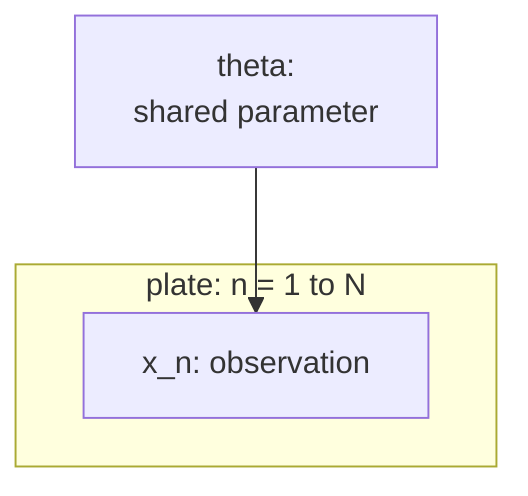

Many models repeat the same local structure for each data point.
Writing one node per observation clutters the graph.
Plate notation solves this by drawing a rectangle (the "plate") around any
set of nodes that are replicated, annotated with the replication index<FN ns="1, 2" />.

## The plate as shorthand

A plate labeled $n = 1, \ldots, N$ enclosing nodes $X_n$ and $Y_n$ means
those nodes are copied $N$ times: the graph contains $X_1, Y_1, \ldots, X_N, Y_N$.
Nodes outside the plate are shared across all copies.

**Naive Bayes.** A single plate over $(X_n, Y_n)$ with a shared parameter $\theta$
outside the plate gives the joint:

$$
P(\theta, Y_{1:N}, X_{1:N}) = P(\theta) \prod_{n=1}^{N} P(Y_n \mid \theta) P(X_n \mid Y_n).
$$

**Gaussian mixture model.** Two nested plates are common here.
An outer plate over $n$ encloses $(Z_n, X_n)$ where $Z_n$ is the latent cluster
assignment and $X_n$ is the observation.
The cluster parameters $\mu_k, \Sigma_k$ live in an inner plate over $k = 1, \ldots, K$,
or are written outside with a $k$-indexed plate.
The joint is:

$$
P(\pi, \mu_{1:K}, \Sigma_{1:K}, Z_{1:N}, X_{1:N})
= P(\pi) \prod_{k=1}^{K} P(\mu_k) P(\Sigma_k)
  \prod_{n=1}^{N} P(Z_n \mid \pi) P(X_n \mid \mu_{Z_n}, \Sigma_{Z_n}).
$$

## Reading off the factorization

The rule is direct: for each node in the plate, write one factor per plate iteration<FN n="3" />.
Nodes outside plates appear once.
Connections crossing plate boundaries mean the outside node is a parent of every
replicated node inside.

**Bayesian linear regression.**

Hyperparameters $\alpha, \beta$ outside; weights $\mathbf{w}$ outside;
a plate over $n$ enclosing $(x_n, y_n)$.
The $x_n$ are observed inputs (no distribution needed); $y_n \sim \mathcal{N}(\mathbf{w}^\top x_n, \beta^{-1})$.

$$
P(\mathbf{w}, y_{1:N} \mid x_{1:N}) = P(\mathbf{w} \mid \alpha) \prod_{n=1}^{N} P(y_n \mid \mathbf{w}, x_n, \beta).
$$

## Nested plates and independence structure

Two plates that share no nodes imply independence between their replicated variables
conditional on any shared parents.
When plates nest, the inner variable is independent of the outer variable's other
copies conditional on the shared parent, but not across different outer iterations.



## Implementation

```python
import numpy as np

rng = np.random.default_rng(0)

# Gaussian mixture model: forward sampling from the plate model
K = 3
N = 300
alpha = np.ones(K)          # symmetric Dirichlet concentration

# Shared params (outside plate)
pi = rng.dirichlet(alpha)
means = rng.uniform(-4, 4, size=(K, 2))
scales = np.ones(K) * 0.8

# Plate over n: sample Z_n then X_n
z = rng.choice(K, size=N, p=pi)       # P(Z_n | pi)
x = means[z] + rng.normal(0, scales[z, None], size=(N, 2))  # P(X_n | Z_n)

# Verify empirical means match the true cluster means
for k in range(K):
    empirical_mean = x[z == k].mean(axis=0)
    print(f"Cluster {k}: true {means[k].round(2)}, empirical {empirical_mean.round(2)}")
```

The plate model samples each $(Z_n, X_n)$ pair independently given the shared parameters $(\pi, \mu_{1:K})$, exactly as the factorization specifies.

The next lesson covers d-separation, the graphical criterion for reading conditional
independence directly from a DAG.

<Footnotes>
  <FNItem n="1">**Buntine, W. L.** (1994). "Operations for learning with graphical models". *JAIR*, 2, 159-225. The formalization of plate notation for replicated structure ([doi:10.1613/jair.62](https://doi.org/10.1613/jair.62)).</FNItem>
  <FNItem n="2">**Bishop, C. M.** (2006). *Pattern Recognition and Machine Learning*, ch. 8 (Graphical Models). Springer. Plate diagrams for i.i.d. data and mixture models.</FNItem>
  <FNItem n="3">**Koller, D., & Friedman, N.** (2009). *Probabilistic Graphical Models: Principles and Techniques.* MIT Press. Reading the joint factorization off a template (plate) model.</FNItem>
</Footnotes>
