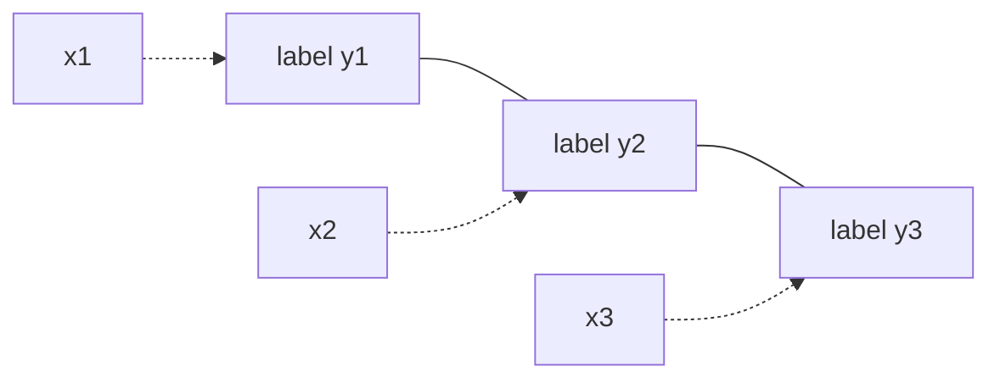

Named-entity recognition, part-of-speech tagging, and sequence labeling tasks share
a structure: given an observed input sequence $\mathbf{x} = (x_1, \ldots, x_T)$,
predict an output label sequence $\mathbf{y} = (y_1, \ldots, y_T)$.
A **conditional random field** (CRF) models $P(\mathbf{y} \mid \mathbf{x})$ directly,
without modeling $P(\mathbf{x})$, which is the discriminative advantage over generative
HMMs<FN ns="1, 2" />.

## Linear-chain CRF

In a **linear-chain CRF**, the MRF graph over $\mathbf{y}$ given $\mathbf{x}$ is a chain:
$Y_1 - Y_2 - \cdots - Y_T$.
The distribution is:

$$
P(\mathbf{y} \mid \mathbf{x}) = \frac{1}{Z(\mathbf{x})} \prod_{t=1}^{T}
\exp\!\bigl(\mathbf{w}^\top \mathbf{f}(y_{t-1}, y_t, \mathbf{x}, t)\bigr),
$$

where $\mathbf{f}(y_{t-1}, y_t, \mathbf{x}, t)$ is a feature vector capturing
transition features (depending on $y_{t-1}, y_t$) and emission features
(depending on $y_t, x_t$), and $Z(\mathbf{x})$ normalizes:

$$
Z(\mathbf{x}) = \sum_{\mathbf{y}'} \prod_{t=1}^{T}
\exp\!\bigl(\mathbf{w}^\top \mathbf{f}(y'_{t-1}, y'_t, \mathbf{x}, t)\bigr).
$$

The log-linear form makes gradient computation tractable via the chain's dynamic
programming structure.

## Forward algorithm for the partition function

Naively summing over all $|\mathcal{Y}|^T$ label sequences to compute $Z(\mathbf{x})$
is exponential. The forward algorithm runs in $O(T \cdot |\mathcal{Y}|^2)$<FN n="3" />:

**Step 1.** Define log-potentials $\psi(y', y, t) = \mathbf{w}^\top \mathbf{f}(y', y, \mathbf{x}, t)$.

**Step 2.** Initialize $\alpha_1(y) = \psi(\text{START}, y, 1)$ for each label $y$.

**Step 3.** Recurse for $t = 2, \ldots, T$:
$$
\alpha_t(y) = \log \sum_{y'} \exp\!\bigl(\alpha_{t-1}(y') + \psi(y', y, t)\bigr).
$$

**Step 4.** $\log Z(\mathbf{x}) = \log \sum_y \exp(\alpha_T(y))$.

The Viterbi algorithm replaces $\log\sum\exp$ with $\max$ and back-traces to find
the MAP label sequence.

## CRF vs. HMM

Both model sequences, but differently:

| Aspect | HMM | Linear-chain CRF |
|---|---|---|
| Factorization | $P(\mathbf{x},\mathbf{y})$ joint | $P(\mathbf{y} \mid \mathbf{x})$ conditional |
| Features | Local emission $P(x_t \mid y_t)$ | Arbitrary $\mathbf{f}(y_{t-1}, y_t, \mathbf{x}, t)$ |
| Modeling cost | Must model $P(\mathbf{x})$ | No model needed for $P(\mathbf{x})$ |
| Label bias | None | Avoids via global normalization |

CRFs can use long-range features in $\mathbf{x}$ without worrying about modeling the
full input distribution, which is the main practical advantage for NLP.



## Implementation

```python
import numpy as np

rng = np.random.default_rng(11)

# Toy linear-chain CRF: 2 labels {0,1}, T=4 positions
T = 4
n_labels = 2

# Random weights: [emit_label0, emit_label1, trans_00, trans_01, trans_10, trans_11]
w = rng.normal(0, 1, 6)

def log_potential(y_prev, y_curr, x_t):
    feat = np.zeros(6)
    feat[y_curr] = x_t              # emission feature
    feat[2 + y_prev * 2 + y_curr] = 1.0  # transition feature
    return w @ feat

# Fake input sequence
x = rng.normal(0, 1, T)

# Brute-force partition function (2^4 = 16 sequences)
log_Z_brute = -np.inf
for seq_int in range(2**T):
    seq = [(seq_int >> t) & 1 for t in range(T)]
    log_score = 0.0
    for t in range(T):
        y_prev = seq[t-1] if t > 0 else 0
        log_score += log_potential(y_prev, seq[t], x[t])
    log_Z_brute = np.logaddexp(log_Z_brute, log_score)

# Forward algorithm
alpha = np.array([log_potential(0, y, x[0]) for y in range(n_labels)])
for t in range(1, T):
    alpha_new = np.zeros(n_labels)
    for y in range(n_labels):
        alpha_new[y] = np.logaddexp.reduce(
            [alpha[yp] + log_potential(yp, y, x[t]) for yp in range(n_labels)]
        )
    alpha = alpha_new
log_Z_forward = np.logaddexp(alpha[0], alpha[1])

print(f"log Z (brute force): {log_Z_brute:.4f}")
print(f"log Z (forward):     {log_Z_forward:.4f}")
```

Both methods agree on $\log Z$; the forward algorithm achieves this in $O(T \cdot |\mathcal{Y}|^2)$ rather than $O(|\mathcal{Y}|^T)$.

The next lesson generalizes the message-passing view of these algorithms to factor graphs.

<Footnotes>
  <FNItem n="1">**Lafferty, J., McCallum, A., & Pereira, F.** (2001). "Conditional random fields: probabilistic models for segmenting and labeling sequence data". *ICML*. The paper introducing CRFs and the label-bias argument against MEMMs.</FNItem>
  <FNItem n="2">**Sutton, C., & McCallum, A.** (2012). "An introduction to conditional random fields". *Foundations and Trends in Machine Learning*, 4(4), 267-373. A tutorial treatment of linear-chain CRFs and their training ([arXiv:1011.4088](https://arxiv.org/abs/1011.4088)).</FNItem>
  <FNItem n="3">**Koller, D., & Friedman, N.** (2009). *Probabilistic Graphical Models: Principles and Techniques.* MIT Press. The forward recursion for the partition function on chains.</FNItem>
</Footnotes>
