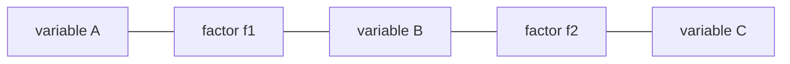

Both Bayesian networks and MRFs factor a joint distribution into local functions.
A **factor graph** makes that factorization explicit as a bipartite graph: one type
of node for variables, another for factors.
The sum-product algorithm on a factor graph computes marginals in a single, unified framework<FN n="1" />.

## Factor graph definition

A factor graph has two kinds of nodes:
- **Variable nodes** $X_1, \ldots, X_n$ (drawn as circles).
- **Factor nodes** $f_1, \ldots, f_m$ (drawn as squares).

An edge connects factor $f_j$ to variable $X_i$ if $X_i$ appears in the scope of $f_j$.
The joint distribution is:

$$
P(\mathbf{X}) = \frac{1}{Z} \prod_{j=1}^{m} f_j(\mathbf{X}_j),
$$

where $\mathbf{X}_j$ is the set of variables connected to factor $f_j$.

**Converting a BN.** Each conditional $P(X_i \mid \mathrm{Pa}(X_i))$ becomes a factor node
connected to $X_i$ and all its parents.

**Converting an MRF.** Each clique potential $\phi_c$ becomes a factor node connected
to all variables in the clique.

## Sum-product message passing

On a **tree-structured** factor graph, the sum-product algorithm computes exact marginals
in $O(n \cdot k^2)$ for $k$-state variables<FN n="2" />.

Two message types pass between the two node types.

**Variable-to-factor message** from variable $X_i$ to factor $f_j$:

$$
\mu_{X_i \to f_j}(x_i) = \prod_{f_k \in N(X_i) \setminus f_j} \mu_{f_k \to X_i}(x_i).
$$

**Factor-to-variable message** from factor $f_j$ to variable $X_i$:

$$
\mu_{f_j \to X_i}(x_i) = \sum_{\sim \{x_i\}} f_j(\mathbf{x}_j) \prod_{X_k \in N(f_j) \setminus X_i} \mu_{X_k \to f_j}(x_k).
$$

The marginal at $X_i$ is proportional to the product of all incoming factor messages:

$$
P(X_i = x_i) \propto \prod_{f_j \in N(X_i)} \mu_{f_j \to X_i}(x_i).
$$

## Why factor graphs unify the picture

The forward-backward algorithm for HMMs, belief propagation for BNs, and the
sum-product decoder for LDPC codes are all instances of sum-product on a factor graph<FN n="3" />.
The bipartite structure makes it easy to see which summations can be done in parallel
and where loops in the graph would break exactness.



## Implementation

```python
import numpy as np

# Chain factor graph: X1 - f12 - X2 - f23 - X3
# f12(x1, x2) and f23(x2, x3) are 2x2 potential matrices
# Compute P(X2) by sum-product

rng = np.random.default_rng(5)
k = 2

f12 = np.abs(rng.normal(1, 0.5, (k, k)))   # f12[x1, x2]
f23 = np.abs(rng.normal(1, 0.5, (k, k)))   # f23[x2, x3]

# Leaf node priors (uniform messages from X1 and X3)
mu_x1_to_f12 = np.ones(k)
mu_x3_to_f23 = np.ones(k)

# Factor-to-variable messages
mu_f12_to_x2 = f12.T @ mu_x1_to_f12        # shape (k,): sum over x1
mu_f23_to_x2 = f23 @ mu_x3_to_f23          # shape (k,): sum over x3

# Marginal at X2
p_x2 = mu_f12_to_x2 * mu_f23_to_x2
p_x2 /= p_x2.sum()
print(f"P(X2) via sum-product: {p_x2.round(4)}")

# Verify by brute force
joint = np.einsum("ij,jk->ijk", f12, f23)   # shape (k,k,k): x1,x2,x3
joint /= joint.sum()
p_x2_brute = joint.sum(axis=(0, 2))
print(f"P(X2) brute force:     {p_x2_brute.round(4)}")
```

The sum-product result matches the brute-force marginalization exactly on the tree-structured chain.

The next subsection moves to temporal graphical models, where the chain structure models
dynamics over time.

<Footnotes>
  <FNItem n="1">**Kschischang, F. R., Frey, B. J., & Loeliger, H.-A.** (2001). "Factor graphs and the sum-product algorithm". *IEEE Transactions on Information Theory*, 47(2), 498-519. The defining paper for factor graphs and message passing ([doi:10.1109/18.910572](https://doi.org/10.1109/18.910572)).</FNItem>
  <FNItem n="2">**Bishop, C. M.** (2006). *Pattern Recognition and Machine Learning*, ch. 8 (Graphical Models). Springer. Sum-product on tree-structured factor graphs and its cost.</FNItem>
  <FNItem n="3">**Koller, D., & Friedman, N.** (2009). *Probabilistic Graphical Models: Principles and Techniques.* MIT Press. Factor graphs as a unifying view of BN and MRF inference.</FNItem>
</Footnotes>
