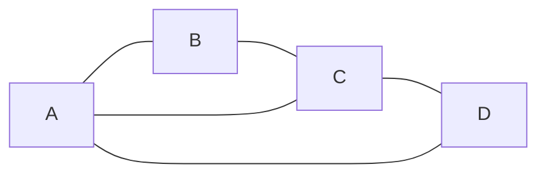

Directed graphical models encode causality naturally, but some relationships are
symmetric: pixel intensities in an image, coupled spins in a physical system, words
in a sentence around a target word.
**Markov random fields** (MRFs), also called undirected graphical models, handle these
by replacing directed arrows with undirected edges and replacing conditional probability
tables with potential functions<FN ns="1, 2" />.

## Gibbs distribution

Given an undirected graph $\mathcal{G}$ over variables $\mathbf{X}$, a **potential function**
$\phi_c(\mathbf{X}_c) \ge 0$ is assigned to each **clique** $c$ (a fully connected subgraph).
The joint distribution takes the **Gibbs form**:

$$
P(\mathbf{X}) = \frac{1}{Z} \prod_{c \in \mathcal{C}} \phi_c(\mathbf{X}_c),
$$

where $\mathcal{C}$ is the set of (maximal) cliques and

$$
Z = \sum_{\mathbf{x}} \prod_{c} \phi_c(\mathbf{x}_c)
$$

is the **partition function**, normalizing the distribution.
$Z$ is a sum over all configurations, making exact computation intractable for large graphs.

## Markov properties

Three equivalent Markov properties characterize MRFs (under positivity of $P$):

**Global:** $\mathbf{X}_A \perp \mathbf{X}_B \mid \mathbf{X}_S$ whenever $S$ separates $A$
from $B$ in the graph (removing $S$ disconnects $A$ and $B$).

**Local:** $X_i \perp \mathbf{X}_{\text{rest}} \mid \mathbf{X}_{N(i)}$ where $N(i)$ is
the set of neighbors of $i$ in $\mathcal{G}$.
The set $N(i)$ is the **Markov blanket** of $X_i$.

**Pairwise:** $X_i \perp X_j \mid \mathbf{X}_{\text{rest}}$ whenever $(i,j) \notin \mathcal{G}$.

The local property is the one that pays off in practice, so it is worth seeing on
numbers. Take the $3\times 3$ Ising grid from the code below ($J = 0.5$, $h = 0$). The
center spin has four neighbors (up, down, left, right); the four corners are not
adjacent to it. Conditioning shows the blanket at work:

- **Marginal**, knowing nothing: $P(X_\text{center} = +1) = 0.5$. By symmetry of the
  $h = 0$ field, up and down are equally likely.
- **All four neighbors $= +1$**: $P(X_\text{center} = +1) = 0.982$. The neighbors
  pull the center to agree with them.
- **All four neighbors $= -1$**: $P(X_\text{center} = +1) = 0.018$. The same pull, the
  other way.

Now the point of the blanket: once the four neighbors are fixed at $+1$, also telling
you a far corner is $+1$ or $-1$ leaves $P(X_\text{center} = +1) = 0.982$ either way.
The corner carries zero extra information about the center given its neighbors, exactly
the local Markov property. This is the routine confusion to name: in a directed model
"who influences the center" would include indirect ancestors, but in an MRF the
**Markov blanket is just the immediate neighbors**, and conditioning on it screens off
the entire rest of the grid.

## Hammersley-Clifford theorem

The Hammersley-Clifford theorem establishes the equivalence<FN n="3" />:

> A strictly positive distribution $P(\mathbf{X}) > 0$ satisfies the global Markov
> property with respect to $\mathcal{G}$ if and only if it factors as a Gibbs distribution
> over the cliques of $\mathcal{G}$.

This gives a clean correspondence between the graph structure and factorization.
The positivity requirement rules out hard constraints (zero probabilities for some
configurations); models with hard constraints need careful treatment of the theorem's boundary.

## The Ising model

The Ising model is an MRF on a grid graph with binary variables $X_i \in \{-1, +1\}$.
The joint is:

$$
P(\mathbf{X}) = \frac{1}{Z} \exp\!\left( J \sum_{(i,j) \in \mathcal{E}} X_i X_j + h \sum_i X_i \right),
$$

with coupling $J$ and external field $h$.
Here each edge $(i,j)$ defines a clique of size 2 with log-potential $J X_i X_j$.



## Implementation

```python
import numpy as np

rng = np.random.default_rng(3)

# Small 3x3 Ising model: compute partition function by brute force
J = 0.5   # coupling
h = 0.0   # external field
n = 9     # 3x3 grid, 9 spins

edges = [
    (0,1),(1,2),(3,4),(4,5),(6,7),(7,8),  # horizontal
    (0,3),(1,4),(2,5),(3,6),(4,7),(5,8),  # vertical
]

configs = np.array([[(c >> i & 1) * 2 - 1 for i in range(n)] for c in range(2**n)])

def energy(cfg):
    coupling_term = sum(cfg[i] * cfg[j] for i, j in edges)
    field_term    = cfg.sum()
    return -J * coupling_term - h * field_term

energies = np.array([energy(c) for c in configs])
log_Z    = np.log(np.sum(np.exp(-energies)))
probs    = np.exp(-energies - log_Z)

print(f"log Z = {log_Z:.4f}")
print(f"Sum of probs: {probs.sum():.6f}")

# Marginal P(X_center = +1)
center_spin = 4
p_center_up = probs[configs[:, center_spin] == 1].sum()
print(f"P(X_center=+1): {p_center_up:.4f}")

# Demonstrate Markov blanket: P(X_center | neighbors) sufficient
neighbor_mask = [1, 3, 5, 7]   # direct neighbors of center in 3x3 grid
# All configs where neighbors are all +1
mask_all_up = np.all(configs[:, neighbor_mask] == 1, axis=1)
p_center_up_given_nb = (probs[mask_all_up & (configs[:, center_spin] == 1)].sum()
                        / probs[mask_all_up].sum())
print(f"P(X_center=+1 | all neighbors=+1): {p_center_up_given_nb:.4f}")
```

The partition function covers all $2^9 = 512$ configurations; at scale, exactly
computing $Z$ is NP-hard, which motivates the approximate inference methods in F5 and F6.

## Exercises

**Exercise 1.** A two-node MRF $X_1 - X_2$ over binary spins $X_i \in \{-1, +1\}$ has a
single edge clique with potential $\phi(x_1, x_2) = \exp(J x_1 x_2)$ and $J = 0.5$.
Compute the partition function $Z$ and the probability $P(X_1 = X_2)$ by hand.

<details>
<summary>Solution</summary>

**Step 1.** Enumerate the four configurations and their unnormalized weights
$\phi = e^{J x_1 x_2}$. Agreeing spins give $x_1 x_2 = +1$, disagreeing give $-1$:

$$
(+,+): e^{0.5}, \quad (-,-): e^{0.5}, \quad (+,-): e^{-0.5}, \quad (-,+): e^{-0.5}.
$$

**Step 2.** Sum for the partition function:

$$
Z = 2 e^{0.5} + 2 e^{-0.5} = 2(1.6487) + 2(0.6065) = 3.2974 + 1.2131 = 4.5105.
$$

**Step 3.** $P(X_1 = X_2)$ collects the two agreeing configurations:

$$
P(X_1 = X_2) = \frac{2 e^{0.5}}{Z} = \frac{3.2974}{4.5105} = 0.7311.
$$

A positive coupling $J = 0.5$ pushes the two spins to agree with probability about $0.73$
rather than the unbiased $0.5$.

</details>

**Exercise 2.** In the $3 \times 3$ Ising grid from the lesson, the center spin (index 4)
has neighbors $\{1, 3, 5, 7\}$. Using only the local Markov property, state the smallest
set of spins you must condition on to make $X_4$ independent of the four corner spins
$\{0, 2, 6, 8\}$, and justify it.

<details>
<summary>Solution</summary>

**Step 1.** The local Markov property says $X_i \perp \mathbf{X}_{\text{rest}} \mid \mathbf{X}_{N(i)}$,
where $N(i)$ is the set of graph neighbors. For the center, $N(4) = \{1, 3, 5, 7\}$.

**Step 2.** Conditioning on $N(4) = \{1, 3, 5, 7\}$ makes $X_4$ independent of every
non-neighbor, which includes all four corners. No corner is adjacent to the center, so
none needs to be in the conditioning set. The four edge-midpoint neighbors are the
Markov blanket and they screen off the rest of the grid.

**Step 3.** It is also the smallest such set: dropping any one neighbor, say $X_1$, leaves
an open path from $X_4$ to that neighbor and onward to corners through it, so independence
from the corners would no longer be guaranteed.

The minimal conditioning set is the Markov blanket $\{1, 3, 5, 7\}$.

</details>

**Exercise 3 (code).** For the same $3 \times 3$ Ising model ($J = 0.5$, $h = 0$),
verify numerically that the Markov blanket screens off the corners: compute
$P(X_4 = +1 \mid X_1{=}X_3{=}X_5{=}X_7{=}+1)$ and show it is unchanged whether or not you
additionally condition corner $X_0$ on $+1$ or $-1$.

<details>
<summary>Solution</summary>

```python
import numpy as np

J, h, n = 0.5, 0.0, 9
edges = [(0,1),(1,2),(3,4),(4,5),(6,7),(7,8),
         (0,3),(1,4),(2,5),(3,6),(4,7),(5,8)]

configs = np.array([[(c >> i & 1) * 2 - 1 for i in range(n)] for c in range(2**n)])

def energy(cfg):
    return -J * sum(cfg[i] * cfg[j] for i, j in edges) - h * cfg.sum()

energies = np.array([energy(c) for c in configs])
log_Z = np.log(np.sum(np.exp(-energies)))
probs = np.exp(-energies - log_Z)

def cond_center_up(mask):
    up = mask & (configs[:, 4] == 1)
    return probs[up].sum() / probs[mask].sum()

nb = np.all(configs[:, [1, 3, 5, 7]] == 1, axis=1)          # blanket = +1
p_blanket   = cond_center_up(nb)
p_corner_up = cond_center_up(nb & (configs[:, 0] == 1))     # add corner X0=+1
p_corner_dn = cond_center_up(nb & (configs[:, 0] == -1))    # add corner X0=-1

assert np.isclose(p_corner_up, p_blanket)                   # corner adds nothing
assert np.isclose(p_corner_dn, p_blanket)
print(f"P(X4=+1 | blanket)        = {p_blanket:.4f}")
print(f"P(X4=+1 | blanket, X0=+1) = {p_corner_up:.4f}")
print(f"P(X4=+1 | blanket, X0=-1) = {p_corner_dn:.4f}")
```

All three probabilities equal $0.9820$: once the four neighbors are fixed, the corner
carries zero additional information about the center, the local Markov property holding
on real numbers.

</details>

The next lesson introduces conditional random fields, which extend MRFs into a
discriminative setting by conditioning the entire model on an input.

<Footnotes>
  <FNItem n="1">**Koller, D., & Friedman, N.** (2009). *Probabilistic Graphical Models: Principles and Techniques.* MIT Press. The Gibbs distribution, clique potentials, and Markov properties of undirected models.</FNItem>
  <FNItem n="2">**Sutton, C., & McCallum, A.** (2012). "An introduction to conditional random fields". *Foundations and Trends in Machine Learning*, 4(4), 267-373. Background on undirected factorization preceding the conditional case ([arXiv:1011.4088](https://arxiv.org/abs/1011.4088)).</FNItem>
  <FNItem n="3">**Bishop, C. M.** (2006). *Pattern Recognition and Machine Learning*, ch. 8 (Graphical Models). Springer. The Hammersley-Clifford correspondence between separation and factorization.</FNItem>
</Footnotes>
