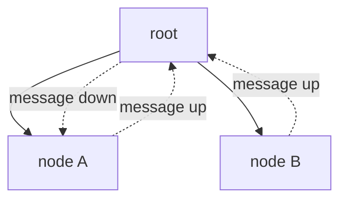

Variable elimination computes one marginal per run.
To compute all $n$ marginals, run VE $n$ times, each time eliminating all other variables.
**Belief propagation** (BP) achieves the same result in $O(n)$ work by recognizing
that the sub-computations share structure: messages computed when marginalizing $X_1$
can be reused when marginalizing $X_2$<FN n="1" />.

## Message passing on a tree

On a tree-structured pairwise factor graph, a single forward-backward pass suffices.
Choose any node as root.
Messages flow from leaves toward the root (collect), then back from root to leaves (distribute).

The sum-product rule on a pairwise MRF with edge potentials $\psi(x_i, x_j)$ and
node potentials $\phi(x_i)$:

**Variable-to-variable message** from $i$ to neighbor $j$:

$$
m_{i \to j}(x_j) = \sum_{x_i} \psi(x_i, x_j)\, \phi(x_i) \prod_{k \in N(i) \setminus j} m_{k \to i}(x_i).
$$

**Belief** at node $i$:

$$
b_i(x_i) \propto \phi(x_i) \prod_{k \in N(i)} m_{k \to i}(x_i).
$$

On a tree, each message is sent exactly once and the beliefs are exact marginals.

## Why trees give exact inference

On a tree with $n$ nodes, messages flow along $n-1$ edges in each direction: $2(n-1)$ messages total.
Each message is computed once from the messages of sub-tree descendants.
Because the tree has no cycles, those sub-tree messages are independent
conditional on the edge variable, and no information is double-counted.

In a cycle, a message arriving at node $j$ from node $i$ can contain information that
originally left $j$ through another path, leading to correlations being overcounted.

## Loopy belief propagation

When applied to graphs with cycles, BP still runs but sends messages iteratively until
convergence (or a fixed number of iterations).
The resulting beliefs are no longer guaranteed to be exact marginals;
they are approximate, sometimes well-calibrated and sometimes not.

Loopy BP is nonetheless effective in practice: it is the decoding algorithm for
LDPC error-correcting codes and an ingredient in early image segmentation models<FN n="2" />.



## Implementation

```python
import numpy as np

rng = np.random.default_rng(6)
k = 4   # states

# Star graph: center node C connected to leaves L1, L2, L3
# Potentials: edge psi[xi, xj], node phi[xi]
phi_c  = np.abs(rng.normal(1, 0.5, k))
phi_l  = [np.abs(rng.normal(1, 0.5, k)) for _ in range(3)]
psi    = [np.abs(rng.normal(1, 0.5, (k, k))) for _ in range(3)]

# Leaf -> center messages: m_{Li -> C}(xc) = sum_{xl} psi[xl,xc] * phi_l[xl]
msgs_to_center = [psi[i].T @ phi_l[i] for i in range(3)]

# Center belief: phi_c * product of all incoming messages
belief_c = phi_c.copy()
for m in msgs_to_center:
    belief_c *= m
belief_c /= belief_c.sum()

# Center -> leaf i message: m_{C -> Li}(xl)
# = sum_{xc} psi[xl, xc] * phi_c[xc] * prod_{j != i} msgs_to_center[j][xc]
belief_l = []
for i in range(3):
    m_c_excl = phi_c.copy()
    for j in range(3):
        if j != i:
            m_c_excl *= msgs_to_center[j]
    m_c_to_l = psi[i] @ m_c_excl
    b_l = phi_l[i] * m_c_to_l
    b_l /= b_l.sum()
    belief_l.append(b_l)

# Verify center belief via brute force
joint_all = np.ones((k, k, k, k))   # xc, xl0, xl1, xl2
for xc in range(k):
    for l in range(3):
        for xl in range(k):
            idx = [xc, xc, xc, xc]
            idx[l+1] = xl
joint_all = np.einsum(
    "c,ci,cj,ck,ic,jc,kc->cijk",
    phi_c, psi[0], psi[1], psi[2], phi_l[0].reshape(k,1)*np.ones((k,k)),
    phi_l[1].reshape(k,1)*np.ones((k,k)), phi_l[2].reshape(k,1)*np.ones((k,k))
)
# Simpler: build it explicitly
joint_all = np.zeros((k,k,k,k))
for xc in range(k):
    for xl0 in range(k):
        for xl1 in range(k):
            for xl2 in range(k):
                joint_all[xc,xl0,xl1,xl2] = (
                    phi_c[xc] * phi_l[0][xl0] * phi_l[1][xl1] * phi_l[2][xl2]
                    * psi[0][xl0,xc] * psi[1][xl1,xc] * psi[2][xl2,xc]
                )
joint_all /= joint_all.sum()
p_c_brute = joint_all.sum(axis=(1,2,3))

print("Belief C (BP):         ", belief_c.round(4))
print("Marginal C (brute):    ", p_c_brute.round(4))
print("Max abs error:", np.abs(belief_c - p_c_brute).max())
```

BP on the star graph returns exact marginals in a single pass because the graph has no cycles.

The next lesson extends this to general graphs by first converting them to a junction tree.

<Footnotes>
  <FNItem n="1">**Pearl, J.** (1988). *Probabilistic Reasoning in Intelligent Systems.* Morgan Kaufmann. Introduces belief propagation as message passing in trees.</FNItem>
  <FNItem n="2">**Bishop, C. M.** (2006). *Pattern Recognition and Machine Learning*, ch. 8. Springer. The sum-product algorithm on factor graphs and the loopy approximation.</FNItem>
</Footnotes>
