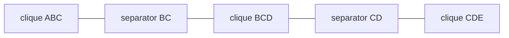

Belief propagation is exact on trees but only approximate on graphs with cycles.
The **junction tree** algorithm converts an arbitrary graph into a tree of cliques,
runs exact BP on that tree, and recovers exact marginals for the original graph<FN n="1" />.

## Step 1: moralization

Given a Bayesian network (directed graph), form the **moral graph**:

1. Add undirected edges between every pair of parents sharing a child (marry the parents).
2. Drop edge directions.

An MRF is already undirected; skip this step.

## Step 2: triangulation (chordal completion)

A graph is **chordal** (triangulated) if every cycle of length $\ge 4$ has a chord
(an edge joining two non-adjacent cycle nodes).
Add the minimum number of fill edges to make the graph chordal.

Triangulation is NP-hard in general; good heuristics (minimum fill-in, minimum degree)
work in practice.

## Step 3: identify maximal cliques

In a chordal graph, the maximal cliques can be found in linear time.
They form the nodes of the junction tree.

## Step 4: build the junction tree

Connect cliques into a tree.
**Running intersection property (RIP):** for any two cliques $C_i$ and $C_j$,
the intersection $C_i \cap C_j$ must appear in every clique on the unique path
between $C_i$ and $C_j$ in the tree.

The RIP is what makes BP on the clique tree exact: it prevents information about
shared variables from being inconsistently duplicated<FN n="2" />.

Build the maximum-weight spanning tree of the complete clique graph,
where edge weights equal $|C_i \cap C_j|$.
The resulting tree satisfies the RIP.

## Step 5: calibration (collect-distribute)

Initialize each clique $C_i$ with the product of all original factors that have
been assigned to it.
Run BP on the clique tree: pass messages from leaves inward (collect phase), then
back outward (distribute phase).
After two passes, each clique's "belief" is the exact joint marginal over its variables.

A message from clique $C_i$ to neighbor $C_j$ is obtained by marginalizing $C_i$'s
current belief over the variables not in the **separator** $S_{ij} = C_i \cap C_j$:

$$
m_{i \to j}(S_{ij}) = \sum_{C_i \setminus S_{ij}} \text{belief}_i(C_i).
$$



## Implementation

```python
import numpy as np

# Small example: triangulated graph with 3 cliques on 4 binary variables
# Cliques: {A,B,C}, {B,C,D}  Separator: {B,C}
rng = np.random.default_rng(17)
k = 2

# Random potentials for each clique
phi_abc = np.abs(rng.normal(1, 0.3, (k, k, k)))   # [a, b, c]
phi_bcd = np.abs(rng.normal(1, 0.3, (k, k, k)))   # [b, c, d]

# Initialize beliefs
belief_abc = phi_abc.copy()
belief_bcd = phi_bcd.copy()

# Collect: send message from BCD to ABC
# Message over separator {B,C}: m_{bcd->abc}(b,c) = sum_d phi_bcd[b,c,d]
m_bcd_to_abc = phi_bcd.sum(axis=2)   # [b, c]

# Update ABC belief with incoming message
belief_abc *= m_bcd_to_abc[np.newaxis, :, :]   # broadcast over a-axis: [a,b,c]

# Distribute: send message from updated ABC to BCD
# m_{abc->bcd}(b,c) = sum_a belief_abc[a,b,c]
m_abc_to_bcd = belief_abc.sum(axis=0)   # [b, c]

# Divide out old message, multiply new
old_sep = m_bcd_to_abc
new_sep = m_abc_to_bcd
belief_bcd = belief_bcd * (new_sep / (old_sep + 1e-12))[:, :, np.newaxis]

# Marginals
p_a = belief_abc.sum(axis=(1, 2));   p_a /= p_a.sum()
p_d = belief_bcd.sum(axis=(0, 1));   p_d /= p_d.sum()

# Verify against brute force joint
joint = phi_abc[:, :, :, np.newaxis] * phi_bcd[np.newaxis, :, :, :]  # [a,b,c,d]
joint /= joint.sum()
p_a_brute = joint.sum(axis=(1,2,3));   p_a_brute /= p_a_brute.sum()
p_d_brute = joint.sum(axis=(0,1,2));   p_d_brute /= p_d_brute.sum()

print(f"P(A) JT:     {p_a.round(4)}")
print(f"P(A) brute:  {p_a_brute.round(4)}")
print(f"P(D) JT:     {p_d.round(4)}")
print(f"P(D) brute:  {p_d_brute.round(4)}")
```

The junction tree recovers exact marginals by running BP on the clique tree rather than
the original graph, with complexity exponential only in the clique size (the treewidth plus 1).

## Exercises

**Exercise 1.** Consider a 4-cycle $A - B - C - D - A$ (each node connected to its two
neighbors, no diagonals). Show it is not chordal, list the two distinct ways to
triangulate it with a single fill edge, and give the resulting maximal cliques for one
of them.

<details>
<summary>Solution</summary>

**Step 1.** The cycle $A - B - C - D - A$ has length 4. Chordality requires every cycle
of length at least 4 to have a chord. The only possible chords are the diagonals
$A - C$ and $B - D$, and neither is present, so the graph is not chordal.

**Step 2.** A single fill edge along either diagonal triangulates it. Option one adds
$A - C$; option two adds $B - D$. Each splits the 4-cycle into two triangles, so one
fill edge suffices in both cases.

**Step 3.** Take the fill edge $A - C$. The graph now has triangles
$\{A, B, C\}$ and $\{A, C, D\}$, which are the two maximal cliques. They share the
separator $\{A, C\}$, exactly the added chord, giving a two-clique junction tree
$ABC - AC - ACD$.

</details>

**Exercise 2.** The running intersection property requires that for any two cliques,
their shared variables appear in every clique on the path between them. Take the clique
chain $\{A,B,C\} - \{B,C,D\} - \{C,D,E\}$. Verify RIP holds for the pair
$\{A,B,C\}$ and $\{C,D,E\}$, and explain what would break if the middle clique were
$\{B,D,F\}$ instead.

<details>
<summary>Solution</summary>

**Step 1.** The intersection of the endpoints is
$\{A,B,C\} \cap \{C,D,E\} = \{C\}$. RIP demands $C$ appear in every clique on the path,
which is the single middle clique $\{B,C,D\}$. Since $C \in \{B,C,D\}$, RIP holds for
this pair.

**Step 2.** Replace the middle clique with $\{B,D,F\}$. The endpoint intersection is
still $\{C\}$, but $C \notin \{B,D,F\}$, so the shared variable $C$ is missing from a
clique on the path. RIP is violated.

**Step 3.** With RIP broken, the two cliques carry information about $C$ that the middle
clique cannot reconcile, so message passing can leave the two beliefs disagreeing on the
marginal of $C$. The calibration step then fails to produce consistent exact marginals,
which is why the tree must be built to satisfy RIP (the maximum-weight spanning tree
construction guarantees it).

</details>

**Exercise 3 (code).** Build the junction tree for the triangulated 4-cycle of
Exercise 1 with cliques $\{A,B,C\}$ and $\{A,C,D\}$, separator $\{A,C\}$, on binary
variables. Initialize with random clique potentials, calibrate with one collect and one
distribute message, and verify the marginal of $D$ against the brute-force joint.

<details>
<summary>Solution</summary>

```python
import numpy as np

rng = np.random.default_rng(21)
k = 2

# Clique potentials. Axes: phi_abc[a,b,c], phi_acd[a,c,d]
phi_abc = np.abs(rng.normal(1, 0.4, (k, k, k)))
phi_acd = np.abs(rng.normal(1, 0.4, (k, k, k)))

belief_abc = phi_abc.copy()
belief_acd = phi_acd.copy()

# Collect: ACD -> ABC over separator {A,C}: sum out D
m_acd_to_abc = phi_acd.sum(axis=2)              # [a, c]
belief_abc *= m_acd_to_abc[:, np.newaxis, :]    # broadcast over b: [a,b,c]

# Distribute: ABC -> ACD over {A,C}: sum out B, divide old, multiply new
m_abc_to_acd = belief_abc.sum(axis=1)           # [a, c]
belief_acd *= (m_abc_to_acd / (m_acd_to_abc + 1e-12))[:, :, np.newaxis]

p_d = belief_acd.sum(axis=(0, 1)); p_d /= p_d.sum()

# Brute force joint over (a,b,c,d)
joint = phi_abc[:, :, :, np.newaxis] * phi_acd[:, np.newaxis, :, :]  # [a,b,c,d]
joint /= joint.sum()
p_d_brute = joint.sum(axis=(0, 1, 2)); p_d_brute /= p_d_brute.sum()

assert np.allclose(p_d, p_d_brute)
print("P(D) JT:    ", p_d.round(4))
print("P(D) brute: ", p_d_brute.round(4))
```

The calibrated clique tree reproduces the brute-force marginal of $D$, confirming exact
inference on the triangulated graph.

</details>

The next subsection turns to approximate inference, which scales to problems where the
treewidth makes exact methods infeasible.

<Footnotes>
  <FNItem n="1">**Lauritzen, S. L., & Spiegelhalter, D. J.** (1988). "Local computations with probabilities on graphical structures and their application to expert systems". *Journal of the Royal Statistical Society: Series B*, 50(2), 157-224. [doi:10.1111/j.2517-6161.1988.tb01721.x](https://doi.org/10.1111/j.2517-6161.1988.tb01721.x)</FNItem>
  <FNItem n="2">**Koller, D., & Friedman, N.** (2009). *Probabilistic Graphical Models: Principles and Techniques.* MIT Press. Triangulation, the running intersection property, and clique-tree calibration.</FNItem>
</Footnotes>
