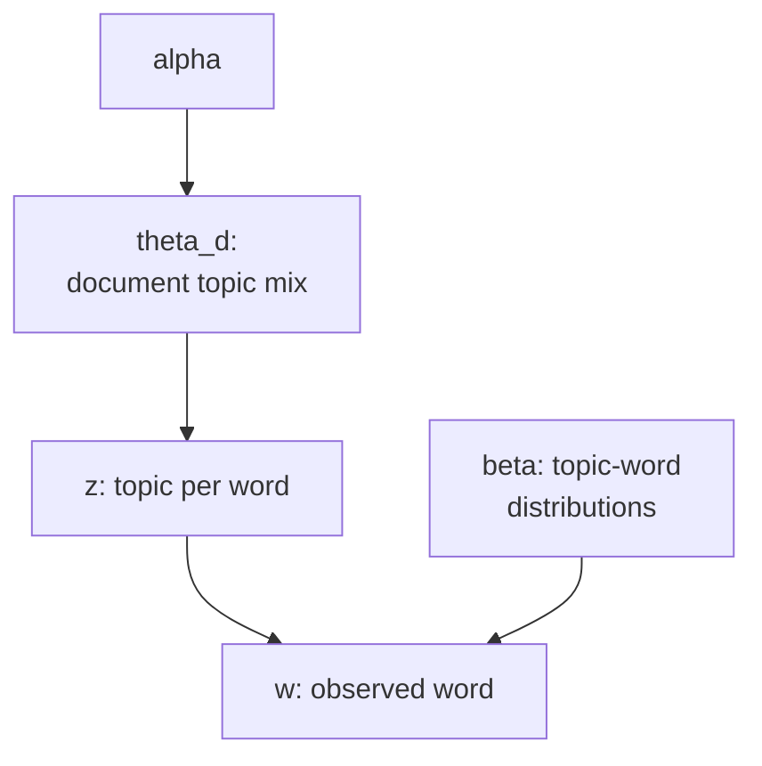

A corpus of documents shares latent themes.
**Latent Dirichlet Allocation** (LDA) is a hierarchical Bayesian model that assigns
each document a mixture of topics and each topic a distribution over words,
learning both from the observed text.

## The LDA generative process

Each document $d$ has a topic proportion vector $\theta_d \sim \text{Dir}(\alpha)$,
where $\alpha$ is a $K$-dimensional concentration parameter.
Each topic $k$ has a word distribution $\phi_k \sim \text{Dir}(\beta)$,
where $\beta$ is a $V$-dimensional concentration parameter ($V$ = vocabulary size).

For each word position $n$ in document $d$:

1. Draw topic assignment $z_{dn} \sim \text{Categorical}(\theta_d)$.
2. Draw word $w_{dn} \sim \text{Categorical}(\phi_{z_{dn}})$.

The joint distribution is:

$$
P(\mathbf{W}, \mathbf{Z}, \boldsymbol{\theta}, \boldsymbol{\phi} \mid \alpha, \beta)
= \prod_k P(\phi_k \mid \beta) \prod_d P(\theta_d \mid \alpha) \prod_{n} P(z_{dn} \mid \theta_d) P(w_{dn} \mid \phi_{z_{dn}}).
$$

## Collapsed Gibbs sampling

Marginalizing out $\theta$ and $\phi$ analytically (using Dirichlet-multinomial conjugacy)
gives the collapsed joint. The full conditional for a single topic assignment $z_{dn}$ is:

$$
P(z_{dn} = k \mid \mathbf{z}_{-dn}, \mathbf{w})
\propto \frac{n_{dk}^{-dn} + \alpha}{\sum_{k'} (n_{dk'}^{-dn} + \alpha)}
\cdot \frac{n_{kw_{dn}}^{-dn} + \beta}{\sum_v (n_{kv}^{-dn} + \beta)},
$$

where $n_{dk}^{-dn}$ is the count of words in document $d$ assigned to topic $k$,
excluding the current position, and $n_{kv}^{-dn}$ is the count of word $v$ assigned
to topic $k$, excluding the current position.

The first factor is the topic proportion for document $d$; the second is how well
topic $k$ explains word $w_{dn}$.

## Interpreting the hyperparameters

**$\alpha$:** controls topic diversity per document.
Large $\alpha$ gives each document a spread across many topics;
small $\alpha$ concentrates each document on a few topics.

**$\beta$:** controls word diversity per topic.
Large $\beta$ makes each topic a broad mixture of words;
small $\beta$ makes topics focused and distinct.



## Implementation

```python
import numpy as np

rng = np.random.default_rng(37)

# Tiny corpus: 3 topics, 6 words, 4 documents
K = 3
V = 6
D = 4

# True topics (not used for inference, just to generate data)
true_phi = np.array([
    [0.4, 0.4, 0.1, 0.05, 0.025, 0.025],
    [0.05, 0.05, 0.4, 0.4, 0.05, 0.05],
    [0.025, 0.025, 0.05, 0.05, 0.4, 0.45],
])
true_theta = np.array([
    [0.8, 0.1, 0.1], [0.1, 0.8, 0.1],
    [0.1, 0.1, 0.8], [0.3, 0.3, 0.4],
])

# Generate corpus
docs = []
doc_z = []
for d in range(D):
    n_words = rng.integers(20, 30)
    z_d = rng.choice(K, n_words, p=true_theta[d])
    w_d = np.array([rng.choice(V, p=true_phi[k]) for k in z_d])
    docs.append(w_d)
    doc_z.append(z_d)

# Collapsed Gibbs sampling
alpha, beta = 0.1, 0.1

# Counts
n_dk = np.zeros((D, K), dtype=int)   # doc-topic
n_kv = np.zeros((K, V), dtype=int)   # topic-word
n_k  = np.zeros(K, dtype=int)        # topic total

# Initialize random assignments
z_assign = []
for d, w_d in enumerate(docs):
    zs = rng.integers(0, K, len(w_d))
    z_assign.append(zs)
    for i, (z, w) in enumerate(zip(zs, w_d)):
        n_dk[d, z] += 1
        n_kv[z, w] += 1
        n_k[z] += 1

n_iter = 200
for it in range(n_iter):
    for d, w_d in enumerate(docs):
        for i, w in enumerate(w_d):
            z = z_assign[d][i]
            # Remove current
            n_dk[d, z] -= 1; n_kv[z, w] -= 1; n_k[z] -= 1
            # Compute probs
            p_z = (n_dk[d] + alpha) * (n_kv[:, w] + beta) / (n_k + V * beta)
            p_z /= p_z.sum()
            # Sample new
            z_new = rng.choice(K, p=p_z)
            z_assign[d][i] = z_new
            n_dk[d, z_new] += 1; n_kv[z_new, w] += 1; n_k[z_new] += 1

# Infer phi and theta
phi = (n_kv + beta) / (n_kv + beta).sum(axis=1, keepdims=True)

# Align inferred topics to true topics by most-concentrated word (topics are label-permuted)
align = np.argmax(phi, axis=1)   # dominant word index per inferred topic
sort_idx = np.argsort(align)     # sort inferred topics by dominant word
true_sort = np.argsort(np.argmax(true_phi, axis=1))

print("Inferred topic-word distributions (sorted by dominant word):")
for i, k in enumerate(sort_idx):
    print(f"  Topic {i}: {phi[k].round(3)}")
print("\nTrue topic-word distributions (sorted by dominant word):")
for i, k in enumerate(true_sort):
    print(f"  Topic {i}: {true_phi[k].round(3)}")
```

Collapsed Gibbs recovers the topic structure because integrating out $\theta$ and $\phi$
reduces variance in the sampler and makes the per-token update cheap and exact.

The next lesson applies EM to a continuous latent variable model: probabilistic PCA.
