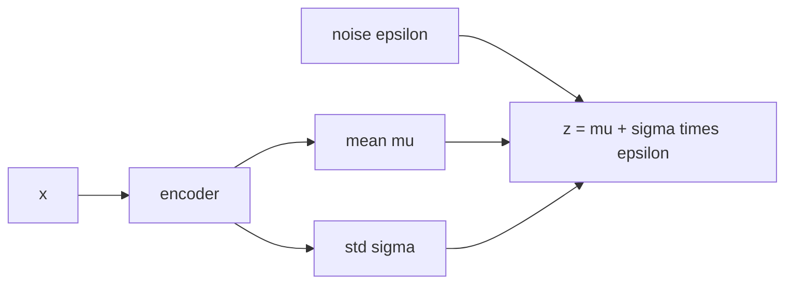

Probabilistic PCA uses a linear decoder and Gaussian noise.
The **Variational Autoencoder** (VAE) replaces both the encoder and decoder with neural
networks while preserving the latent variable structure, enabling the model to learn
complex, nonlinear data distributions<FN n="1" />.

This lesson focuses on the mathematical core: the ELBO objective and the reparameterization
trick that makes it differentiable.
For the full VAE architecture with convolutional encoders and decoders, see the
cross-reference in D4.

## The VAE objective

Given a datapoint $x$, the VAE encoder outputs parameters of the approximate posterior
$q_\phi(z \mid x) = \mathcal{N}(\mu_\phi(x), \text{diag}(\sigma_\phi^2(x)))$.
The decoder defines the likelihood $p_\theta(x \mid z)$.

The ELBO for a single datapoint is:

$$
\mathcal{L}(\phi, \theta; x) = \mathbb{E}_{q_\phi(z \mid x)}[\log p_\theta(x \mid z)] - \mathrm{KL}(q_\phi(z \mid x) \| p(z)).
$$

The first term is the **reconstruction loss** (negative expected log-likelihood under the decoder).
The second term is the **regularization loss**: it penalizes the encoder for drifting
from the prior $p(z) = \mathcal{N}(0, I)$.

For a Gaussian encoder and standard normal prior, the KL has the closed form:

$$
\mathrm{KL}(\mathcal{N}(\mu, \text{diag}(\sigma^2)) \| \mathcal{N}(0, I))
= \frac{1}{2} \sum_j (\mu_j^2 + \sigma_j^2 - 1 - \log \sigma_j^2).
$$

The formula reads cleanly on a single latent dimension, where it measures how far
the encoder has drifted from the unit Gaussian prior:

- **On the prior** ($\mu = 0$, $\sigma = 1$): KL $= 0$. Every term cancels, so an
  encoder that ignores $x$ and outputs the prior pays no penalty (this is the
  posterior-collapse fixed point).
- **Shifted off-center** ($\mu = 2$, $\sigma = 1$): KL $= \tfrac12(4) = 2$ nats. The
  $\mu^2$ term is the cost of placing the code two standard deviations from the
  origin.
- **Over-confident** ($\mu = 0$, $\sigma = 0.1$): KL $\approx 1.81$ nats. A posterior
  much narrower than the prior is penalized through the $-\log\sigma^2$ term, even
  with the mean on target. This is what stops the encoder from shrinking each code to
  a noiseless point and overfitting.

The contrast between the second and third case is the lesson: the same KL budget
buys either a displaced mean or a sharpened variance, and the regularizer charges
for both, keeping the latent code both centered and appropriately fuzzy.

## The reparameterization trick

The ELBO contains $\mathbb{E}_{q_\phi}[\cdot]$, which requires sampling from $q_\phi(z \mid x)$.
Sampling is non-differentiable in $\phi$, blocking backpropagation.

The reparameterization trick rewrites the sample as<FN n="1" />:

$$
z = \mu_\phi(x) + \sigma_\phi(x) \odot \epsilon, \qquad \epsilon \sim \mathcal{N}(0, I).
$$

Now $\epsilon$ is independent of $\phi$, and $z$ is a deterministic function of $\phi$
and $\epsilon$.
Gradients $\nabla_\phi \mathbb{E}[\log p_\theta(x \mid z)]$ flow through $z = \mu + \sigma \odot \epsilon$ cleanly:

$$
\nabla_\phi \mathbb{E}_{q_\phi}[f(z)] = \mathbb{E}_{\epsilon \sim \mathcal{N}(0,I)}[\nabla_\phi f(\mu_\phi + \sigma_\phi \odot \epsilon)].
$$

## KL as a bottleneck

The KL term prevents the encoder from mapping all inputs to very different,
non-overlapping regions of $z$-space (which would make $p(z)$ useless as a prior).
It pushes the posterior toward the prior, creating a regularized, continuous latent space
where nearby $z$ values decode to similar outputs.

Too large a weight on KL relative to reconstruction leads to **posterior collapse**:
the encoder ignores $x$ and outputs the prior, and the decoder degenerates.



## Implementation

```python
import numpy as np

rng = np.random.default_rng(41)

# Toy VAE on 1D data: linear encoder/decoder (recovers PPCA in the limit)
N = 300
d_x, d_z = 4, 2
W_true = rng.normal(0, 1, (d_x, d_z))
x_data = rng.normal(0, 1, (N, d_z)) @ W_true.T + rng.normal(0, 0.5, (N, d_x))

# Encoder: mu = x @ A.T, log_sigma = b (shared)
# Decoder: x_recon_mean = z @ C.T
A = rng.normal(0, 0.1, (d_z, d_x))
b = np.zeros(d_z) - 1.0   # log_sigma
C = rng.normal(0, 0.1, (d_x, d_z))
lr = 1e-2
S_mc = 5

# The ELBO takes eps as an argument: holding eps fixed makes the objective a
# deterministic function of C, so the finite-difference gradient is exact
# (common random numbers). Drawing fresh eps per evaluation instead would let
# Monte Carlo noise swamp the perturbation and the gradient would be garbage.
def compute_elbo(A, b, C, x_batch, eps):
    mu    = x_batch @ A.T                             # (M, d_z)
    sigma = np.exp(b)[np.newaxis]                     # (1, d_z)
    z     = mu[np.newaxis] + sigma * eps              # (S, M, d_z)
    x_recon = z @ C.T                                 # (S, M, d_x)
    recon = -0.5 * ((x_batch[np.newaxis] - x_recon)**2).sum(-1).mean()
    kl    = 0.5 * (mu**2 + sigma**2 - 1 - 2*b).sum(-1).mean()
    return recon - kl

batch_size = 64
n_steps = 500
for step in range(n_steps):
    idx     = rng.choice(N, batch_size, replace=False)
    x_batch = x_data[idx]
    eps     = rng.normal(0, 1, (S_mc, batch_size, d_z))  # fixed within this step

    # Finite-difference gradient of the ELBO w.r.t. the decoder C
    # (the reparameterized z flows through compute_elbo; no autograd needed)
    h = 1e-4
    elbo_curr = compute_elbo(A, b, C, x_batch, eps)
    grad_C = np.zeros_like(C)
    for i in range(d_x):
        for j in range(d_z):
            C[i,j] += h
            e_plus = compute_elbo(A, b, C, x_batch, eps)
            C[i,j] -= 2*h
            e_minus = compute_elbo(A, b, C, x_batch, eps)
            C[i,j] += h
            grad_C[i,j] = (e_plus - e_minus) / (2*h)
    C += lr * grad_C

    if step == n_steps - 1 or step % 100 == 0:
        print(f"Step {step:3d}  ELBO: {elbo_curr:.3f}")

eps_full = rng.normal(0, 1, (S_mc, N, d_z))
print(f"\nFinal ELBO: {compute_elbo(A, b, C, x_data, eps_full):.3f}")
```

The ELBO increases as the decoder learns to reconstruct the data; the KL term keeps
the latent distribution close to the prior throughout.

## Exercises

**Exercise 1.** A Gaussian encoder outputs $\mu = (1, 0)$ and $\sigma = (1, 2)$ for a
two-dimensional latent code. Compute $\mathrm{KL}(q \| p)$ against the standard normal
prior $p(z) = \mathcal{N}(0, I)$ in nats, by hand.

<details>
<summary>Solution</summary>

**Step 1.** The closed form is a sum over independent dimensions:
$\mathrm{KL} = \tfrac12 \sum_j (\mu_j^2 + \sigma_j^2 - 1 - \log \sigma_j^2)$.

**Step 2.** Dimension 1 ($\mu = 1$, $\sigma = 1$): $\tfrac12(1 + 1 - 1 - \log 1) = \tfrac12(1) = 0.5$.
The $\mu^2 = 1$ is the only cost, since the variance already matches the prior.

**Step 3.** Dimension 2 ($\mu = 0$, $\sigma = 2$): $\tfrac12(0 + 4 - 1 - \log 4) = \tfrac12(3 - 1.3863) = 0.8069$.
The mean is on target, but a posterior wider than the prior ($\sigma^2 = 4$) is penalized.

**Step 4.** Sum the two: $\mathrm{KL} = 0.5 + 0.8069 = 1.3069$ nats. The total charges
separately for the off-center mean in one dimension and the over-spread variance in the
other.

</details>

**Exercise 2.** Show that the reparameterized gradient is unbiased: that
$\nabla_\phi \mathbb{E}_{q_\phi}[f(z)] = \mathbb{E}_{\epsilon \sim \mathcal{N}(0,I)}[\nabla_\phi f(\mu_\phi + \sigma_\phi \odot \epsilon)]$
for a smooth $f$, with $q_\phi(z) = \mathcal{N}(\mu_\phi, \mathrm{diag}(\sigma_\phi^2))$.

<details>
<summary>Solution</summary>

**Step 1.** Rewrite the expectation under $q_\phi$ as an expectation under the
$\phi$-free base distribution. The change of variables $z = \mu_\phi + \sigma_\phi \odot \epsilon$
with $\epsilon \sim \mathcal{N}(0, I)$ maps the standard normal to $q_\phi$, so

$$
\mathbb{E}_{q_\phi(z)}[f(z)] = \mathbb{E}_{\epsilon \sim \mathcal{N}(0,I)}[f(\mu_\phi + \sigma_\phi \odot \epsilon)].
$$

**Step 2.** On the right-hand side the distribution of $\epsilon$ does not depend on
$\phi$, so the gradient passes through the expectation (dominated convergence lets the
$\nabla_\phi$ and the integral over $\epsilon$ swap):

$$
\nabla_\phi \mathbb{E}_{\epsilon}[f(\mu_\phi + \sigma_\phi \odot \epsilon)]
= \mathbb{E}_{\epsilon}[\nabla_\phi f(\mu_\phi + \sigma_\phi \odot \epsilon)].
$$

**Step 3.** A single draw $\epsilon$ gives the one-sample estimator
$\nabla_\phi f(\mu_\phi + \sigma_\phi \odot \epsilon)$, whose expectation is the true
gradient by Step 2, hence unbiased. Differentiating the density $q_\phi$ directly (the
score-function estimator) is also unbiased but typically much higher variance, which is
why the reparameterized form is preferred.

</details>

**Exercise 3 (code).** Verify that the closed-form KL of a diagonal Gaussian against the
standard normal prior matches a Monte Carlo estimate $\mathbb{E}_q[\log q(z) - \log p(z)]$,
for $\mu = (1, 0)$, $\sigma = (1, 2)$.

<details>
<summary>Solution</summary>

```python
import numpy as np

rng = np.random.default_rng(5)
mu  = np.array([1.0, 0.0])
sig = np.array([1.0, 2.0])

# Closed form: 0.5 * sum(mu^2 + sigma^2 - 1 - log sigma^2)
kl_closed = 0.5 * np.sum(mu**2 + sig**2 - 1 - np.log(sig**2))

# Monte Carlo: E_q[log q(z) - log p(z)]
n = 4_000_000
z = rng.normal(mu, sig, (n, 2))
log_q = (-0.5 * (((z - mu) / sig)**2).sum(1)
         - np.log(sig).sum() - 2 * 0.5 * np.log(2 * np.pi))
log_p = -0.5 * (z**2).sum(1) - 2 * 0.5 * np.log(2 * np.pi)
kl_mc = (log_q - log_p).mean()

assert np.isclose(kl_closed, kl_mc, atol=2e-3)
print("closed-form KL:", round(kl_closed, 4))
print("Monte Carlo KL:", round(kl_mc, 4))
```

The two agree to three decimals ($\approx 1.307$ nats), confirming the closed form used
in the ELBO is the exact KL the Monte Carlo average estimates.

</details>

The next lesson covers how to estimate uncertainty in neural networks without
a full variational treatment, using MC dropout and deep ensembles.

<Footnotes>
  <FNItem n="1">**Kingma, D. P., & Welling, M.** (2014). "Auto-encoding variational Bayes". *ICLR*. Introduces the VAE, the amortized ELBO, and the reparameterization trick for low-variance gradients through a stochastic latent ([arXiv:1312.6114](https://arxiv.org/abs/1312.6114)).</FNItem>
</Footnotes>
