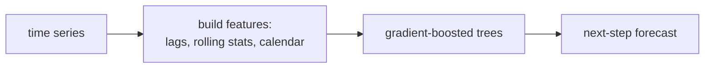

Gradient-boosted decision trees (GBDT) win a large share of forecasting
competitions when the data is tabular and rich in covariates. They take the
feature table from the previous lesson and learn nonlinear interactions between
lags, calendar effects, and external regressors that linear ARIMA cannot. The new
question they raise is how to forecast more than one step ahead, because a tree
predicts a single number, not a trajectory.

## Why trees fit forecasting

A boosted-tree ensemble approximates the target as a sum of regression trees,
$\hat{y} = \sum_b f_b(\mathbf{x})$, each $f_b$ fit to the gradient of the loss left
by its predecessors. The gradient-boosting lesson covers the mechanics. For
time series the appeal is specific:

- Trees split on thresholds, so they model regime changes (a holiday flag, a
  promotion) without manual interaction terms.
- They ingest many heterogeneous features (lags, rolling stats, prices, weather)
  on different scales without normalization.
- They are robust to irrelevant features, so over-generating lag candidates is
  cheap.

What trees cannot do is **extrapolate**. A tree's prediction is bounded by the leaf
values seen in training, so a series with an unbounded trend must be differenced or
detrended first; feed the model stationary targets (for example, the change
$y_t - y_{t-1}$ or a ratio) and add the trend back afterward.

## Recursive multi-step forecasting

The first strategy trains a single one-step model $\hat{y}_{t+1} = g(\mathbf{x}_t)$
and applies it repeatedly, feeding each prediction back in as the lag input for the
next step:

$$
\hat{y}_{t+2} = g(\mathbf{x}_{t+1}), \quad \text{where } \mathbf{x}_{t+1} \text{ contains } \hat{y}_{t+1}.
$$

- **Advantage:** one model, and it uses the most recent lag at every step.
- **Disadvantage:** errors compound. A mistake at step 1 becomes a corrupted input
  at step 2, and the model was trained on *clean* lags, never on its own noisy
  predictions, so the train and inference distributions diverge as the horizon
  grows.

## Direct multi-step forecasting

The second strategy trains a **separate model per horizon**. Model $g_h$ predicts
$y_{t+h}$ directly from $\mathbf{x}_t$:

$$
\hat{y}_{t+h} = g_h(\mathbf{x}_t), \qquad h = 1, \dots, H.
$$

- **Advantage:** no error feedback; each model optimizes its own horizon, and
  inference sees the same feature distribution as training.
- **Disadvantage:** $H$ models to train and store, and each ignores the others, so
  the forecast trajectory can be jagged across horizons.

A middle path, **DirRec**, trains one model per horizon but lets each use the
previous horizons' predictions, combining the strengths. In practice, recursive is
the default for long horizons with cheap retraining; direct wins when $H$ is small
and accuracy at each specific lead time matters.



## A global model across many series

When forecasting thousands of related series (every product in a catalogue), a
**global** model trains one GBDT on the pooled rows of all series, with a series
identifier or static features as columns. This shares statistical strength,
regularizes short series toward the population, and beats fitting a separate model
per series, the insight behind the winning M5-competition solutions.

```python
import numpy as np

rng = np.random.default_rng(2)
n, m = 800, 12
t = np.arange(n)
y = 5*np.sin(2*np.pi*t/m) + 0.5*rng.standard_normal(n) + np.cos(2*np.pi*t/50)

def feats(y, t, i, m):
    return [y[i-1], y[i-2], y[i-m], np.sin(2*np.pi*t[i]/m), np.cos(2*np.pi*t[i]/m)]

# Minimal gradient boosting on depth-1 regression stumps (squared-error loss).
class Stump:
    def fit(self, X, g):
        best = (np.inf, 0, 0.0, g.mean(), g.mean())
        for j in range(X.shape[1]):
            order = np.argsort(X[:, j]); xs, gs = X[order, j], g[order]
            for thr in np.unique(xs)[1:]:                 # candidate split points
                left = xs < thr
                if left.sum() == 0 or left.sum() == len(gs):
                    continue
                vl, vr = gs[left].mean(), gs[~left].mean()
                sse = ((gs[left]-vl)**2).sum() + ((gs[~left]-vr)**2).sum()
                if sse < best[0]:
                    best = (sse, j, thr, vl, vr)
        _, self.j, self.thr, self.vl, self.vr = best
        return self
    def predict(self, X):
        return np.where(X[:, self.j] < self.thr, self.vl, self.vr)

def gbdt_fit(X, y, rounds=120, lr=0.1):
    pred = np.full(len(y), y.mean()); base = y.mean(); trees = []
    for _ in range(rounds):
        resid = y - pred                                   # negative gradient of MSE
        s = Stump().fit(X, resid); trees.append(s)
        pred += lr * s.predict(X)
    return base, trees

def gbdt_predict(base, trees, X, lr=0.1):
    out = np.full(len(X), base)
    for s in trees:
        out += lr * s.predict(X)
    return out

start, H = m, 12
X  = np.array([feats(y, t, i, m) for i in range(start, n-H)])
y1 = np.array([y[i+1] for i in range(start, n-H)])         # one-step target
split = len(X) - 100
base, trees = gbdt_fit(X[:split], y1[:split])

# Recursive: roll the one-step model forward H steps from the split point
hist = list(y[:start+split+1]); preds = []
for _ in range(H):
    i = len(hist)
    x = np.array([[hist[i-1], hist[i-2], hist[i-m],
                   np.sin(2*np.pi*i/m), np.cos(2*np.pi*i/m)]])
    p = gbdt_predict(base, trees, x)[0]
    preds.append(p); hist.append(p)

actual = y[start+split+1 : start+split+1+H]
rmse = np.sqrt(((np.array(preds) - actual)**2).mean())
print(f"recursive {H}-step RMSE: {rmse:.2f}  (noise std 0.5)")
```

The recursive forecast tracks the seasonal signal across the full horizon, with
error a few times the noise floor, the expected accumulation from feeding
predictions back as inputs.

A single GBDT treats all series with one flat model. The next lesson handles series
that are organized into a hierarchy, where forecasts must add up consistently
across levels.
