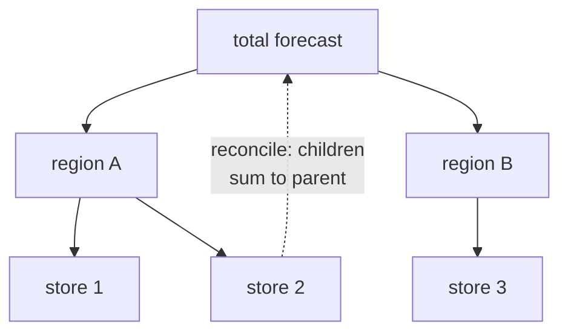

Sales aggregate: each store rolls up into a region, regions into a country. If you
forecast every level independently, the store forecasts will not sum to the region
forecast, and the numbers contradict each other. **Hierarchical forecasting** fixes
this by producing **coherent** forecasts that respect the aggregation structure,
and the good methods improve accuracy at the same time<FN n="1" />.

## The hierarchy and the summing matrix

Let $\mathbf{b}_t \in \mathbb{R}^{m}$ be the $m$ bottom-level series (the stores).
Every aggregate is a sum of bottom series, so the full vector of all series,
$\mathbf{y}_t$, is a linear map of the bottom level:

$$
\mathbf{y}_t = S\, \mathbf{b}_t,
$$

where $S$ is the **summing matrix**: each row picks out which bottom series enter
that aggregate. For a two-store, one-total hierarchy,

$$
S = \begin{pmatrix} 1 & 1 \\ 1 & 0 \\ 0 & 1 \end{pmatrix}, \qquad \mathbf{y}_t = (\text{total},\, \text{store}_1,\, \text{store}_2)^\top.
$$

The top row sums both stores; the bottom rows are the identity. **Coherence** means
the forecasts satisfy this same relation: $\hat{\mathbf{y}} = S \hat{\mathbf{b}}$
for some bottom-level vector $\hat{\mathbf{b}}$.

## Single-level approaches and their flaw

- **Bottom-up:** forecast each bottom series, then sum up with $S$. Coherent by
  construction, and it keeps fine-grained signal, but bottom series are noisy and
  the aggregates inherit that noise.
- **Top-down:** forecast the top series, then split it down by historical
  proportions. Stable at the top, but it cannot capture series-specific dynamics at
  the bottom and the proportions are themselves uncertain.

Each uses information from only one level. Reconciliation uses all levels at once.

## Reconciliation as a projection

Start by forecasting *every* series independently, giving **base forecasts**
$\hat{\mathbf{y}}$ that are generally incoherent. A reconciliation maps them to
coherent forecasts through a matrix $G$ that estimates the bottom level, then sums:

$$
\tilde{\mathbf{y}} = S G\, \hat{\mathbf{y}}.
$$

Different choices of $G$ recover different methods. Bottom-up is $G = [\,0 \mid I\,]$
(keep the base bottom forecasts, ignore the rest). The question is which $G$ is
best.

## MinT: minimum-trace reconciliation

The reconciliation error is $\tilde{\mathbf{y}} - \mathbf{y}_t$. Among all $G$ that
yield unbiased coherent forecasts, **MinT** picks the one that minimizes the total
variance of this error (the trace of its covariance)<FN n="2" />. With $W$ the covariance of
the base-forecast errors, the optimal map is

$$
G = (S^\top W^{-1} S)^{-1} S^\top W^{-1}.
$$

This is a generalized least-squares projection of the base forecasts onto the
coherent subspace $\{S\mathbf{b}\}$, weighting each series by the inverse of its
forecast-error variance so noisy series get pulled toward the structure more. When
$W = I$ it reduces to ordinary least squares (OLS reconciliation); the
least-squares lesson is the underlying machinery. MinT uses every level's forecast
to correct every other level, which is why it dominates bottom-up and top-down on
accuracy while guaranteeing coherence.



## Grouped versus strictly hierarchical

A strict **hierarchy** has a single tree (store within region within country).
**Grouped** structures cross attributes that do not nest, for example sales by
\{region\} and independently by \{product category\}. The summing matrix $S$ encodes
both groupings, and MinT applies unchanged; only the structure of $S$ differs.

```python
import numpy as np

rng = np.random.default_rng(0)
# Hierarchy: total = store1 + store2.  S maps bottom (2) to all series (3).
S = np.array([[1., 1.], [1., 0.], [0., 1.]])

# Base forecasts are incoherent: total != store1 + store2
yhat = np.array([100.0, 55.0, 40.0])     # 55 + 40 = 95 != 100
print("incoherent base:", yhat, " sum of stores:", yhat[1] + yhat[2])

# MinT with diagonal W (forecast-error variances per series)
W = np.diag([9.0, 4.0, 4.0])
Wi = np.linalg.inv(W)
G = np.linalg.inv(S.T @ Wi @ S) @ S.T @ Wi
b_tilde = G @ yhat                         # reconciled bottom level
y_tilde = S @ b_tilde                      # coherent full vector

print("reconciled:", np.round(y_tilde, 2),
      " sum of stores:", round(y_tilde[1] + y_tilde[2], 2))
print("coherent:", np.isclose(y_tilde[0], y_tilde[1] + y_tilde[2]))
```

The reconciled forecast is coherent (the total equals the sum of the stores) and
MinT has nudged all three numbers using their relative error variances, rather than
trusting any single level outright.

## Exercises

**Exercise 1.** For the two-store hierarchy with
$S = \left(\begin{smallmatrix} 1 & 1 \\ 1 & 0 \\ 0 & 1 \end{smallmatrix}\right)$,
the base forecasts are $\hat{\mathbf{y}} = (\text{total}, \text{store}_1, \text{store}_2) = (100, 55, 40)$.
Reconcile them bottom-up by hand and confirm the result is coherent. Then check
whether the base forecasts were coherent to begin with.

<details>
<summary>Solution</summary>

**Step 1.** Bottom-up uses $G = [\,0 \mid I\,]$, which discards the total row and
keeps the base bottom-level forecasts:
$\hat{\mathbf{b}} = (\text{store}_1, \text{store}_2) = (55, 40)$.

**Step 2.** Resum with $S$ to get the coherent full vector:

$$
\tilde{\mathbf{y}} = S \hat{\mathbf{b}} = (55 + 40,\ 55,\ 40) = (95,\ 55,\ 40).
$$

**Step 3.** Coherence check: the top entry $95$ equals the sum of the bottom
entries $55 + 40 = 95$. Coherent by construction. The original base forecast had
$\text{total} = 100 \ne 55 + 40 = 95$, so it was incoherent; bottom-up resolved the
conflict by trusting the bottom level and overwriting the total.

</details>

**Exercise 2.** Show that the MinT map $G = (S^\top W^{-1} S)^{-1} S^\top W^{-1}$
recovers the identity on the bottom level: prove $GS = I$. Explain why this property
is exactly what makes the reconciled forecast $\tilde{\mathbf{y}} = SG\hat{\mathbf{y}}$
coherent and unbiased.

<details>
<summary>Solution</summary>

**Step 1.** Substitute $S$ in place of $\hat{\mathbf{y}}$ inside $G$:

$$
GS = (S^\top W^{-1} S)^{-1} S^\top W^{-1} S.
$$

**Step 2.** The trailing factor $S^\top W^{-1} S$ cancels its own inverse:
$(S^\top W^{-1} S)^{-1}(S^\top W^{-1} S) = I$. So $GS = I$, the
$m \times m$ identity on the bottom level.

**Step 3 (coherence).** Any reconciled vector has the form
$\tilde{\mathbf{y}} = SG\hat{\mathbf{y}} = S\hat{\mathbf{b}}$ with
$\hat{\mathbf{b}} = G\hat{\mathbf{y}}$. It lies in the column space
$\{S\mathbf{b}\}$, the coherent subspace, so children sum to parents automatically.

**Step 4 (unbiasedness).** If the base forecasts are unbiased,
$\mathbb{E}[\hat{\mathbf{y}}] = S\mathbf{b}_t$ (the true coherent mean). Then
$\mathbb{E}[\tilde{\mathbf{y}}] = SG\,S\mathbf{b}_t = S(GS)\mathbf{b}_t = S\mathbf{b}_t$,
using $GS = I$. The reconciliation introduces no bias; it only projects onto the
coherent subspace.

</details>

**Exercise 3 (code).** With the lesson's $S$ and the diagonal weight
$W = \mathrm{diag}(9, 4, 4)$, build the MinT map $G$, reconcile the incoherent base
forecast $(100, 55, 40)$, and verify two facts: the result is coherent, and
$GS = I$. End with asserts. (Solve the linear systems directly with `numpy`.)

<details>
<summary>Solution</summary>

```python
import numpy as np

S = np.array([[1., 1.], [1., 0.], [0., 1.]])     # bottom (2) -> all series (3)
W = np.diag([9., 4., 4.])                          # forecast-error variances
Wi = np.linalg.inv(W)

G = np.linalg.inv(S.T @ Wi @ S) @ S.T @ Wi         # MinT map, shape (2, 3)

yhat = np.array([100., 55., 40.])                  # incoherent: 100 != 95
b_tilde = G @ yhat                                  # reconciled bottom level
y_tilde = S @ b_tilde                               # coherent full vector

# Coherence: total equals sum of stores
assert np.isclose(y_tilde[0], y_tilde[1] + y_tilde[2])
# MinT recovers the identity on the bottom level: G S = I
assert np.allclose(G @ S, np.eye(2))
print("reconciled:", np.round(y_tilde, 3),
      " coherent:", bool(np.isclose(y_tilde[0], y_tilde[1] + y_tilde[2])))
```

The reconciled total equals the sum of the stores, and $GS$ is the identity, so
the MinT projection lands in the coherent subspace exactly as the algebra predicts.

</details>

GBDT, hierarchical reconciliation, and the next model all live in the classical-ML
camp. The next lesson covers Prophet, a decomposable additive model designed for
analyst-friendly forecasting at scale.

<Footnotes>
  <FNItem n="1">**Hyndman, R. J., & Athanasopoulos, G.** (2021). *Forecasting: Principles and Practice* (3rd ed.). OTexts. Hierarchical and grouped time series, the summing matrix, and coherence (Ch. 11).</FNItem>
  <FNItem n="2">**Hyndman, R. J., Ahmed, R. A., Athanasopoulos, G., & Shang, H. L.** (2011). "Optimal combination forecasts for hierarchical time series". *Computational Statistics & Data Analysis*, 55(9), 2579-2589. [doi:10.1016/j.csda.2011.03.006](https://doi.org/10.1016/j.csda.2011.03.006). The least-squares reconciliation projection underlying MinT.</FNItem>
</Footnotes>
